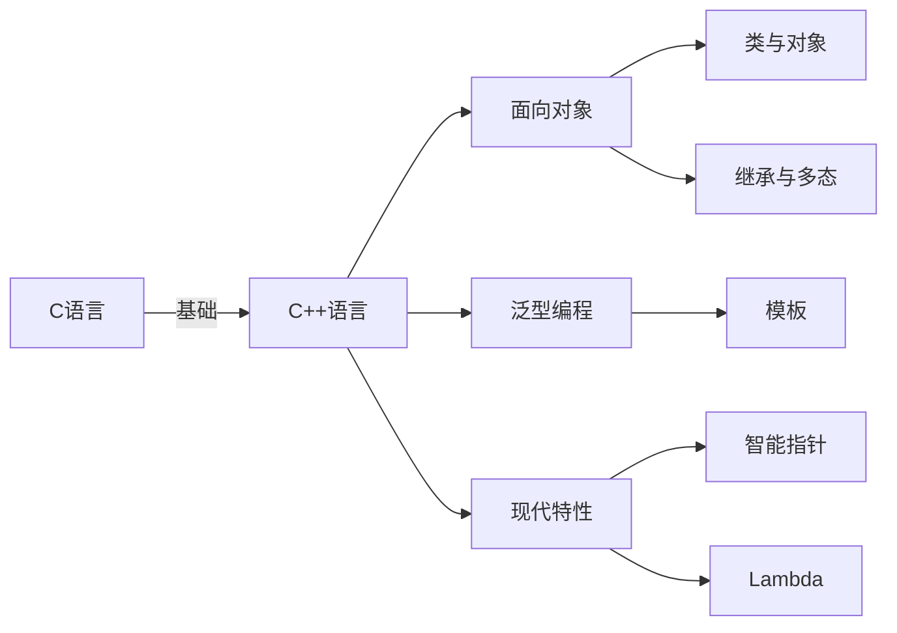
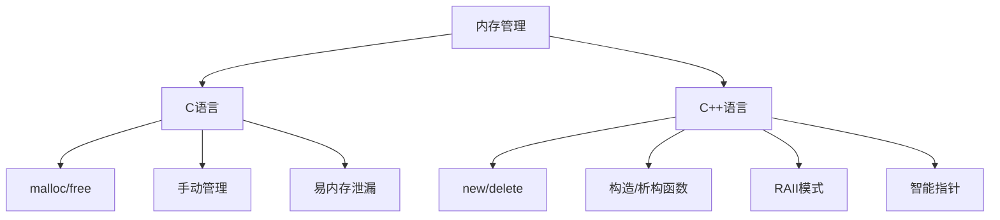

# C 与 C++ 的区别

## 概述
C++ 是 C 语言的超集，在兼容 C 语言的基础上引入了面向对象编程、泛型编程等现代编程范式。本笔记系统整理 C 与 C++ 的核心差异，帮助开发者理解从面向过程到面向对象的转变。



## 一、语法差异

| 特性         | C 语言                    | C++ 语言                     | 说明                             |
|--------------|---------------------------|------------------------------|----------------------------------|
| 头文件       | `#include <stdio.h>`      | `#include <iostream>`        | C++ 标准库头文件无 `.h` 后缀     |
| 输入输出     | `printf()` / `scanf()`    | `cout` / `cin`               | C++ 使用流式 IO                 |
| 空指针       | `NULL`                    | `nullptr` (C++11+)           | 类型安全的空指针表示             |
| 布尔类型     | 无原生支持 (常用 int)     | `bool` (true/false)          | C++ 提供原生布尔类型             |
| 函数声明     | 可选参数列表              | 必须声明参数类型             | C++ 类型检查更严格             |
| **结构体**   | 仅数据成员                | 支持成员函数、继承、访问控制 | C++ 结构体功能更强大           |
| **枚举**     | 仅传统枚举                | 支持强类型枚举 (enum class)  | 避免命名冲突，类型更安全       |
| **字符串**   | `char[]` + 函数操作       | `std::string` 类             | 更安全易用的字符串操作         |

### 结构体增强
```cpp
// C++ 结构体支持成员函数、继承和访问控制
struct Person {
    std::string name;   // 默认 public
    int age;            // 默认 public
    
    void introduce() {  // 成员函数
        std::cout << "My name is " << name << ", age " << age;
    }
};

struct Employee : Person {  // 继承
    int salary;
    void work() {
        std::cout << name << " earns " << salary << " yuan";
    }
};
```

### 枚举增强
```cpp
// 传统枚举（C风格）
enum Color { RED, GREEN, BLUE }; 
// int color = GREEN; // 允许隐式转换

// 强类型枚举（C++11）
enum class TrafficLight { RED, YELLOW, GREEN };
// TrafficLight light = TrafficLight::RED; // 必须显式
// int value = static_cast<int>(TrafficLight::RED); // 显式转换
```

### 布尔类型增强
```cpp
// C++ 原生布尔类型
bool flag = true; // 1字节，值只能是true/false

// C中需使用宏定义
// #define bool int
// #define true 1
// #define false 0
```

### 字符串增强
```cpp
#include <string>

std::string cppStr = "Hello C++"; // 自动管理内存
cppStr += " World!";              // 支持运算符操作
size_t len = cppStr.size();       // 获取长度

// 与C字符串互转
const char* cStr = cppStr.c_str(); // C++转C
std::string fromCStr = "C String"; // C转C++
```

## 二、编程范式差异

### 面向过程 vs 面向对象

| 维度         | C 语言                        | C++ 语言                          |
|--------------|-------------------------------|-----------------------------------|
| 基本单位     | 函数                          | 类与对象                          |
| 数据管理     | 结构体+独立函数               | 类封装数据与操作                  |
| 代码复用     | 函数复用                      | 继承与多态                        |
| 抽象层次     | 低层次硬件操作                | 高层次问题域建模                  |
| 典型应用     | 系统编程/嵌入式               | 大型应用/游戏开发/框架            |

**面向对象核心概念：**
```cpp
// C++ 类示例
class Shape {
protected:
    double area;
public:
    virtual void calculateArea() = 0; // 纯虚函数（抽象类）
    double getArea() const { return area; }
};

class Circle : public Shape {
    double radius;
public:
    Circle(double r) : radius(r) {}
    void calculateArea() override { // 多态实现
        area = 3.14159 * radius * radius;
    }
};

int main() {
    Circle c(5.0);
    c.calculateArea();
    cout << "Circle area: " << c.getArea() << endl;
    return 0;
}
```

## 三、核心特性对比

### 1. 类型安全
- **C 语言**：
  - 弱类型系统
  - 隐式类型转换常见
  - `void*` 可任意转换（风险高）
  
- **C++**：
  - 强类型系统
  - 显式类型转换操作符（`static_cast`, `dynamic_cast`等）
  - 类型安全的模板
  - 引用类型避免空指针
  - 强类型枚举（enum class）防止隐式转换

### 2. 封装性
- **C 语言**：
  - 结构体无访问控制
  - 数据与行为分离
  - 无真正的封装机制

- **C++**：
  - 类提供 `public/protected/private` 访问控制
  - 数据与方法的绑定
  - 友元机制（有限打破封装）
  - 结构体与类统一（仅默认访问权限不同）

```cpp
class SecureContainer {
private: // 默认private
    int secretData;
public:
    void accessData() { /* 安全访问 */ }
};

struct OpenContainer { // 默认public
    int openData;
    void modifyData() { /* 直接修改 */ }
};
```

### 3. 抽象性
- **C 语言**：
  - 函数指针实现简单多态
  - 无接口概念
  - 模块化通过文件实现

- **C++**：
  - 抽象类与纯虚函数
  - 接口设计（纯虚类）
  - 命名空间模块化管理
  - 模板元编程

### 4. 内存管理


**内存管理对比：**
- **C 语言**：
  - 手动内存管理（`malloc/calloc/free`）
  - 无构造函数/析构函数
  - 资源获取即初始化（RAII）需手动实现

- **C++**：
  - 运算符 `new/delete`（类型安全）
  - 构造函数初始化/析构函数清理
  - RAII 模式（资源获取即初始化）
  - 智能指针（`unique_ptr`, `shared_ptr`）
  - 支持内存初始化

**堆内存管理示例：**
```cpp
// C++ 类：构造/析构自动调用
class Human {
public:
    Human(const std::string& name, int age) : name(name), age(age) {
        std::cout << name << " created\n";
    }
    ~Human() {
        std::cout << name << " destroyed\n";
    }
private:
    std::string name;
    int age;
};

void heapDemo() {
    // 单个对象（带初始化）
    int* num = new int(42); 
    delete num;
    
    // 对象数组（自动调用构造/析构）
    Human* group = new Human[3]{
        {"Alice", 25},
        {"Bob", 30},
        {"Charlie", 35}
    };
    delete[] group; // 自动调用3次析构
    
    // 异常安全
    try {
        int* huge = new int[1000000000000];
    } catch (const std::bad_alloc& e) {
        std::cerr << "Allocation failed: " << e.what();
    }
}
```

## 四、关键差异总结

| 特性             | C 语言                          | C++ 语言                          | 优势对比                         |
|------------------|--------------------------------|-----------------------------------|----------------------------------|
| **编程范式**     | 面向过程                       | 多范式（面向对象+泛型+过程）       | C++ 更适合大型复杂系统           |
| **类型系统**     | 弱类型                         | 强类型                            | C++ 更安全，减少运行时错误       |
| **封装性**       | 无原生支持                     | 类访问控制                        | C++ 更好的信息隐藏               |
| **多态支持**     | 有限（函数指针）               | 完备（虚函数/RTTI）               | C++ 支持运行时多态               |
| **内存管理**     | 完全手动                       | 半自动（RAII+智能指针）           | C++ 减少内存泄漏风险             |
| **异常处理**     | 无                             | try/catch 机制                    | C++ 更健壮的错误处理             |
| **代码重用**     | 函数/宏                        | 继承/模板                         | C++ 重用机制更强大安全           |
| **标准库**       | 基础库（stdio, stdlib）        | 丰富STL（容器/算法/迭代器）       | C++ 开发效率更高                 |
| **结构体**       | 仅数据成员                     | 支持函数、继承、访问控制          | C++ 结构体功能更强大             |
| **堆管理**       | malloc/free                   | new/delete（带构造/析构）         | C++ 内存管理更安全               |

## 五、选择建议

- **使用 C 当**：
  - 开发嵌入式/操作系统级软件
  - 需要极致性能与控制
  - 跨平台兼容性要求极高
  - 资源极度受限环境

- **使用 C++ 当**：
  - 开发大型应用程序
  - 需要面向对象设计
  - 利用现代编程范式
  - 需要高级抽象和模板元编程
  - 重视代码安全和可维护性

> 关键理解：C++ 不是替代 C，而是在 C 基础上提供更高级的抽象机制。优秀 C++ 开发者应理解底层 C 机制，同时善用高层抽象提高生产力。

## 六、类与结构体对比

| 特性             | C 结构体                      | C++ 结构体                     | C++ 类                         |
|------------------|------------------------------|--------------------------------|--------------------------------|
| **成员函数**     | ❌ 不支持                     | ✔️ 支持                        | ✔️ 支持                        |
| **访问控制**     | ❌ 无                         | ✔️ public默认                  | ✔️ private默认                 |
| **继承**         | ❌ 不支持                     | ✔️ 支持                        | ✔️ 支持                        |
| **构造/析构**    | ❌ 无                         | ✔️ 支持                        | ✔️ 支持                        |
| **多态**         | ❌ 不支持                     | ✔️ 支持                        | ✔️ 支持                        |
| **使用场景**     | 简单数据聚合                  | 简单对象/数据集合              | 复杂对象/封装实现              |

```cpp
// 类与结构体唯一区别：默认访问权限
class MyClass {   // 默认private
    int data;     // private
public:
    void method();
};

struct MyStruct { // 默认public
    int data;     // public
    void method();
};
```

## 七、联合体增强
C++ 联合体支持成员函数和访问控制：
```cpp
union SmartUnion {
    int intVal;
    double dblVal;
    
    void setInt(int v) { intVal = v; }
    void setDouble(double v) { dblVal = v; }
    
    void print() {
        std::cout << "Int: " << intVal << ", Double: " << dblVal;
    }
};
```

> 通过以上对比，可以清晰看到 C++ 在 C 基础上引入了面向对象特性、强类型系统、更安全的内存管理等现代编程特性，使开发者能够构建更复杂、更健壮的应用程序。