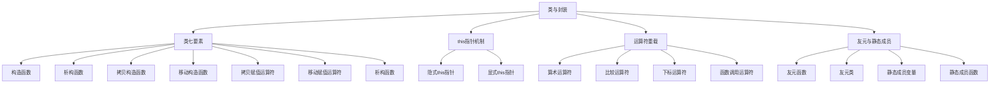
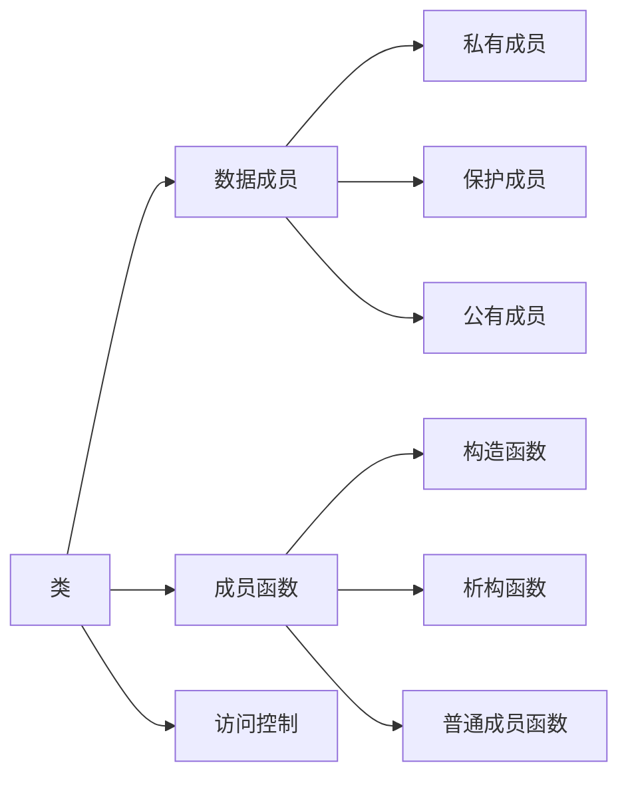
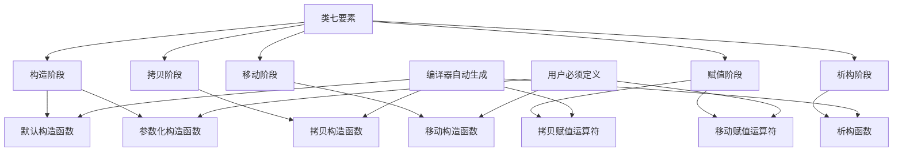
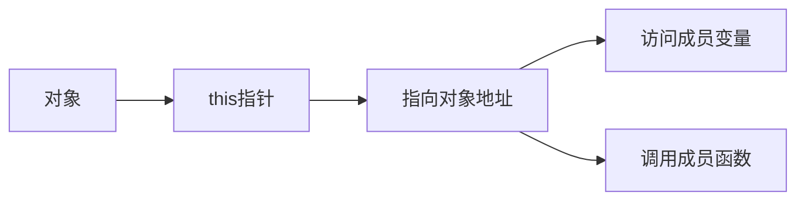
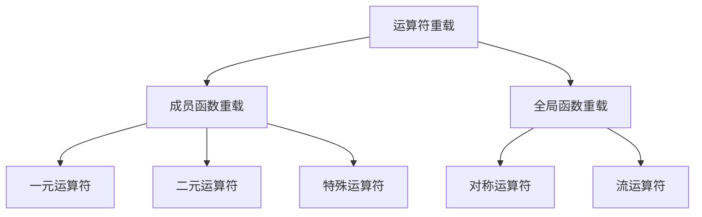
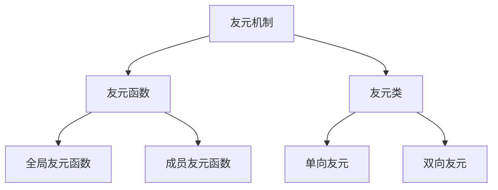
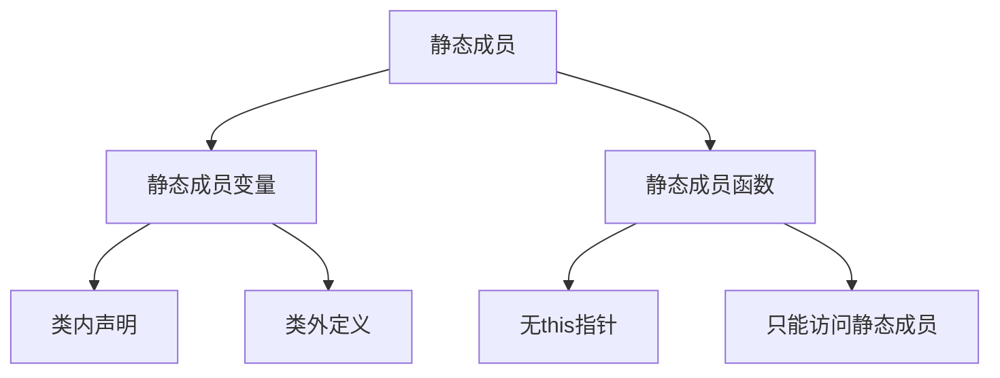

# 第二章 面向对象编程

## 2.1 类与封装

**概述**：类与封装是面向对象编程的基础，通过类将数据和行为封装在一起，实现信息隐藏和模块化设计。本节将深入探讨类的七要素、this指针机制、运算符重载以及友元与静态成员等核心概念。



## 一、类的基本概念

### 类的定义与封装

**概念说明**：类是一种用户自定义的数据类型，它将数据（成员变量）和操作数据的函数（成员函数）封装在一起，通过访问控制实现信息隐藏。



| 访问控制符 | 访问权限                    | 继承影响                | 使用场景                |
|------------|----------------------------|------------------------|------------------------|
| `private`  | 仅类内部可访问              | 派生类不可直接访问      | 内部数据成员            |
| `protected`| 类内部和派生类可访问        | 派生类可访问            | 需要继承的成员          |
| `public`   | 任何地方都可访问            | 派生类可访问            | 对外接口                |

```cpp
// 基本类定义示例
class Student {
private:
    // 私有成员：内部数据
    std::string name;
    int age;
    double score;
    
protected:
    // 保护成员：可被派生类访问
    void updateScore(double newScore);
    
public:
    // 公有成员：对外接口
    Student(const std::string& n, int a);
    void display() const;
    std::string getName() const { return name; }
    int getAge() const { return age; }
};
```

> **注意**：类的封装性通过访问控制实现，私有成员对外部完全隐藏，保护成员对派生类开放，公有成员提供对外接口。

## 二、类七要素详解

### 类七要素概述

**概念说明**：类七要素是C++中确保对象完整生命周期管理的七个核心成员函数，包括构造、拷贝、移动、赋值和析构等操作。这些函数构成了C++对象管理的完整体系，是实现RAII（资源获取即初始化）和异常安全的基础。



| 要素名称 | 函数签名 | 调用时机 | 编译器生成 | 用户定义必要性 |
|----------|----------|----------|------------|----------------|
| 默认构造函数 | `ClassName()` | 无参数创建对象 | ✅ 自动生成 | 可选 |
| 参数化构造函数 | `ClassName(params)` | 带参数创建对象 | ❌ 不生成 | 必需 |
| 拷贝构造函数 | `ClassName(const ClassName&)` | 对象拷贝时 | ✅ 自动生成 | 可选 |
| 移动构造函数 | `ClassName(ClassName&&)` | 右值对象构造 | ❌ 不生成 | 可选 |
| 拷贝赋值运算符 | `ClassName& operator=(const ClassName&)` | 对象赋值时 | ✅ 自动生成 | 可选 |
| 移动赋值运算符 | `ClassName& operator=(ClassName&&)` | 右值对象赋值 | ❌ 不生成 | 可选 |
| 析构函数 | `~ClassName()` | 对象销毁时 | ✅ 自动生成 | 可选 |

> **重要原则**：
> 1. **三/五法则**：如果定义了拷贝构造函数、拷贝赋值运算符或析构函数中的任何一个，通常需要定义所有三个
> 2. **零/三/五法则**（C++11+）：要么不定义任何拷贝控制函数，要么定义所有五个（包括移动操作）
> 3. **RAII原则**：构造函数获取资源，析构函数释放资源

### 1. 构造函数（Constructor）

**概念说明**：构造函数是特殊的成员函数，用于初始化对象。它在对象创建时自动调用，确保对象处于有效状态。

#### 1.1 默认构造函数

```cpp
// 默认构造函数示例
class Person {
private:
    std::string name;
    int age;
    
public:
    // 默认构造函数
    Person() : name("Unknown"), age(0) {
        std::cout << "默认构造函数调用" << std::endl;
    }
    
    // 或者使用默认关键字
    // Person() = default;
    
    void display() const {
        std::cout << "Name: " << name << ", Age: " << age << std::endl;
    }
};

// 使用示例
Person p1;  // 调用默认构造函数
p1.display();
```

#### 1.2 参数化构造函数

```cpp
// 参数化构造函数示例
class Rectangle {
private:
    double width;
    double height;
    
public:
    // 参数化构造函数
    Rectangle(double w, double h) : width(w), height(h) {
        if (w < 0 || h < 0) {
            throw std::invalid_argument("宽度和高度不能为负数");
        }
        std::cout << "参数化构造函数调用" << std::endl;
    }
    
    // 单参数构造函数（可隐式转换）
    explicit Rectangle(double side) : width(side), height(side) {
        std::cout << "单参数构造函数调用" << std::endl;
    }
    
    double getArea() const { return width * height; }
    double getPerimeter() const { return 2 * (width + height); }
};

// 使用示例
Rectangle r1(5.0, 3.0);  // 调用参数化构造函数
Rectangle r2(4.0);       // 调用单参数构造函数
```

> **注意**：使用 `explicit` 关键字可以防止隐式转换，提高代码安全性。

### 2. 析构函数（Destructor）

**概念说明**：析构函数用于清理对象资源，在对象生命周期结束时自动调用。它是RAII模式的核心，确保资源正确释放。

```cpp
// 析构函数示例
class ResourceManager {
private:
    int* data;
    size_t size;
    
public:
    // 构造函数：获取资源
    ResourceManager(size_t s) : size(s) {
        data = new int[s];
        std::cout << "分配内存: " << s << " 个整数" << std::endl;
    }
    
    // 析构函数：释放资源
    ~ResourceManager() {
        delete[] data;
        std::cout << "释放内存" << std::endl;
    }
    
    void setValue(size_t index, int value) {
        if (index < size) {
            data[index] = value;
        }
    }
    
    int getValue(size_t index) const {
        if (index < size) {
            return data[index];
        }
        return -1;
    }
};

// 使用示例
void testResourceManager() {
    ResourceManager rm(10);  // 构造函数调用
    rm.setValue(0, 42);
    std::cout << "Value: " << rm.getValue(0) << std::endl;
    // 函数结束时，析构函数自动调用
}
```

> **重要提示**：
> 1. 析构函数必须为虚函数（当类作为基类时）
> 2. 析构函数不能抛出异常
> 3. 析构函数调用顺序与构造顺序相反

### 3. 拷贝构造函数（Copy Constructor）

**概念说明**：拷贝构造函数用于创建一个对象的副本，通常通过深拷贝来避免资源冲突。

```cpp
// 拷贝构造函数示例
class String {
private:
    char* data;
    size_t length;
    
public:
    // 构造函数
    String(const char* str = "") {
        length = strlen(str);
        data = new char[length + 1];
        strcpy(data, str);
        std::cout << "构造函数调用" << std::endl;
    }
    
    // 拷贝构造函数（深拷贝）
    String(const String& other) {
        length = other.length;
        data = new char[length + 1];
        strcpy(data, other.data);
        std::cout << "拷贝构造函数调用" << std::endl;
    }
    
    // 析构函数
    ~String() {
        delete[] data;
        std::cout << "析构函数调用" << std::endl;
    }
    
    const char* c_str() const { return data; }
};

// 使用示例
void testCopyConstructor() {
    String s1("Hello");
    String s2 = s1;  // 调用拷贝构造函数
    String s3(s1);   // 显式调用拷贝构造函数
    
    std::cout << "s1: " << s1.c_str() << std::endl;
    std::cout << "s2: " << s2.c_str() << std::endl;
    std::cout << "s3: " << s3.c_str() << std::endl;
}
```

### 4. 移动构造函数（Move Constructor, C++11+）

**概念说明**：移动构造函数通过转移资源所有权来提高性能，避免不必要的拷贝操作。

```cpp
// 移动构造函数示例
class Vector {
private:
    int* data;
    size_t size;
    
public:
    // 构造函数
    Vector(size_t s) : size(s) {
        data = new int[s];
        for (size_t i = 0; i < s; ++i) {
            data[i] = 0;
        }
        std::cout << "构造函数调用" << std::endl;
    }
    
    // 拷贝构造函数
    Vector(const Vector& other) : size(other.size) {
        data = new int[size];
        for (size_t i = 0; i < size; ++i) {
            data[i] = other.data[i];
        }
        std::cout << "拷贝构造函数调用" << std::endl;
    }
    
    // 移动构造函数
    Vector(Vector&& other) noexcept : data(other.data), size(other.size) {
        other.data = nullptr;  // 置空源对象
        other.size = 0;
        std::cout << "移动构造函数调用" << std::endl;
    }
    
    // 析构函数
    ~Vector() {
        delete[] data;
        std::cout << "析构函数调用" << std::endl;
    }
    
    // 获取数据
    int* getData() const { return data; }
    size_t getSize() const { return size; }
};

// 使用示例
void testMoveConstructor() {
    Vector v1(5);
    Vector v2 = std::move(v1);  // 调用移动构造函数
    
    std::cout << "v1.data: " << v1.getData() << std::endl;  // nullptr
    std::cout << "v2.data: " << v2.getData() << std::endl;  // 原v1的data
}
```

### 5. 拷贝赋值运算符（Copy Assignment Operator）

**概念说明**：拷贝赋值运算符用于对象间的赋值操作，必须处理自赋值和资源管理。

```cpp
// 拷贝赋值运算符示例
class Array {
private:
    int* data;
    size_t size;
    
public:
    // 构造函数
    Array(size_t s) : size(s) {
        data = new int[s];
        for (size_t i = 0; i < s; ++i) {
            data[i] = 0;
        }
    }
    
    // 拷贝构造函数
    Array(const Array& other) : size(other.size) {
        data = new int[size];
        for (size_t i = 0; i < size; ++i) {
            data[i] = other.data[i];
        }
    }
    
    // 拷贝赋值运算符
    Array& operator=(const Array& other) {
        if (this != &other) {  // 自赋值检查
            delete[] data;      // 释放原有资源
            
            size = other.size;
            data = new int[size];
            for (size_t i = 0; i < size; ++i) {
                data[i] = other.data[i];
            }
        }
        return *this;
    }
    
    // 析构函数
    ~Array() {
        delete[] data;
    }
    
    // 下标运算符
    int& operator[](size_t index) {
        return data[index];
    }
    
    const int& operator[](size_t index) const {
        return data[index];
    }
};

// 使用示例
void testCopyAssignment() {
    Array a1(3);
    a1[0] = 1; a1[1] = 2; a1[2] = 3;
    
    Array a2(2);
    a2 = a1;  // 调用拷贝赋值运算符
    
    std::cout << "a2[0]: " << a2[0] << std::endl;
    std::cout << "a2[1]: " << a2[1] << std::endl;
    std::cout << "a2[2]: " << a2[2] << std::endl;
}
```

### 6. 移动赋值运算符（Move Assignment Operator, C++11+）

**概念说明**：移动赋值运算符通过转移资源所有权来提高赋值操作的性能。

```cpp
// 移动赋值运算符示例
class Buffer {
private:
    char* data;
    size_t capacity;
    
public:
    // 构造函数
    Buffer(size_t cap) : capacity(cap) {
        data = new char[capacity];
        std::cout << "构造函数调用" << std::endl;
    }
    
    // 移动赋值运算符
    Buffer& operator=(Buffer&& other) noexcept {
        if (this != &other) {
            delete[] data;           // 释放当前资源
            data = other.data;       // 转移资源所有权
            capacity = other.capacity;
            other.data = nullptr;    // 置空源对象
            other.capacity = 0;
            std::cout << "移动赋值运算符调用" << std::endl;
        }
        return *this;
    }
    
    // 析构函数
    ~Buffer() {
        delete[] data;
        std::cout << "析构函数调用" << std::endl;
    }
    
    char* getData() const { return data; }
    size_t getCapacity() const { return capacity; }
};

// 使用示例
void testMoveAssignment() {
    Buffer b1(100);
    Buffer b2(50);
    
    b2 = std::move(b1);  // 调用移动赋值运算符
    
    std::cout << "b1.data: " << b1.getData() << std::endl;  // nullptr
    std::cout << "b2.capacity: " << b2.getCapacity() << std::endl;  // 100
}
```

### 7. 完整的类七要素示例

```cpp
// 完整的类七要素实现示例
class SmartArray {
private:
    int* data;
    size_t size;
    
public:
    // 1. 默认构造函数
    SmartArray() : data(nullptr), size(0) {
        std::cout << "默认构造函数" << std::endl;
    }
    
    // 2. 参数化构造函数
    SmartArray(size_t s) : size(s) {
        data = new int[s];
        for (size_t i = 0; i < s; ++i) {
            data[i] = 0;
        }
        std::cout << "参数化构造函数" << std::endl;
    }
    
    // 3. 拷贝构造函数
    SmartArray(const SmartArray& other) : size(other.size) {
        data = new int[size];
        for (size_t i = 0; i < size; ++i) {
            data[i] = other.data[i];
        }
        std::cout << "拷贝构造函数" << std::endl;
    }
    
    // 4. 移动构造函数
    SmartArray(SmartArray&& other) noexcept 
        : data(other.data), size(other.size) {
        other.data = nullptr;
        other.size = 0;
        std::cout << "移动构造函数" << std::endl;
    }
    
    // 5. 拷贝赋值运算符
    SmartArray& operator=(const SmartArray& other) {
        if (this != &other) {
            if(data) delete[] data;
            size = other.size;
            data = new int[size];
            for (size_t i = 0; i < size; ++i) {
                data[i] = other.data[i];
            }
        }
        std::cout << "拷贝赋值运算符" << std::endl;
        return *this;
    }
    
    // 6. 移动赋值运算符
    SmartArray& operator=(SmartArray&& other) noexcept {
        if (this != &other) {
            if(data) delete[] data;
            data = other.data;
            size = other.size;
            other.data = nullptr;
            other.size = 0;
        }
        std::cout << "移动赋值运算符" << std::endl;
        return *this;
    }
    
    // 7. 析构函数
    ~SmartArray() {
        if(data) delete[] data;
        std::cout << "析构函数" << std::endl;
    }
    
    // 其他成员函数
    int& operator[](size_t index) { return data[index]; }
    const int& operator[](size_t index) const { return data[index]; }
    size_t getSize() const { return size; }
    /*
    总结：为什么两者都必不可少？
	如果没有非 const 版本：你就永远无法通过 [] 来修改数组元素了，例如 sarr[0] = 'A' 将无法编译。这会使你的类变得非常不实用。
	如果没有 const 版本：你就无法在 const 对象上使用 [] 了。这会严重限制你的类的使用范围，比如你无法将它传递给一个期望 const 引用的函数（这在C++中是非常好的编程实践），也无法创建 const 的 SmartArray 实例。代码 char value = const_sarr[0]; 将会编译失败。
*/
};

// 测试类七要素
void testAllSevenElements() {
    std::cout << "=== 测试类七要素 ===" << std::endl;
    
    // 测试构造函数
    SmartArray arr1(3);
    arr1[0] = 1; arr1[1] = 2; arr1[2] = 3;
    
    // 测试拷贝构造函数
    SmartArray arr2 = arr1;
    
    // 测试移动构造函数
    SmartArray arr3 = std::move(SmartArray(2));
    
    // 测试拷贝赋值运算符
    SmartArray arr4;
    arr4 = arr1;
    
    // 测试移动赋值运算符
    SmartArray arr5;
    arr5 = std::move(arr2);
    
    std::cout << "=== 测试完成 ===" << std::endl;
}
```

### 类七要素的重要性

| 要素 | 重要性 | 不定义的风险 | 最佳实践 |
|------|--------|--------------|----------|
| 默认构造函数 | 支持无参数创建对象 | 无法创建默认对象 | 提供合理的默认值 |
| 参数化构造函数 | 初始化对象状态 | 无法正确初始化 | 验证参数有效性 |
| 拷贝构造函数 | 支持对象拷贝 | 浅拷贝导致资源冲突 | 实现深拷贝 |
| 移动构造函数 | 提高性能 | 无法利用移动语义 | 转移资源所有权 |
| 拷贝赋值运算符 | 支持对象赋值 | 资源泄漏或冲突 | 自赋值检查 |
| 移动赋值运算符 | 提高赋值性能 | 无法利用移动语义 | 转移资源所有权 |
| 析构函数 | 资源清理 | 内存泄漏 | 释放所有资源 |

> **设计原则**：
> 1. **零法则**：如果类不需要管理资源，可以不定义任何拷贝控制函数
> 2. **三法则**：如果定义了拷贝构造函数、拷贝赋值运算符或析构函数，通常需要定义所有三个
> 3. **五法则**：在现代C++中，如果定义了任何拷贝控制函数，考虑定义所有五个（包括移动操作）
> 4. **RAII原则**：构造函数获取资源，析构函数释放资源

## 三、this指针机制

### this指针的本质

**概念说明**：this指针是每个非静态成员函数隐含的参数，指向当前对象的地址。



| this指针特性 | 说明                        | 使用场景                |
|-------------|----------------------------|------------------------|
| 隐含参数     | 编译器自动添加              | 所有非静态成员函数      |
| 常量指针     | `ClassName* const this`    | 不能修改this指向        |
| 类型安全     | 指向当前类类型              | 避免类型错误            |

```cpp
// this指针使用示例
class Counter {
private:
    int count;
    
public:
    Counter(int initial = 0) : count(initial) {}
    
    // 显式使用this指针
    Counter& increment() {
        this->count++;  // 显式访问成员变量
        return *this;   // 返回当前对象引用
    }
    
    // 隐式使用this指针
    Counter& decrement() {
        count--;        // 隐式访问成员变量
        return *this;   // 链式调用支持
    }
    
    int getCount() const {
        return this->count;  // const成员函数中的this是const指针
    }
    
    // 链式调用示例
    Counter& setValue(int value) {
        this->count = value;
        return *this;
    }
};

// 使用示例
Counter c(10);
c.increment().decrement().setValue(5);  // 链式调用
```

## 四、运算符重载

### 运算符重载基础

**概念说明**：运算符重载允许为自定义类型定义运算符的行为，使代码更直观易读。通过重载运算符，可以使代码更直观、简洁，例如用 `+` 直接操作两个对象，而不是调用函数。



| 运算符类别 | 可重载运算符                | 不可重载运算符          | 重载方式                |
|------------|----------------------------|------------------------|------------------------|
| 算术运算符 | `+`, `-`, `*`, `/`, `%`    | `.`, `.*`, `::`, `?:`  | 成员函数或全局函数      |
| 比较运算符 | `==`, `!=`, `<`, `>`, `<=`, `>=` | 无                | 成员函数或全局函数      |
| 逻辑运算符 | `!`, `&&`, `||`            | 无                    | 成员函数或全局函数      |
| 特殊运算符 | `[]`, `()`, `->`, `++`, `--` ,`<<` ,`>>` ,`new`, `delete` | 无                | 通常为成员函数          |

> **重要规则**：
> 1. 不能改变运算符的优先级和结合性
> 2. 至少有一个操作数是自定义类型
> 3. 不能为内置类型重载运算符
> 4. 全局重载 `new`、`delete` 时会影响所有动态内存分配

### 1. 算术运算符重载

```cpp
// 复数类运算符重载示例
class Complex {
private:
    double real;
    double imag;
    
public:
    Complex(double r = 0.0, double i = 0.0) : real(r), imag(i) {}
    
    // 加法运算符重载（成员函数形式）
    Complex operator+(const Complex& other) const {
        return Complex(real + other.real, imag + other.imag);
    }
    
    // 减法运算符重载
    Complex operator-(const Complex& other) const {
        return Complex(real - other.real, imag - other.imag);
    }
    
    // 乘法运算符重载
    Complex operator*(const Complex& other) const {
        return Complex(real * other.real - imag * other.imag,
                      real * other.imag + imag * other.real);
    }
    
    // 前置递增运算符 (++c)
    Complex& operator++() {
        ++real;
        ++imag;
        return *this;
    }
    
    // 后置递增运算符 (c++)
    Complex operator++(int) {
        Complex temp = *this;
        ++(*this);
        return temp;
    }
    
    // 输出运算符重载（友元函数）
    friend std::ostream& operator<<(std::ostream& os, const Complex& c);
    
    // 输入运算符重载（友元函数）
    friend std::istream& operator>>(std::istream& is, Complex& c);
    
    void show() const {
        std::cout << "real = " << real << " imag = " << imag << std::endl;
    }
};

// 友元函数实现
std::ostream& operator<<(std::ostream& os, const Complex& c) {
    os << "(" << c.real << " + " << c.imag << "i)";
    return os;
}

std::istream& operator>>(std::istream& is, Complex& c) {
    std::cout << "Enter real and imaginary parts: ";
    is >> c.real >> c.imag;
    return is;
}

// 使用示例
void testComplexOperators() {
    Complex c1(1, 2), c2(3, 4);
    Complex c3 = c1 + c2;  // 调用 operator+
    c3.show();
    
    // 测试输入输出运算符
    Complex c;
    std::cin >> c;
    std::cout << c << std::endl;
    
    // 测试递增运算符
    std::cout << "c1 = " << c1 << std::endl;
    std::cout << "++c1 = " << ++c1 << std::endl;
    std::cout << "c1++ = " << c1++ << std::endl;
    std::cout << "c1 after c1++ = " << c1 << std::endl;
}
```

### 2. 关系运算符重载

```cpp
// 点类关系运算符重载示例
class Point {
private:
    int x, y;
    
public:
    Point(int x = 0, int y = 0) : x(x), y(y) {}
    
    // 重载 '==' 运算符
    bool operator==(const Point& other) const {
        return (x == other.x) && (y == other.y);
    }
    
    // 重载 '!=' 运算符
    bool operator!=(const Point& other) const {
        return !(*this == other);
    }
    
    // 重载 '<' 运算符（按x坐标比较，相同时按y坐标）
    bool operator<(const Point& other) const {
        if (x != other.x) return x < other.x;
        return y < other.y;
    }
};

void testPointOperators() {
    Point p1(1, 2), p2(1, 2), p3(2, 1);
    
    if (p1 == p2) {
        std::cout << "Points are equal!" << std::endl;
    }
    
    if (p1 < p3) {
        std::cout << "p1 is less than p3" << std::endl;
    }
}
```

### 3. 下标运算符重载

```cpp
// 安全数组类下标运算符重载
class SafeArray {
private:
    int* data;
    size_t size;
    
public:
    SafeArray(size_t s) : size(s) {
        data = new int[s];
        // 初始化数组
        for (size_t i = 0; i < s; ++i) {
            data[i] = 0;
        }
    }
    
    // 下标运算符重载（用于读写元素）
    int& operator[](int index) {
        if (index < 0 || index >= static_cast<int>(size)) {
            throw std::out_of_range("Index out of range!");
        }
        return data[index];
    }
    
    // const版本的下标运算符（只读）
    const int& operator[](int index) const {
        if (index < 0 || index >= static_cast<int>(size)) {
            throw std::out_of_range("Index out of range!");
        }
        return data[index];
    }
    
    ~SafeArray() {
        delete[] data;
    }
};

void testSubscriptOperator() {
    SafeArray a(10);
    a[3] = 42;    // 写入
    std::cout << a[3] << std::endl;  // 读取
    
    const SafeArray& constA = a;
    std::cout << constA[3] << std::endl;  // 只读访问
}
```

### 4. 函数调用运算符重载

```cpp
// 函数对象（仿函数）示例
class Adder {
private:
    int value;
    
public:
    Adder(int v) : value(v) {}
    
    // 重载 () 运算符（函数对象）
    int operator()(int x) const {
        return value + x;
    }
    
    // 重载版本：两个参数
    int operator()(int x, int y) const {
        return x + y + value;
    }
};

void testFunctionOperator() {
    Adder add5(5);  // 首次调用构造函数
    std::cout << add5(3) << std::endl;     // 输出 8（等价于 add5.operator()(3)）
    std::cout << add5(3, 4) << std::endl;  // 输出 12
}
```

### 5. 赋值运算符重载

```cpp
// 字符串类赋值运算符重载示例
class String {
private:
    char* data;
    
public:
    // 构造函数
    String(const char* str = "") {
        data = new char[strlen(str) + 1];
        strcpy(data, str);
    }
    
    // 拷贝构造函数
    String(const String& other) {
        data = new char[strlen(other.data) + 1];
        strcpy(data, other.data);
    }
    
    // 重载赋值运算符（深拷贝）
    String& operator=(const String& other) {
        if (this != &other) {  // 自赋值检查
            delete[] data;      // 释放原有资源
            data = new char[strlen(other.data) + 1];
            strcpy(data, other.data);
        }
        return *this;
    }
    
    void show() const {
        std::cout << data << std::endl;
    }
    
    ~String() { 
        delete[] data; 
    }
};

void testAssignmentOperator() {
    String s1("Hello"), s2;
    s2 = s1;  // 调用 operator=
    s2.show();
    
    String s3 = s1;  // 调用拷贝构造函数
    s3.show();
}
```

### 6. 运算符重载的实现方式对比

| 实现方式 | 语法形式 | 适用场景 | 优势 | 劣势 |
|----------|----------|----------|------|------|
| 成员函数 | `T operator+(const T&)` | 第一个操作数是当前对象 | 可直接访问私有成员 | 第一个操作数必须是当前类型 |
| 友元函数 | `friend T operator+(const T&, const T&)` | 对称运算符、流运算符 | 对称性、灵活性 | 需要友元声明 |
| 全局函数 | `T operator+(const T&, const T&)` | 第一个操作数不是当前对象 | 灵活性高 | 不能直接访问私有成员 |

> **最佳实践**：
> 1. 使用引用参数避免不必要的拷贝：`const Complex& other`
> 2. 使用 `const` 修饰符确保不修改操作数
> 3. 返回引用支持链式调用：`Complex& operator++()`
> 4. 自赋值检查防止资源泄漏：`if (this != &other)`

## 五、友元与静态成员

### 友元机制

**概念说明**：友元允许非成员函数或类访问私有成员，打破封装性但提供必要的灵活性。



| 友元类型 | 声明方式                    | 访问权限                | 使用场景                |
|----------|----------------------------|------------------------|------------------------|
| 友元函数 | `friend ReturnType func()` | 可访问所有成员          | 运算符重载、工具函数    |
| 友元类   | `friend class ClassName`   | 可访问所有成员          | 紧密协作的类            |

```cpp
// 友元函数示例
class Point {
private:
    int x, y;
    
public:
    Point(int x = 0, int y = 0) : x(x), y(y) {}
    
    // 友元函数声明
    friend Point operator+(const Point& p1, const Point& p2);
    friend std::ostream& operator<<(std::ostream& os, const Point& p);
    
    // 成员函数
    void display() const {
        std::cout << "(" << x << ", " << y << ")" << std::endl;
    }
};

// 友元函数实现
Point operator+(const Point& p1, const Point& p2) {
    return Point(p1.x + p2.x, p1.y + p2.y);  // 访问私有成员
}

std::ostream& operator<<(std::ostream& os, const Point& p) {
    os << "(" << p.x << ", " << p.y << ")";  // 访问私有成员
    return os;
}
```

### 静态成员

**概念说明**：静态成员属于类而非对象，所有对象共享同一份静态成员。



| 静态成员特性 | 说明                        | 访问方式                | 使用场景                |
|-------------|----------------------------|------------------------|------------------------|
| 静态成员变量 | 所有对象共享                | `ClassName::var`       | 计数器、配置信息        |
| 静态成员函数 | 无this指针，只能访问静态成员 | `ClassName::func()`    | 工具函数、工厂方法      |

```cpp
// 静态成员示例
class Student {
private:
    std::string name;
    int id;
    
    // 静态成员变量声明
    static int totalCount;
    static int nextId;
    
public:
    Student(const std::string& n) : name(n), id(nextId++) {
        totalCount++;
    }
    
    ~Student() {
        totalCount--;
    }
    
    // 静态成员函数
    static int getTotalCount() {
        return totalCount;
    }
    
    static int getNextId() {
        return nextId;
    }
    
    // 静态成员函数不能访问非静态成员
    // static void display() { std::cout << name; }  // 错误！
    
    void display() const {
        std::cout << "ID: " << id << ", Name: " << name << std::endl;
    }
};

// 静态成员变量定义（必须在类外）
int Student::totalCount = 0;
int Student::nextId = 1001;

// 使用示例
Student s1("Alice");
Student s2("Bob");
std::cout << "总学生数: " << Student::getTotalCount() << std::endl;
std::cout << "下一个ID: " << Student::getNextId() << std::endl;
```

## 六、最佳实践与注意事项

### 1. 类设计原则

```cpp
// 良好的类设计示例
class BankAccount {
private:
    std::string accountNumber;
    double balance;
    static int accountCounter;
    
public:
    // 构造函数：资源初始化
    BankAccount(const std::string& number, double initialBalance = 0.0)
        : accountNumber(number), balance(initialBalance) {
        if (initialBalance < 0) {
            throw std::invalid_argument("初始余额不能为负");
        }
    }
    
    // 拷贝构造函数：深拷贝
    BankAccount(const BankAccount& other)
        : accountNumber(other.accountNumber), balance(other.balance) {}
    
    // 拷贝赋值运算符：自赋值检查
    BankAccount& operator=(const BankAccount& other) {
        if (this != &other) {
            accountNumber = other.accountNumber;
            balance = other.balance;
        }
        return *this;
    }
    
    // 析构函数：资源清理
    ~BankAccount() = default;  // 使用默认析构函数
    
    // 成员函数：提供接口
    void deposit(double amount) {
        if (amount > 0) {
            balance += amount;
        }
    }
    
    bool withdraw(double amount) {
        if (amount > 0 && amount <= balance) {
            balance -= amount;
            return true;
        }
        return false;
    }
    
    double getBalance() const { return balance; }
    std::string getAccountNumber() const { return accountNumber; }
    
    // 静态成员函数：工具函数
    static int getAccountCount() { return accountCounter; }
};
```

### 2. 常见错误与避免

| 错误类型 | 错误示例                    | 正确做法                | 说明                    |
|----------|----------------------------|------------------------|------------------------|
| 忘记自赋值检查 | `obj = obj;` 导致资源泄漏 | `if (this != &other)`  | 防止自我赋值问题        |
| 浅拷贝问题 | 指针成员直接赋值            | 深拷贝或智能指针        | 避免多个对象共享资源    |
| 友元过度使用 | 大量友元破坏封装            | 谨慎使用，提供接口      | 保持类的封装性          |
| 静态成员误用 | 静态函数访问非静态成员      | 只访问静态成员          | 遵守静态成员规则        |

## 七、总结

| 核心概念    | C 语言实现方式              | C++ 语言实现方式        | 优势对比                |
|-------------|---------------------------|------------------------|------------------------|
| 数据封装    | 结构体 + 函数              | 类 + 访问控制          | 语言级支持，类型安全    |
| 对象构造    | 手动初始化函数             | 构造函数自动调用        | 保证对象正确初始化      |
| 资源管理    | 手动内存管理               | RAII + 析构函数        | 自动资源清理，异常安全  |
| 运算符重载  | 不支持                    | 运算符重载机制          | 代码更直观，类型自然    |
| 静态成员    | 全局变量 + 函数            | 静态成员变量/函数       | 作用域限制，类型安全    |

> **关键要点**：
> 1. 类的七要素确保对象的完整生命周期管理
> 2. this指针是成员函数的隐含参数，支持链式调用
> 3. 运算符重载使自定义类型行为更自然
> 4. 友元机制在必要时打破封装，静态成员提供类级功能
> 5. 良好的类设计遵循封装、单一职责和资源管理原则 