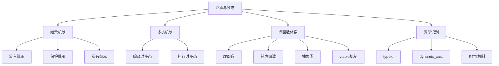
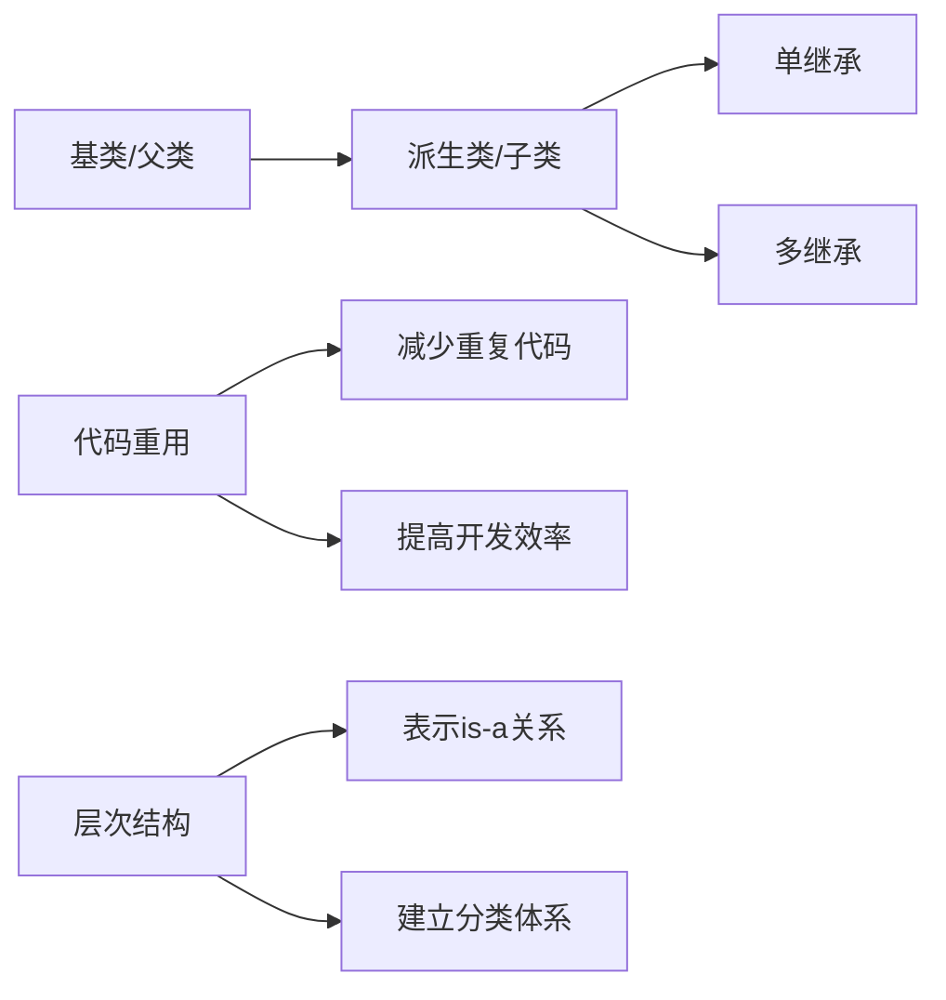
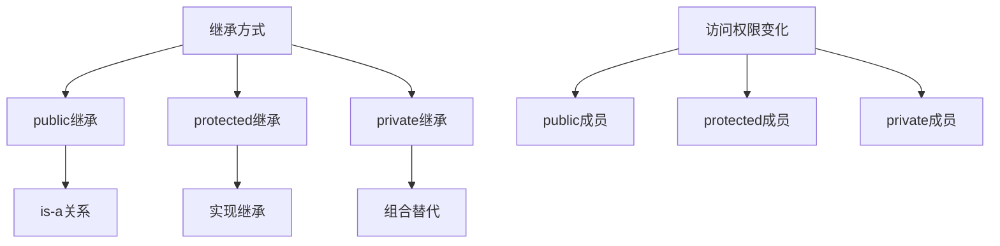
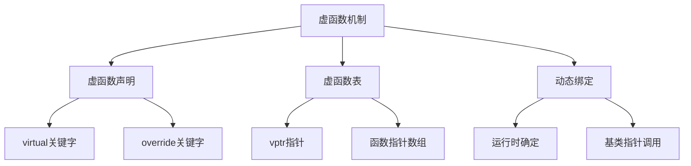
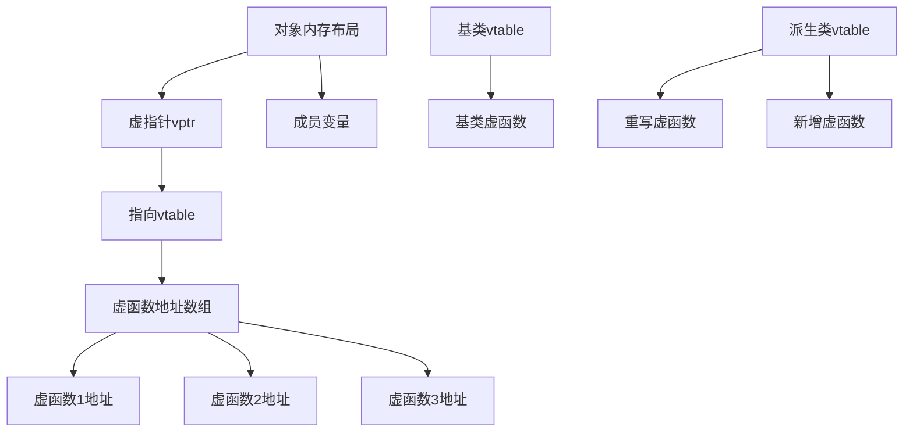
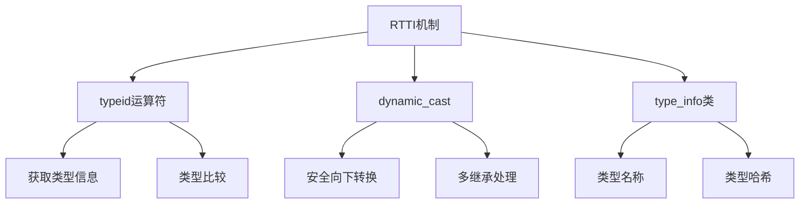
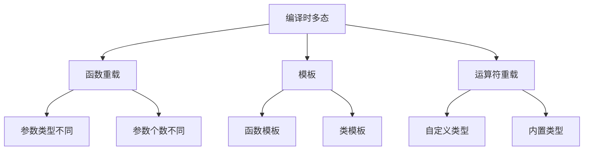

# 第二章 面向对象编程

## 2.2 继承与多态

**概述**：继承与多态是面向对象编程的核心特性，继承实现了代码重用和层次结构，多态提供了接口统一和运行时灵活性。本节将深入探讨三种继承方式、虚函数机制、抽象类、vtable实现原理以及动态类型识别等核心概念。



## 一、继承机制基础

### 继承的概念与意义

**概念说明**：继承是面向对象编程中实现代码重用和建立类层次结构的重要机制。派生类继承基类的属性和行为，同时可以添加新的特性或修改现有行为。



| 继承特性 | 说明 | 优势 | 注意事项 |
|----------|------|------|----------|
| 代码重用 | 派生类继承基类成员 | 减少重复代码，提高开发效率 | 避免过度继承 |
| 层次结构 | 建立类之间的is-a关系 | 清晰表达对象间关系 | 保持层次简洁 |
| 多态基础 | 为多态提供基础 | 实现接口统一 | 合理设计接口 |

```cpp
// 继承基础示例
class Animal {
protected:
    std::string name;
    int age;
    
public:
    Animal(const std::string& n, int a) : name(n), age(a) {}
    
    virtual void makeSound() const {
        std::cout << "Some animal sound" << std::endl;
    }
    
    virtual void eat() const {
        std::cout << name << " is eating" << std::endl;
    }
    
    std::string getName() const { return name; }
    int getAge() const { return age; }
    
    virtual ~Animal() {
        std::cout << name << " is destroyed" << std::endl;
    }
};

class Dog : public Animal {
private:
    std::string breed;
    
public:
    Dog(const std::string& n, int a, const std::string& b) 
        : Animal(n, a), breed(b) {}
    
    void makeSound() const override {
        std::cout << name << " says: Woof!" << std::endl;
    }
    
    void fetch() const {
        std::cout << name << " is fetching the ball" << std::endl;
    }
    
    std::string getBreed() const { return breed; }
};

// 使用示例
void testInheritance() {
    Animal animal("Generic", 5);
    Dog dog("Buddy", 3, "Golden Retriever");
    
    animal.makeSound();  // Some animal sound
    dog.makeSound();     // Buddy says: Woof!
    dog.fetch();         // Buddy is fetching the ball
    
    std::cout << "Dog breed: " << dog.getBreed() << std::endl;
}
```

## 二、三种继承方式

### 继承访问控制

**概念说明**：C++提供三种继承方式，控制基类成员在派生类中的访问权限，影响继承层次中的封装性。



| 继承方式 | 基类public成员 | 基类protected成员 | 基类private成员 | 使用场景 |
|----------|----------------|-------------------|-----------------|----------|
| `public` | 派生类public | 派生类protected | 派生类不可访问 | 表示is-a关系 |
| `protected` | 派生类protected | 派生类protected | 派生类不可访问 | 实现继承 |
| `private` | 派生类private | 派生类private | 派生类不可访问 | 组合替代 |

### 1. 公有继承（public inheritance）

**概念说明**：公有继承表示"is-a"关系，派生类是基类的特殊化，可以替代基类使用。

```cpp
// 公有继承示例
class Vehicle {
protected:
    std::string brand;
    int year;
    
public:
    Vehicle(const std::string& b, int y) : brand(b), year(y) {}
    
    virtual void start() const {
        std::cout << brand << " vehicle starting..." << std::endl;
    }
    
    virtual void stop() const {
        std::cout << brand << " vehicle stopping..." << std::endl;
    }
    
    std::string getBrand() const { return brand; }
    int getYear() const { return year; }
    
    virtual ~Vehicle() = default;
};

class Car : public Vehicle {
private:
    int doors;
    
public:
    Car(const std::string& b, int y, int d) 
        : Vehicle(b, y), doors(d) {}
    
    void start() const override {
        std::cout << brand << " car starting with " << doors << " doors" << std::endl;
    }
    
    void honk() const {
        std::cout << brand << " car honking!" << std::endl;
    }
    
    int getDoors() const { return doors; }
};

// 使用示例
void testPublicInheritance() {
    Car car("Toyota", 2020, 4);
    
    // 可以访问基类的公有成员
    std::cout << "Brand: " << car.getBrand() << std::endl;
    std::cout << "Year: " << car.getYear() << std::endl;
    
    // 调用派生类特有的方法
    car.honk();
    
    // 多态使用
    Vehicle* vehicle = &car;
    vehicle->start();  // 调用Car的start方法
}
```

### 2. 保护继承（protected inheritance）

**概念说明**：保护继承主要用于实现继承，基类的公有成员在派生类中变为保护成员。

```cpp
// 保护继承示例
class Base {
public:
    void publicMethod() {
        std::cout << "Base public method" << std::endl;
    }
    
protected:
    void protectedMethod() {
        std::cout << "Base protected method" << std::endl;
    }
    
private:
    void privateMethod() {
        std::cout << "Base private method" << std::endl;
    }
};

class Derived : protected Base {
public:
    void useBaseMethods() {
        publicMethod();      // 可以访问，现在是protected
        protectedMethod();   // 可以访问
        // privateMethod();  // 错误：不能访问private成员
    }
};

class FurtherDerived : public Derived {
public:
    void useInheritedMethods() {
        publicMethod();      // 可以访问，从Derived继承的protected
        protectedMethod();   // 可以访问
    }
};

// 使用示例
void testProtectedInheritance() {
    Derived d;
    d.useBaseMethods();
    
    // d.publicMethod();  // 错误：publicMethod现在是protected
    
    FurtherDerived fd;
    fd.useInheritedMethods();
}
```

### 3. 私有继承（private inheritance）

**概念说明**：私有继承主要用于实现继承，基类的所有公有和保护成员在派生类中变为私有成员。

```cpp
// 私有继承示例
class Engine {
public:
    void start() {
        std::cout << "Engine starting..." << std::endl;
    }
    
    void stop() {
        std::cout << "Engine stopping..." << std::endl;
    }
    
    void setRPM(int rpm) {
        std::cout << "Engine RPM set to " << rpm << std::endl;
    }
};

class Car : private Engine {
public:
    void drive() {
        start();        // 可以访问，现在是private
        setRPM(2000);   // 可以访问，现在是private
        std::cout << "Car is driving" << std::endl;
    }
    
    void park() {
        stop();         // 可以访问，现在是private
        std::cout << "Car is parked" << std::endl;
    }
    
    // 重新暴露某些方法
    using Engine::start;
};

// 使用示例
void testPrivateInheritance() {
    Car car;
    car.drive();
    car.park();
    car.start();  // 通过using声明重新暴露
    
    // car.setRPM(3000);  // 错误：setRPM现在是private
}
```

## 三、虚函数与多态

### 虚函数机制

**概念说明**：虚函数是实现运行时多态的关键机制，通过虚函数表（vtable）实现动态绑定。



| 虚函数特性 | 说明 | 使用场景 | 注意事项 |
|------------|------|----------|----------|
| 动态绑定 | 运行时确定调用哪个函数 | 多态行为 | 性能开销 |
| 虚函数表 | 存储虚函数地址 | 实现多态 | 内存开销 |
| 虚析构函数 | 确保正确析构 | 基类析构 | 必须为虚函数 |

### 1. 虚函数基础

```cpp
// 虚函数示例
class Shape {
protected:
    double x, y;
    
public:
    Shape(double x, double y) : x(x), y(y) {}
    
    // 虚函数
    virtual double area() const {
        return 0.0;
    }
    
    virtual void draw() const {
        std::cout << "Drawing shape at (" << x << ", " << y << ")" << std::endl;
    }
    
    // 虚析构函数
    virtual ~Shape() {
        std::cout << "Shape destroyed" << std::endl;
    }
};

class Circle : public Shape {
private:
    double radius;
    
public:
    Circle(double x, double y, double r) : Shape(x, y), radius(r) {}
    
    // 重写虚函数
    double area() const override {
        return 3.14159 * radius * radius;
    }
    
    void draw() const override {
        std::cout << "Drawing circle at (" << x << ", " << y 
                  << ") with radius " << radius << std::endl;
    }
    
    ~Circle() override {
        std::cout << "Circle destroyed" << std::endl;
    }
};

class Rectangle : public Shape {
private:
    double width, height;
    
public:
    Rectangle(double x, double y, double w, double h) 
        : Shape(x, y), width(w), height(h) {}
    
    double area() const override {
        return width * height;
    }
    
    void draw() const override {
        std::cout << "Drawing rectangle at (" << x << ", " << y 
                  << ") with size " << width << "x" << height << std::endl;
    }
    
    ~Rectangle() override {
        std::cout << "Rectangle destroyed" << std::endl;
    }
};

// 多态使用示例
void testVirtualFunctions() {
    Shape* shapes[3];
    shapes[0] = new Circle(0, 0, 5);
    shapes[1] = new Rectangle(1, 1, 4, 3);
    shapes[2] = new Shape(2, 2);
    
    for (int i = 0; i < 3; ++i) {
        shapes[i]->draw();
        std::cout << "Area: " << shapes[i]->area() << std::endl;
        delete shapes[i];
    }
}
```

### 2. 纯虚函数与抽象类

**概念说明**：纯虚函数没有实现，包含纯虚函数的类成为抽象类，不能实例化。

```cpp
// 抽象类示例
class AbstractAnimal {
protected:
    std::string name;
    
public:
    AbstractAnimal(const std::string& n) : name(n) {}
    
    // 纯虚函数
    virtual void makeSound() const = 0;
    virtual void move() const = 0;
    
    // 普通虚函数
    virtual void sleep() const {
        std::cout << name << " is sleeping" << std::endl;
    }
    
    std::string getName() const { return name; }
    
    virtual ~AbstractAnimal() = default;
};

class Bird : public AbstractAnimal {
public:
    Bird(const std::string& n) : AbstractAnimal(n) {}
    
    void makeSound() const override {
        std::cout << name << " chirps" << std::endl;
    }
    
    void move() const override {
        std::cout << name << " flies" << std::endl;
    }
};

class Fish : public AbstractAnimal {
public:
    Fish(const std::string& n) : AbstractAnimal(n) {}
    
    void makeSound() const override {
        std::cout << name << " bubbles" << std::endl;
    }
    
    void move() const override {
        std::cout << name << " swims" << std::endl;
    }
};

// 使用示例
void testAbstractClass() {
    // AbstractAnimal animal("Generic");  // 错误：不能实例化抽象类
    
    Bird bird("Sparrow");
    Fish fish("Goldfish");
    
    bird.makeSound();
    bird.move();
    bird.sleep();
    
    fish.makeSound();
    fish.move();
    fish.sleep();
    
    // 多态使用
    AbstractAnimal* animals[] = {&bird, &fish};
    for (auto animal : animals) {
        animal->makeSound();
        animal->move();
    }
}
```

## 四、vtable机制详解

### 虚函数表原理

**概念说明**：虚函数表（vtable）是实现动态多态的核心机制，每个包含虚函数的类都有一个虚函数表，对象通过虚指针（vptr）访问虚函数表。



| vtable组件 | 说明 | 作用 | 内存开销 |
|------------|------|------|----------|
| 虚指针vptr | 指向虚函数表的指针 | 运行时查找虚函数 | 每个对象8字节 |
| 虚函数表 | 存储虚函数地址的数组 | 提供函数地址映射 | 每个类一个表 |
| RTTI信息 | 类型信息 | 支持typeid和dynamic_cast | 额外内存开销 |

### vtable实现示例

```cpp
// vtable机制演示
class Base {
public:
    virtual void func1() {
        std::cout << "Base::func1()" << std::endl;
    }
    
    virtual void func2() {
        std::cout << "Base::func2()" << std::endl;
    }
    
    void nonVirtual() {
        std::cout << "Base::nonVirtual()" << std::endl;
    }
    
    virtual ~Base() {
        std::cout << "Base destructor" << std::endl;
    }
};

class Derived : public Base {
public:
    void func1() override {
        std::cout << "Derived::func1()" << std::endl;
    }
    
    virtual void func3() {
        std::cout << "Derived::func3()" << std::endl;
    }
    
    ~Derived() override {
        std::cout << "Derived destructor" << std::endl;
    }
};

// 演示vtable机制
void demonstrateVTable() {
    Base* ptr = new Derived();
    
    // 通过虚函数表调用
    ptr->func1();  // 调用Derived::func1()
    ptr->func2();  // 调用Base::func2()
    
    // 非虚函数直接调用
    ptr->nonVirtual();  // 调用Base::nonVirtual()
    
    // 不能通过基类指针调用派生类特有的虚函数
    // ptr->func3();  // 错误：Base类没有func3
    
    delete ptr;
}
```

### 虚函数调用开销分析

```cpp
// 性能对比示例
class PerformanceTest {
public:
    virtual void virtualFunc() {
        // 虚函数调用
    }
    
    void nonVirtualFunc() {
        // 非虚函数调用
    }
};

// 测试虚函数调用开销
void testVirtualCallOverhead() {
    PerformanceTest obj;
    PerformanceTest* ptr = &obj;
    
    // 虚函数调用（有开销）
    for (int i = 0; i < 1000000; ++i) {
        ptr->virtualFunc();
    }
    
    // 非虚函数调用（无开销）
    for (int i = 0; i < 1000000; ++i) {
        ptr->nonVirtualFunc();
    }
}
```

## 五、动态类型识别（RTTI）

### RTTI机制

**概念说明**：RTTI（Runtime Type Information）是C++提供的运行时类型识别机制，包括typeid运算符和dynamic_cast转换。



| RTTI组件 | 功能 | 使用场景 | 注意事项 |
|----------|------|----------|----------|
| typeid | 获取对象类型信息 | 类型检查、调试 | 需要包含typeinfo头文件 |
| dynamic_cast | 安全类型转换 | 向下转换、接口转换 | 只能用于多态类 |
| type_info | 类型信息类 | 类型比较、名称获取 | 不能直接构造 |

### 1. typeid运算符

```cpp
// typeid使用示例
#include <typeinfo>

class Animal {
public:
    virtual ~Animal() = default;
};

class Dog : public Animal {};
class Cat : public Animal {};

void testTypeId() {
    Animal* animals[] = {new Dog(), new Cat(), new Animal()};
    
    for (int i = 0; i < 3; ++i) {
        const std::type_info& type = typeid(*animals[i]);
        std::cout << "Object " << i << " is of type: " << type.name() << std::endl;
        
        // 类型比较
        if (type == typeid(Dog)) {
            std::cout << "This is a Dog" << std::endl;
        } else if (type == typeid(Cat)) {
            std::cout << "This is a Cat" << std::endl;
        } else if (type == typeid(Animal)) {
            std::cout << "This is an Animal" << std::endl;
        }
        
        delete animals[i];
    }
}
```

### 2. dynamic_cast转换

```cpp
// dynamic_cast示例
class Base {
public:
    virtual ~Base() = default;
};

class Derived1 : public Base {
public:
    void derived1Method() {
        std::cout << "Derived1 method" << std::endl;
    }
};

class Derived2 : public Base {
public:
    void derived2Method() {
        std::cout << "Derived2 method" << std::endl;
    }
};

void testDynamicCast() {
    Base* base1 = new Derived1();
    Base* base2 = new Derived2();
    
    // 安全的向下转换
    Derived1* d1 = dynamic_cast<Derived1*>(base1);
    if (d1) {
        d1->derived1Method();
    }
    
    Derived2* d2 = dynamic_cast<Derived2*>(base1);
    if (d2) {
        d2->derived2Method();
    } else {
        std::cout << "Cast to Derived2 failed" << std::endl;
    }
    
    // 引用转换（失败时抛出异常）
    try {
        Derived1& ref1 = dynamic_cast<Derived1&>(*base1);
        ref1.derived1Method();
        
        Derived2& ref2 = dynamic_cast<Derived2&>(*base1);  // 抛出异常
    } catch (const std::bad_cast& e) {
        std::cout << "Bad cast: " << e.what() << std::endl;
    }
    
    delete base1;
    delete base2;
}
```

## 六、编译时多态

### 函数重载与模板

**概念说明**：编译时多态通过函数重载和模板实现，在编译时确定调用哪个函数，没有运行时开销。



| 编译时多态类型 | 实现方式 | 优势 | 使用场景 |
|----------------|----------|------|----------|
| 函数重载 | 同名不同参数 | 类型安全 | 相似功能不同参数 |
| 模板 | 泛型编程 | 代码复用 | 通用算法实现 |
| 运算符重载 | 自定义运算符行为 | 语法自然 | 自定义类型操作 |

### 1. 函数重载

```cpp
// 函数重载示例
class Calculator {
public:
    // 整数加法
    int add(int a, int b) {
        return a + b;
    }
    
    // 浮点数加法
    double add(double a, double b) {
        return a + b;
    }
    
    // 三个整数加法
    int add(int a, int b, int c) {
        return a + b + c;
    }
    
    // 字符串连接
    std::string add(const std::string& a, const std::string& b) {
        return a + b;
    }
};

void testFunctionOverloading() {
    Calculator calc;
    
    std::cout << calc.add(5, 3) << std::endl;           // 8
    std::cout << calc.add(3.14, 2.86) << std::endl;     // 6.0
    std::cout << calc.add(1, 2, 3) << std::endl;        // 6
    std::cout << calc.add("Hello", " World") << std::endl; // Hello World
}
```

### 2. 模板多态

```cpp
// 模板多态示例
template<typename T>
class Container {
private:
    T data;
    
public:
    Container(const T& value) : data(value) {}
    
    T getValue() const { return data; }
    
    void setValue(const T& value) { data = value; }
    
    // 模板成员函数
    template<typename U>
    bool isEqual(const U& other) const {
        return data == static_cast<T>(other);
    }
};

// 函数模板
template<typename T>
T maximum(T a, T b) {
    return (a > b) ? a : b;
}

// 特化版本
template<>
std::string maximum(std::string a, std::string b) {
    return (a.length() > b.length()) ? a : b;
}

void testTemplatePolymorphism() {
    Container<int> intContainer(42);
    Container<std::string> strContainer("Hello");
    
    std::cout << intContainer.getValue() << std::endl;
    std::cout << strContainer.getValue() << std::endl;
    
    // 模板函数调用
    std::cout << maximum(10, 20) << std::endl;
    std::cout << maximum(3.14, 2.71) << std::endl;
    std::cout << maximum(std::string("short"), std::string("longer")) << std::endl;
}
```

## 七、多态的最佳实践

### 设计原则

```cpp
// 良好的多态设计示例
class Shape {
public:
    virtual double area() const = 0;
    virtual double perimeter() const = 0;
    virtual void draw() const = 0;
    virtual ~Shape() = default;
};

class Circle : public Shape {
private:
    double radius;
    
public:
    Circle(double r) : radius(r) {}
    
    double area() const override {
        return 3.14159 * radius * radius;
    }
    
    double perimeter() const override {
        return 2 * 3.14159 * radius;
    }
    
    void draw() const override {
        std::cout << "Drawing circle with radius " << radius << std::endl;
    }
};

class Rectangle : public Shape {
private:
    double width, height;
    
public:
    Rectangle(double w, double h) : width(w), height(h) {}
    
    double area() const override {
        return width * height;
    }
    
    double perimeter() const override {
        return 2 * (width + height);
    }
    
    void draw() const override {
        std::cout << "Drawing rectangle " << width << "x" << height << std::endl;
    }
};

// 多态使用
void processShapes(const std::vector<Shape*>& shapes) {
    for (const auto& shape : shapes) {
        shape->draw();
        std::cout << "Area: " << shape->area() << std::endl;
        std::cout << "Perimeter: " << shape->perimeter() << std::endl;
    }
}
```

### 常见错误与避免

| 错误类型 | 错误示例 | 正确做法 | 说明 |
|----------|----------|----------|------|
| 忘记虚析构函数 | 基类析构函数非虚 | 基类析构函数必须为虚 | 防止内存泄漏 |
| 切片问题 | 对象赋值而非指针 | 使用指针或引用 | 避免信息丢失 |
| 过度使用虚函数 | 所有函数都虚 | 合理使用虚函数 | 平衡性能与灵活性 |
| 忽略const正确性 | 虚函数缺少const | 保持const一致性 | 提高代码安全性 |

## 八、总结

| 核心概念 | C 语言实现方式 | C++ 语言实现方式 | 优势对比 |
|----------|----------------|------------------|----------|
| 代码重用 | 函数指针、宏 | 继承机制 | 类型安全、编译时检查 |
| 多态行为 | 函数指针数组 | 虚函数表 | 性能更好、类型安全 |
| 类型识别 | 手动类型标记 | RTTI机制 | 自动、安全 |
| 接口统一 | 结构体+函数 | 抽象类+虚函数 | 更清晰、更安全 |

> **关键要点**：
> 1. 继承实现代码重用，多态提供运行时灵活性
> 2. 虚函数表是实现动态多态的核心机制
> 3. 抽象类定义接口，具体类实现功能
> 4. RTTI提供安全的类型识别和转换
> 5. 编译时多态和运行时多态各有适用场景
> 6. 合理使用继承和多态，避免过度设计 