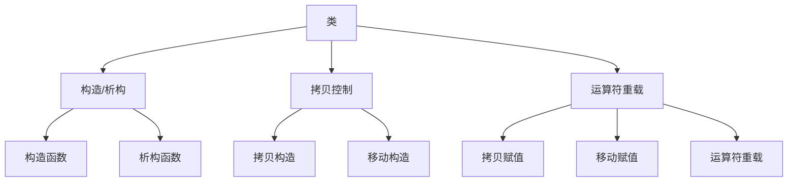

# 1.1 类与对象

## 概述
类是 C++ 面向对象编程的核心概念，它将**数据**（成员变量）和**操作**（成员函数）封装为一个逻辑单元。对象是类的具体实例，通过实例化类创建。本节深入探讨类定义的七个核心要素和 `this` 指针的工作原理。



## 一、类定义七要素

### 1. 构造函数（Constructor）
- **作用**：初始化对象成员变量
- **特点**：
  - 与类同名，无返回类型
  - 可重载（默认构造、参数化构造等）
  - 使用初始化列表提高效率

```cpp
class Book {
public:
    // 默认构造函数
    Book() : title("Unknown"), pages(0) {}
    
    // 参数化构造函数
    Book(const std::string& t, int p) : title(t), pages(p) {}
    
private:
    std::string title;
    int pages;
};
```

### 2. 析构函数（Destructor）
- **作用**：清理对象资源
- **特点**：
  - `~` + 类名，无参数无返回
  - 自动调用（对象离开作用域时）
  - 管理动态内存的关键

```cpp
class DatabaseConnection {
public:
    DatabaseConnection() {
        std::cout << "Connecting to DB...\n";
        // 分配资源
    }
    
    ~DatabaseConnection() {
        std::cout << "Closing DB connection...\n";
        // 释放资源
    }
};
```

### 3. 拷贝构造函数（Copy Constructor）
- **作用**：用现有对象初始化新对象
- **签名**：`ClassName(const ClassName& other)`
- **调用场景**：
  - 对象值传递
  - 返回对象值
  - 显式拷贝构造

```cpp
class Student {
public:
    Student(const Student& other) 
        : name(other.name), id(other.id + "_copy") {
        std::cout << "Copy constructor called\n";
    }
    
private:
    std::string name;
    std::string id;
};
```

### 4. 移动构造函数（Move Constructor）(C++11+)
- **作用**：高效转移资源所有权
- **签名**：`ClassName(ClassName&& other) noexcept`
- **优势**：避免不必要的深拷贝

```cpp
class DynamicArray {
public:
    // 移动构造函数
    DynamicArray(DynamicArray&& other) noexcept
        : data(other.data), size(other.size) 
    {
        other.data = nullptr; // 置空原指针
        other.size = 0;
    }
    
private:
    int* data;
    size_t size;
};
```

### 5. 拷贝赋值运算符（Copy Assignment）
- **作用**：对象间赋值操作
- **签名**：`ClassName& operator=(const ClassName& other)`
- **要点**：
  - 检查自赋值
  - 返回 `*this` 支持链式调用

```cpp
class Vector2D {
public:
    Vector2D& operator=(const Vector2D& other) {
        if (this != &other) { // 防止自赋值
            x = other.x;
            y = other.y;
        }
        return *this;
    }
    
private:
    double x, y;
};
```

### 6. 移动赋值运算符（Move Assignment）(C++11+)
- **作用**：高效转移资源所有权
- **签名**：`ClassName& operator=(ClassName&& other) noexcept`

```cpp
class Buffer {
public:
    Buffer& operator=(Buffer&& other) noexcept {
        if (this != &other) {
            delete[] data;    // 释放当前资源
            data = other.data;
            size = other.size;
            other.data = nullptr; // 置空原指针
            other.size = 0;
        }
        return *this;
    }
    
private:
    char* data;
    size_t size;
};
```

### 7. 运算符重载（Operator Overloading）
- **作用**：自定义类对象操作语义
- **形式**：
  - 成员函数：`T operator+(const T& rhs)`
  - 友元函数：`friend T operator+(const T& lhs, const T& rhs)`
- **常见重载运算符**：
  - 算术运算符：`+`, `-`, `*`, `/`
  - 比较运算符：`==`, `!=`, `<`, `>`
  - 下标运算符：`[]`
  - 函数调用运算符：`()`

```cpp
class Complex {
public:
    Complex(double r, double i) : real(r), imag(i) {}
    
    // 成员函数形式重载+
    Complex operator+(const Complex& rhs) const {
        return Complex(real + rhs.real, imag + rhs.imag);
    }
    
    // 友元函数形式重载<<
    friend std::ostream& operator<<(std::ostream& os, const Complex& c);
    
private:
    double real, imag;
};

std::ostream& operator<<(std::ostream& os, const Complex& c) {
    return os << "(" << c.real << ", " << c.imag << "i)";
}
```

## 二、`this` 指针原理与使用场景

### 1. 本质与原理
- **本质**：指向当前对象的常量指针
- **类型**：`ClassName* const this`
- **存储位置**：非静态成员函数的隐式参数
- **编译器行为**：
  ```cpp
  // 编译器转换示例
  obj.method(arg);
  // 转换为：
  ClassName::method(&obj, arg);
  ```

### 2. 核心使用场景
| 场景                | 说明                          | 示例                     |
|---------------------|-------------------------------|--------------------------|
| 解决命名冲突        | 区分成员与局部变量            | `this->value = value;`   |
| 返回当前对象引用    | 支持链式调用                  | `return *this;`          |
| 成员函数互调        | 调用其他成员函数              | `this->helper();`        |
| 对象自引用          | 传递自身给其他函数            | `processor.process(this)`|

```cpp
class Counter {
public:
    Counter(int start = 0) : count(start) {}
    
    Counter& increment() {
        count++;
        return *this; // 返回当前对象引用
    }
    
    Counter& set(int value) {
        this->count = value; // 显式使用this
        return *this;
    }
    
    void display() const {
        std::cout << "Count: " << this->count << std::endl;
    }
    
private:
    int count;
};

// 链式调用示例
Counter c;
c.set(5).increment().increment().display();
// 输出：Count: 7
```

### 3. 特殊注意事项
1. **静态成员函数**中无 `this` 指针
   ```cpp
   class Utility {
   public:
       static void print() {
           // 错误：this不可用
           // std::cout << this->data; 
       }
   };
   ```
   
2. **常量成员函数**中的 `this` 类型为 `const ClassName* const`
   ```cpp
   class Immutable {
   public:
       void inspect() const {
           // 在此函数内不能修改成员
           // this->data = 42; // 错误！
       }
   };
   ```

## 三、类核心要素总结表

| 要素                | 关键签名                          | 调用时机                     | 重要特性                  |
|---------------------|-----------------------------------|------------------------------|---------------------------|
| **构造函数**        | `ClassName()`                     | 对象创建时                   | 可重载，初始化列表        |
| **析构函数**        | `~ClassName()`                    | 对象销毁时                   | 自动调用，不可重载        |
| **拷贝构造**        | `ClassName(const ClassName&)`     | 拷贝初始化时                 | 深拷贝资源                |
| **移动构造**        | `ClassName(ClassName&&)`          | 转移临时对象资源时           | 高效，noexcept            |
| **拷贝赋值**        | `ClassName& operator=(const ClassName&)` | 对象赋值时         | 检查自赋值，返回引用      |
| **移动赋值**        | `ClassName& operator=(ClassName&&)` | 移动赋值时                 | 转移所有权，noexcept      |
| **运算符重载**      | `ret operator@(args)`             | 使用对应运算符时             | 成员函数/友元函数形式     |
| **`this` 指针**     | `ClassName* const`                | 非静态成员函数内             | 指向当前对象，支持链式调用|

> **最佳实践提示**：
> 1. 遵循 **Rule of Three/Five/Zero** 原则：
>    - 需要自定义拷贝操作时，同时提供析构和拷贝赋值（Rule of Three）
>    - C++11+ 中增加移动操作（Rule of Five）
>    - 优先使用默认操作或智能指针（Rule of Zero）
> 
> 2. 移动操作应标记 `noexcept` 确保标准库容器使用移动而非拷贝
> 
> 3. 运算符重载保持语义一致性：
>    - `operator+` 不应修改操作数
>    - `operator==` 应与 `operator!=` 行为一致