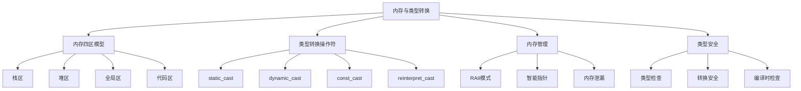
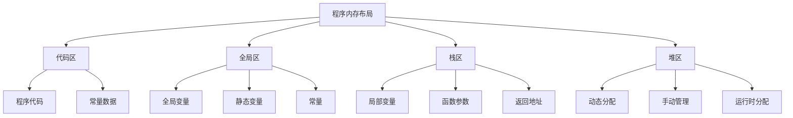
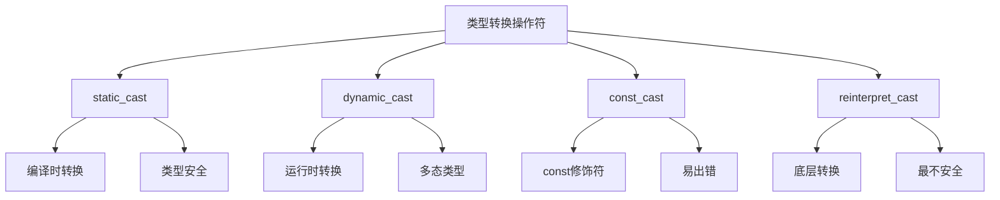

# 第三章 核心语言机制

## 3.1 内存与类型转换

**概述**：内存管理和类型转换是C++程序运行的基础机制。内存四区模型描述了程序运行时的内存布局，类型转换操作符提供了安全的类型转换机制。本节将深入探讨内存模型、类型转换规则以及相关的最佳实践。



## 一、内存四区模型

### 内存布局概述

**概念说明**：C++程序运行时的内存被分为四个主要区域，每个区域有不同的生命周期、访问方式和用途。理解内存四区模型对于编写高效、安全的C++程序至关重要。



| 内存区域 | 存储内容 | 生命周期 | 访问方式 | 特点 |
|----------|----------|----------|----------|------|
| 代码区 | 程序代码、常量 | 程序运行期间 | 只读 | 共享、不可修改 |
| 全局区 | 全局变量、静态变量 | 程序运行期间 | 读写 | 程序启动时初始化 |
| 栈区 | 局部变量、函数参数 | 函数调用期间 | 读写 | 自动管理、LIFO |
| 堆区 | 动态分配的内存 | 手动控制 | 读写 | 手动管理、随机访问 |

### 1. 代码区（Code Segment）

**概念说明**：代码区存储程序的机器码和常量数据，是只读区域，在程序运行期间保持不变。

```cpp
// 代码区示例
#include <iostream>

// 全局常量（存储在代码区）
const int MAX_SIZE = 100;
const char* VERSION = "1.0.0";

// 函数代码（存储在代码区）
void printInfo() {
    std::cout << "Version: " << VERSION << std::endl;
    std::cout << "Max Size: " << MAX_SIZE << std::endl;
}

int main() {
    // 字符串字面量（存储在代码区）
    const char* message = "Hello, World!";
    
    printInfo();
    std::cout << message << std::endl;
    
    return 0;
}
```

**代码区特点**：
- 只读，防止程序意外修改代码
- 共享，多个进程可以共享相同的代码
- 固定大小，编译时确定
- 包含常量数据和字符串字面量

### 2. 全局区（Data Segment）

**概念说明**：全局区存储全局变量、静态变量和常量，在程序启动时初始化，程序结束时销毁。

```cpp
// 全局区示例
#include <iostream>
#include <string>

// 全局变量（存储在全局区）
int globalCounter = 0;
std::string globalName = "Default";

// 全局常量（存储在全局区）
const double PI = 3.14159;

class GlobalManager {
private:
    static int instanceCount;  // 静态成员变量
    
public:
    GlobalManager() {
        instanceCount++;
        std::cout << "Created instance " << instanceCount << std::endl;
    }
    
    ~GlobalManager() {
        instanceCount--;
        std::cout << "Destroyed instance, remaining: " << instanceCount << std::endl;
    }
    
    static int getInstanceCount() {
        return instanceCount;
    }
};

// 静态成员变量定义（必须在类外）
int GlobalManager::instanceCount = 0;

// 全局对象
GlobalManager globalManager;

void testGlobalArea() {
    // 访问全局变量
    globalCounter++;
    std::cout << "Global counter: " << globalCounter << std::endl;
    
    // 访问全局常量
    std::cout << "PI: " << PI << std::endl;
    
    // 访问静态成员
    std::cout << "Instance count: " << GlobalManager::getInstanceCount() << std::endl;
    
    // 局部静态变量（也存储在全局区）
    static int localStatic = 0;
    localStatic++;
    std::cout << "Local static: " << localStatic << std::endl;
}

int main() {
    testGlobalArea();
    testGlobalArea();  // localStatic会保持值
    return 0;
}
```

**全局区特点**：
- 程序启动时初始化
- 程序结束时销毁
- 所有线程共享
- 包含全局变量、静态变量、常量

### 3. 栈区（Stack Segment）

**概念说明**：栈区存储局部变量、函数参数和返回地址，采用LIFO（后进先出）管理方式，由编译器自动管理。

```cpp
// 栈区示例
#include <iostream>

// 递归函数演示栈的使用
int factorial(int n) {
    // 局部变量存储在栈区
    int result;
    
    if (n <= 1) {
        result = 1;
    } else {
        // 递归调用会在栈上分配新的空间
        result = n * factorial(n - 1);
    }
    
    std::cout << "factorial(" << n << ") = " << result << std::endl;
    return result;
}

// 栈溢出演示
void stackOverflow(int depth) {
    // 大量局部变量可能导致栈溢出
    int localVar1 = 1;
    int localVar2 = 2;
    int localVar3 = 3;
    // ... 更多局部变量
    
    if (depth > 0) {
        stackOverflow(depth - 1);  // 递归调用
    }
}

// 栈上对象示例
class StackObject {
private:
    int data;
    
public:
    StackObject(int value) : data(value) {
        std::cout << "StackObject constructed with " << data << std::endl;
    }
    
    ~StackObject() {
        std::cout << "StackObject destroyed with " << data << std::endl;
    }
    
    int getData() const { return data; }
};

void testStackArea() {
    // 局部变量存储在栈区
    int localVar = 42;
    double localDouble = 3.14;
    
    // 栈上对象
    StackObject obj1(100);
    StackObject obj2(200);
    
    // 函数调用
    factorial(5);
    
    std::cout << "Local variables: " << localVar << ", " << localDouble << std::endl;
    std::cout << "Stack objects: " << obj1.getData() << ", " << obj2.getData() << std::endl;
    
    // 函数结束时，栈上的对象会自动销毁
}

int main() {
    testStackArea();
    return 0;
}
```

**栈区特点**：
- 自动管理，无需手动释放
- LIFO（后进先出）管理
- 大小有限，可能溢出
- 访问速度快
- 线程私有

### 4. 堆区（Heap Segment）

**概念说明**：堆区用于动态内存分配，由程序员手动管理，支持运行时分配和释放。

```cpp
// 堆区示例
#include <iostream>
#include <memory>

class HeapObject {
private:
    int* data;
    size_t size;
    
public:
    HeapObject(size_t s) : size(s) {
        // 在堆上分配内存
        data = new int[size];
        std::cout << "HeapObject allocated " << size << " integers on heap" << std::endl;
    }
    
    ~HeapObject() {
        // 释放堆内存
        delete[] data;
        std::cout << "HeapObject freed heap memory" << std::endl;
    }
    
    void setValue(size_t index, int value) {
        if (index < size) {
            data[index] = value;
        }
    }
    
    int getValue(size_t index) const {
        if (index < size) {
            return data[index];
        }
        return -1;
    }
};

// 内存泄漏示例（错误示范）
void memoryLeakExample() {
    int* ptr = new int(42);
    // 忘记释放内存 - 内存泄漏！
    // delete ptr;  // 应该添加这行
}

// 正确的堆内存管理
void correctHeapManagement() {
    // 使用智能指针（推荐）
    std::unique_ptr<int> smartPtr = std::make_unique<int>(42);
    std::cout << "Smart pointer value: " << *smartPtr << std::endl;
    // 自动释放，无需手动delete
    
    // 手动管理（需要小心）
    int* rawPtr = new int(100);
    std::cout << "Raw pointer value: " << *rawPtr << std::endl;
    delete rawPtr;  // 必须手动释放
    
    // 数组分配
    int* array = new int[10];
    for (int i = 0; i < 10; ++i) {
        array[i] = i * i;
    }
    delete[] array;  // 数组必须用delete[]
}

void testHeapArea() {
    // 堆上对象
    HeapObject* heapObj = new HeapObject(5);
    heapObj->setValue(0, 10);
    heapObj->setValue(1, 20);
    
    std::cout << "Heap object values: " 
              << heapObj->getValue(0) << ", " 
              << heapObj->getValue(1) << std::endl;
    
    delete heapObj;  // 手动释放
    
    // 使用智能指针
    std::unique_ptr<HeapObject> smartObj = std::make_unique<HeapObject>(3);
    smartObj->setValue(0, 100);
    std::cout << "Smart object value: " << smartObj->getValue(0) << std::endl;
    // 自动释放
}

int main() {
    testHeapArea();
    correctHeapManagement();
    return 0;
}
```

**堆区特点**：
- 手动管理，需要显式分配和释放
- 大小动态变化
- 访问速度相对较慢
- 可能产生内存泄漏
- 支持随机访问

## 二、类型转换操作符

### 类型转换概述

**概念说明**：C++提供了四种类型转换操作符，每种都有特定的用途和安全性保证，替代了C风格的类型转换。



| 转换操作符 | 用途 | 安全性 | 使用场景 |
|------------|------|--------|----------|
| `static_cast` | 编译时类型转换 | 高 | 数值转换、继承转换 |
| `dynamic_cast` | 运行时类型转换 | 高 | 多态类型向下转换 |
| `const_cast` | 移除const修饰符 | 低 | 兼容旧代码 |
| `reinterpret_cast` | 底层类型转换 | 最低 | 指针类型转换 |

### 1. static_cast

**概念说明**：static_cast用于编译时已知的类型转换，是最常用的类型转换操作符，提供类型安全检查。

```cpp
// static_cast示例
#include <iostream>

class Base {
public:
    virtual ~Base() = default;
};

class Derived : public Base {
public:
    void derivedMethod() {
        std::cout << "Derived method called" << std::endl;
    }
};

void testStaticCast() {
    // 1. 数值类型转换
    int intValue = 42;
    double doubleValue = static_cast<double>(intValue);
    std::cout << "int to double: " << doubleValue << std::endl;
    
    double pi = 3.14159;
    int intPi = static_cast<int>(pi);
    std::cout << "double to int: " << intPi << std::endl;
    
    // 2. 继承层次转换（向上转换）
    Derived derived;
    Base* basePtr = static_cast<Base*>(&derived);  // 向上转换，安全
    
    // 3. 继承层次转换（向下转换）
    Base* base = new Derived();
    Derived* derivedPtr = static_cast<Derived*>(base);  // 向下转换，不安全
    derivedPtr->derivedMethod();
    delete base;
    
    // 4. void*转换
    int* intPtr = new int(100);
    void* voidPtr = static_cast<void*>(intPtr);
    int* backToInt = static_cast<int*>(voidPtr);
    std::cout << "Value through void*: " << *backToInt << std::endl;
    delete intPtr;
    
    // 5. 枚举转换
    enum Color { RED, GREEN, BLUE };
    Color color = RED;
    int colorValue = static_cast<int>(color);
    std::cout << "Color value: " << colorValue << std::endl;
}

// 编译时类型检查示例
template<typename T>
T safeDivide(T a, T b) {
    // 编译时检查类型是否支持除法
    return static_cast<T>(a / b);
}

int main() {
    testStaticCast();
    
    // 模板函数使用
    std::cout << "Safe divide: " << safeDivide(10.0, 3.0) << std::endl;
    std::cout << "Safe divide: " << safeDivide(10, 3) << std::endl;
    
    return 0;
}
```

**static_cast特点**：
- 编译时检查
- 类型安全
- 不支持运行时类型检查
- 不能移除const修饰符
- 不能转换不相关的指针类型

### 2. dynamic_cast

**概念说明**：dynamic_cast用于运行时类型转换，主要用于多态类型的向下转换，提供运行时类型安全检查。

```cpp
// dynamic_cast示例
#include <iostream>
#include <typeinfo>

class Animal {
public:
    virtual ~Animal() = default;
    virtual void makeSound() const {
        std::cout << "Some animal sound" << std::endl;
    }
};

class Dog : public Animal {
public:
    void makeSound() const override {
        std::cout << "Woof!" << std::endl;
    }
    
    void fetch() const {
        std::cout << "Fetching the ball" << std::endl;
    }
};

class Cat : public Animal {
public:
    void makeSound() const override {
        std::cout << "Meow!" << std::endl;
    }
    
    void climb() const {
        std::cout << "Climbing the tree" << std::endl;
    }
};

void testDynamicCast() {
    // 创建不同类型的动物
    Animal* animals[] = {new Dog(), new Cat(), new Animal()};
    
    for (int i = 0; i < 3; ++i) {
        std::cout << "Processing animal " << i << ":" << std::endl;
        
        // 尝试转换为Dog
        Dog* dog = dynamic_cast<Dog*>(animals[i]);
        if (dog) {
            std::cout << "  This is a Dog" << std::endl;
            dog->fetch();
        }
        
        // 尝试转换为Cat
        Cat* cat = dynamic_cast<Cat*>(animals[i]);
        if (cat) {
            std::cout << "  This is a Cat" << std::endl;
            cat->climb();
        }
        
        // 如果都不是，则是基类Animal
        if (!dog && !cat) {
            std::cout << "  This is a generic Animal" << std::endl;
        }
        
        animals[i]->makeSound();
        std::cout << std::endl;
    }
    
    // 清理内存
    for (int i = 0; i < 3; ++i) {
        delete animals[i];
    }
}

// 引用转换示例
void testDynamicCastReference() {
    Dog dog;
    Animal& animalRef = dog;
    
    try {
        // 引用转换成功
        Dog& dogRef = dynamic_cast<Dog&>(animalRef);
        dogRef.fetch();
        
        // 引用转换失败会抛出异常
        Cat& catRef = dynamic_cast<Cat&>(animalRef);  // 抛出std::bad_cast
    } catch (const std::bad_cast& e) {
        std::cout << "Bad cast: " << e.what() << std::endl;
    }
}

// 多继承示例
class Flying {
public:
    virtual ~Flying() = default;
    virtual void fly() const {
        std::cout << "Flying..." << std::endl;
    }
};

class Bird : public Animal, public Flying {
public:
    void makeSound() const override {
        std::cout << "Chirp!" << std::endl;
    }
    
    void fly() const override {
        std::cout << "Bird flying" << std::endl;
    }
};

void testMultipleInheritance() {
    Bird bird;
    Animal* animalPtr = &bird;
    Flying* flyingPtr = &bird;
    
    // 跨继承层次转换
    Flying* fromAnimal = dynamic_cast<Flying*>(animalPtr);
    if (fromAnimal) {
        fromAnimal->fly();
    }
    
    Animal* fromFlying = dynamic_cast<Animal*>(flyingPtr);
    if (fromFlying) {
        fromFlying->makeSound();
    }
}

int main() {
    testDynamicCast();
    testDynamicCastReference();
    testMultipleInheritance();
    return 0;
}
```

**dynamic_cast特点**：
- 运行时类型检查
- 只能用于多态类型（有虚函数）
- 失败时返回nullptr（指针）或抛出异常（引用）
- 支持多继承
- 性能开销较大

### 3. const_cast

**概念说明**：const_cast用于移除或添加const修饰符，是最危险的类型转换，应该谨慎使用。

```cpp
// const_cast示例
#include <iostream>

// 旧式C函数（没有const参数）
void legacyFunction(char* str) {
    std::cout << "Legacy function: " << str << std::endl;
}

// 现代C++函数（有const参数）
void modernFunction(const char* str) {
    std::cout << "Modern function: " << str << std::endl;
}

void testConstCast() {
    const char* constString = "Hello, World!";
    
    // 1. 移除const（危险操作）
    char* nonConstString = const_cast<char*>(constString);
    
    // 调用旧式函数
    legacyFunction(nonConstString);
    
    // 2. 添加const（安全操作）
    char* mutableString = new char[20];
    strcpy(mutableString, "Mutable string");
    
    const char* constString2 = const_cast<const char*>(mutableString);
    modernFunction(constString2);
    
    delete[] mutableString;
    
    // 3. 错误使用示例（不要这样做）
    const int constValue = 42;
    int* nonConstValue = const_cast<int*>(&constValue);
    
    // 修改const对象是未定义行为！
    // *nonConstValue = 100;  // 危险！
    
    std::cout << "Original value: " << constValue << std::endl;
    // 可能输出42或100，取决于编译器优化
}

// 正确的const_cast使用场景
class StringWrapper {
private:
    char* data;
    mutable int accessCount;  // mutable允许在const函数中修改
    
public:
    StringWrapper(const char* str) {
        data = new char[strlen(str) + 1];
        strcpy(data, str);
        accessCount = 0;
    }
    
    ~StringWrapper() {
        delete[] data;
    }
    
    // const函数，但需要修改accessCount
    const char* getData() const {
        accessCount++;  // 使用mutable，无需const_cast
        return data;
    }
    
    // 非const版本
    char* getData() {
        accessCount++;
        return data;
    }
    
    int getAccessCount() const {
        return accessCount;
    }
};

// 兼容性示例
class LegacyInterface {
public:
    virtual void process(char* data) = 0;
};

class ModernClass {
public:
    void process(const char* data) {
        std::cout << "Processing: " << data << std::endl;
    }
};

class Adapter : public LegacyInterface {
private:
    ModernClass* modern;
    
public:
    Adapter(ModernClass* m) : modern(m) {}
    
    void process(char* data) override {
        // 使用const_cast进行兼容性转换
        const char* constData = const_cast<const char*>(data);
        modern->process(constData);
    }
};

int main() {
    testConstCast();
    
    // StringWrapper示例
    StringWrapper wrapper("Test string");
    const StringWrapper& constWrapper = wrapper;
    
    std::cout << "Data: " << constWrapper.getData() << std::endl;
    std::cout << "Access count: " << constWrapper.getAccessCount() << std::endl;
    
    // Adapter示例
    ModernClass modern;
    Adapter adapter(&modern);
    char data[] = "Adapter test";
    adapter.process(data);
    
    return 0;
}
```

**const_cast特点**：
- 只能修改const修饰符
- 不能改变类型
- 移除const是危险操作
- 主要用于兼容性
- 应该尽量避免使用

### 4. reinterpret_cast

**概念说明**：reinterpret_cast是最不安全的类型转换，用于底层类型转换，如指针类型转换，不进行任何类型检查。

```cpp
// reinterpret_cast示例
#include <iostream>
#include <cstring>

void testReinterpretCast() {
    // 1. 指针类型转换
    int value = 0x12345678;
    int* intPtr = &value;
    
    // 转换为char指针（查看字节表示）
    char* charPtr = reinterpret_cast<char*>(intPtr);
    std::cout << "Bytes: ";
    for (int i = 0; i < sizeof(int); ++i) {
        std::cout << std::hex << static_cast<int>(charPtr[i]) << " ";
    }
    std::cout << std::dec << std::endl;
    
    // 2. 函数指针转换
    typedef void (*FunctionPtr)();
    typedef int (*IntFunctionPtr)(int);
    
    void (*voidFunc)() = []() { std::cout << "Void function" << std::endl; };
    int (*intFunc)(int) = [](int x) { return x * 2; };
    
    // 转换函数指针类型（危险！）
    FunctionPtr func1 = reinterpret_cast<FunctionPtr>(voidFunc);
    FunctionPtr func2 = reinterpret_cast<FunctionPtr>(intFunc);  // 危险！
    
    func1();  // 安全
    // func2();  // 危险！可能导致崩溃
    
    // 3. 整数和指针转换
    uintptr_t address = reinterpret_cast<uintptr_t>(intPtr);
    int* backToPtr = reinterpret_cast<int*>(address);
    
    std::cout << "Address: " << std::hex << address << std::dec << std::endl;
    std::cout << "Value through address: " << *backToPtr << std::endl;
}

// 网络编程示例
struct NetworkPacket {
    uint32_t header;
    uint32_t data;
    uint32_t checksum;
};

void processNetworkData(const char* rawData) {
    // 将原始数据重新解释为网络包
    const NetworkPacket* packet = reinterpret_cast<const NetworkPacket*>(rawData);
    
    std::cout << "Header: 0x" << std::hex << packet->header << std::dec << std::endl;
    std::cout << "Data: 0x" << std::hex << packet->data << std::dec << std::endl;
    std::cout << "Checksum: 0x" << std::hex << packet->checksum << std::dec << std::endl;
}

// 硬件访问示例（模拟）
class HardwareRegister {
private:
    volatile uint32_t* reg;
    
public:
    HardwareRegister(uintptr_t address) {
        reg = reinterpret_cast<volatile uint32_t*>(address);
    }
    
    void write(uint32_t value) {
        *reg = value;
    }
    
    uint32_t read() const {
        return *reg;
    }
};

// 序列化示例
class Serializable {
public:
    virtual ~Serializable() = default;
    virtual size_t getSize() const = 0;
    virtual void serialize(char* buffer) const = 0;
    virtual void deserialize(const char* buffer) = 0;
};

class Point : public Serializable {
private:
    int x, y;
    
public:
    Point(int x = 0, int y = 0) : x(x), y(y) {}
    
    size_t getSize() const override {
        return sizeof(Point);
    }
    
    void serialize(char* buffer) const override {
        // 将对象内存直接复制到缓冲区
        memcpy(buffer, this, sizeof(Point));
    }
    
    void deserialize(const char* buffer) override {
        // 从缓冲区直接复制到对象内存
        memcpy(this, buffer, sizeof(Point));
    }
    
    void print() const {
        std::cout << "Point(" << x << ", " << y << ")" << std::endl;
    }
};

void testSerialization() {
    Point original(10, 20);
    char buffer[sizeof(Point)];
    
    // 序列化
    original.serialize(buffer);
    
    // 反序列化
    Point restored;
    restored.deserialize(buffer);
    
    std::cout << "Original: ";
    original.print();
    std::cout << "Restored: ";
    restored.print();
}

int main() {
    testReinterpretCast();
    
    // 网络数据示例
    char networkData[] = {0x12, 0x34, 0x56, 0x78,  // header
                          0x9A, 0xBC, 0xDE, 0xF0,  // data
                          0x11, 0x22, 0x33, 0x44}; // checksum
    processNetworkData(networkData);
    
    // 序列化示例
    testSerialization();
    
    return 0;
}
```

**reinterpret_cast特点**：
- 最不安全的转换
- 不进行类型检查
- 用于底层编程
- 可能导致未定义行为
- 应该尽量避免使用

## 三、类型转换最佳实践

### 转换优先级

```cpp
// 类型转换优先级示例
void demonstrateCastPriority() {
    int value = 42;
    
    // 1. 首选：避免转换
    double result1 = value;  // 隐式转换，安全
    
    // 2. 其次：static_cast
    double result2 = static_cast<double>(value);
    
    // 3. 多态类型：dynamic_cast
    Base* base = new Derived();
    Derived* derived = dynamic_cast<Derived*>(base);
    
    // 4. 最后考虑：const_cast和reinterpret_cast
    const int constValue = 100;
    int* nonConst = const_cast<int*>(&constValue);  // 危险！
    
    delete base;
}
```

### 常见错误与避免

| 错误类型 | 错误示例 | 正确做法 | 说明 |
|----------|----------|----------|------|
| 使用C风格转换 | `(int*)ptr` | `static_cast<int*>(ptr)` | 更安全、更明确 |
| 忽略const_cast风险 | 修改const对象 | 使用mutable或重新设计 | 避免未定义行为 |
| 过度使用reinterpret_cast | 任意指针转换 | 使用适当的转换 | 保持类型安全 |
| 忘记检查dynamic_cast结果 | 直接使用转换结果 | 检查nullptr | 防止崩溃 |

### 类型安全设计

```cpp
// 类型安全的设计示例
template<typename T>
class SafeContainer {
private:
    T* data;
    size_t size;
    
public:
    SafeContainer(size_t s) : size(s) {
        data = new T[s];
    }
    
    ~SafeContainer() {
        delete[] data;
    }
    
    // 类型安全的访问
    T& operator[](size_t index) {
        if (index >= size) {
            throw std::out_of_range("Index out of range");
        }
        return data[index];
    }
    
    const T& operator[](size_t index) const {
        if (index >= size) {
            throw std::out_of_range("Index out of range");
        }
        return data[index];
    }
    
    // 类型安全的转换
    template<typename U>
    SafeContainer<U> convert() const {
        SafeContainer<U> result(size);
        for (size_t i = 0; i < size; ++i) {
            result[i] = static_cast<U>(data[i]);
        }
        return result;
    }
    
    size_t getSize() const { return size; }
};

// 使用示例
void testSafeContainer() {
    SafeContainer<int> intContainer(5);
    for (size_t i = 0; i < intContainer.getSize(); ++i) {
        intContainer[i] = static_cast<int>(i * i);
    }
    
    // 安全的类型转换
    SafeContainer<double> doubleContainer = intContainer.convert<double>();
    
    for (size_t i = 0; i < doubleContainer.getSize(); ++i) {
        std::cout << doubleContainer[i] << " ";
    }
    std::cout << std::endl;
}
```

## 四、总结

| 核心概念 | C 语言实现方式 | C++ 语言实现方式 | 优势对比 |
|----------|----------------|------------------|----------|
| 内存管理 | malloc/free | new/delete + RAII | 自动管理、异常安全 |
| 类型转换 | (type)value | 四种cast操作符 | 类型安全、明确意图 |
| 内存布局 | 手动管理 | 四区模型 | 清晰、可预测 |
| 类型安全 | 弱类型检查 | 强类型检查 | 减少运行时错误 |

> **关键要点**：
> 1. 理解内存四区模型是编写高效C++程序的基础
> 2. 使用适当的类型转换操作符，避免C风格转换
> 3. 优先使用static_cast，谨慎使用const_cast和reinterpret_cast
> 4. 利用RAII模式自动管理内存，避免内存泄漏
> 5. 理解类型转换的安全性和性能影响
> 6. 设计类型安全的接口，减少转换需求 