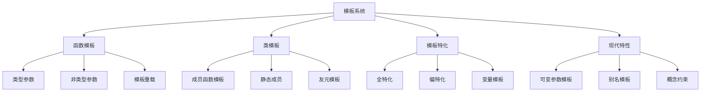
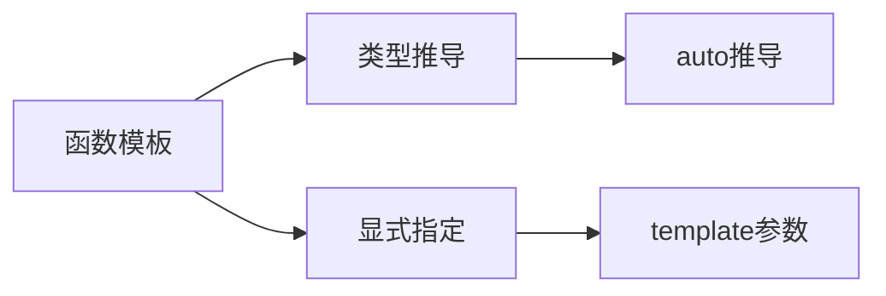
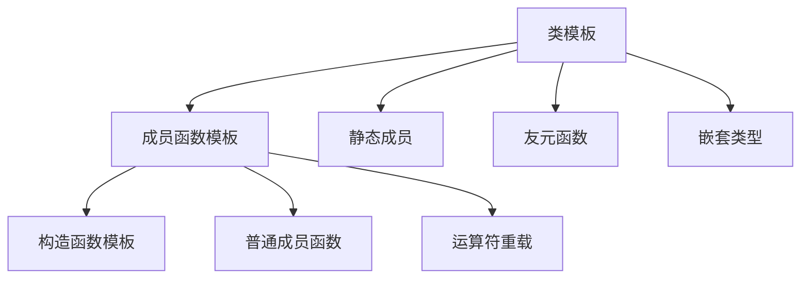
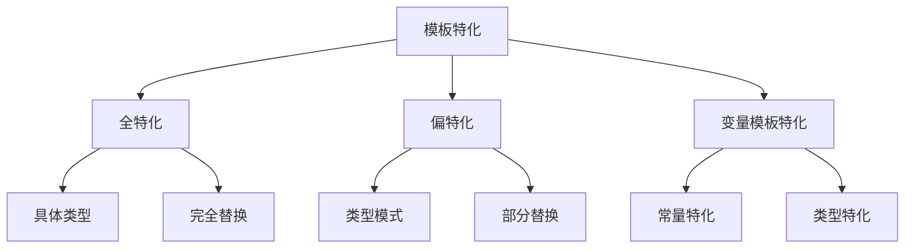

# 3.2 模板系统

## 概述

模板是 C++ 泛型编程的核心机制，通过参数化类型实现代码复用。模板系统包括函数模板和类模板两大类，支持特化技术实现类型特定的优化。本章将深入探讨模板的语法、特化机制和现代 C++ 中的模板增强特性。



## 一、函数模板

### 基本语法与类型参数

**概念说明**：
函数模板允许编写与类型无关的通用函数，编译器根据调用时的实际类型生成具体函数版本。



| 模板特性    | 函数模板                    | 普通函数                    | 优势对比                    |
|------------|----------------------------|----------------------------|----------------------------|
| 类型处理    | 参数化类型                  | 固定类型                   | 代码复用，类型安全          |
| 编译方式    | 实例化时生成代码            | 直接编译                   | 按需生成，减少代码体积      |
| 重载机制    | 支持模板重载                | 支持函数重载               | 更灵活的类型匹配            |

```cpp
// 基础函数模板示例
template<typename T>
T max(T a, T b) {
    return (a > b) ? a : b;
}

// 多类型参数模板
template<typename T1, typename T2>
auto add(T1 a, T2 b) -> decltype(a + b) {
    return a + b;
}

// 非类型参数模板
template<typename T, int N>
class Array {
private:
    T data[N];
public:
    T& operator[](int index) {
        return data[index];
    }
    int size() const { return N; }
};

// 使用示例
int main() {
    // 类型推导
    int result1 = max(10, 20);           // T = int
    double result2 = max(3.14, 2.71);    // T = double
    
    // 显式指定类型
    int result3 = max<int>(10, 20);
    
    // 多类型参数
    auto sum = add(10, 3.14);            // T1 = int, T2 = double
    
    // 非类型参数
    Array<int, 10> arr;
    arr[0] = 42;
    
    return 0;
}
```

### 模板重载与优先级规则

**概念说明**：
模板重载允许为不同参数类型提供不同的实现，特化则为特定类型提供专门的实现。函数模板与普通函数存在优先级规则。

```cpp
// 基础函数模板
template<typename T>
void print(T a, T b) {
    std::cout << "调用函数模板" << std::endl;
}

// 普通函数重载
void print(int a, int b) {
    std::cout << "调用普通函数" << std::endl;
}

// 函数模板重载
template<typename T>
void print(T a, T b, T c) {
    std::cout << "调用函数模板重载" << std::endl;
}

// 函数模板特化
template<>
void print(const char* str) {
    std::cout << "字符串特化: " << str << std::endl;
}

// 使用示例
int main() {
    int a = 1, b = 2, c = 3;
    
    print(a, b);        // 优先调用普通函数
    print(3.4, 3.5);    // 调用函数模板
    print<>(a, b);      // 空模板参数强制调用函数模板
    print(a, b, c);     // 调用函数模板重载
    print("Hello");     // 调用字符串特化版本
    
    return 0;
}
```

> **重载优先级规则**：
> 1. 如果函数模板和普通函数都可以实现，**优先调用普通函数**
> 2. 通过**空模板参数列表** `<>` 可以强制调用函数模板
> 3. 函数模板支持重载，可以有不同的参数数量或类型

## 二、类模板

### 基本语法与成员函数

**概念说明**：
类模板允许定义与类型无关的类，所有成员函数和成员变量都可以使用模板参数。类模板与函数模板在类型推导和默认参数方面存在重要差异。



| 类模板特性  | 实现方式                    | 普通类                      | 优势对比                    |
|------------|----------------------------|----------------------------|----------------------------|
| 成员函数    | 自动模板化                  | 固定类型                   | 类型无关的成员操作          |
| 静态成员    | 每个实例化独立              | 全局共享                   | 类型特定的静态数据          |
| 友元函数    | 支持模板友元                | 固定友元关系               | 灵活的友元机制              |

| 特性对比    | 函数模板                    | 类模板                      | 说明                        |
|------------|----------------------------|----------------------------|----------------------------|
| 自动类型推导 | 支持                       | **不支持**                 | 类模板必须显式指定类型      |
| 默认参数    | **不支持**                 | 支持                       | 类模板参数可以有默认值      |

```cpp
// 基础类模板示例（支持默认参数）
template<typename T1 = std::string, typename T2 = int>
class Person {
public:
    T1 name;
    T2 age;
    
    Person() {}
    Person(T1 name, T2 age) : name(name), age(age) {}
    
    void printer() {
        std::cout << "name: " << name << ", age: " << age << std::endl;
    }
};

// 使用示例
int main() {
    // 类模板必须显式指定类型（无自动推导）
    Person<std::string, int> p1("张三丰", 99);
    Person<> p2;  // 使用默认参数
    
    p1.printer();
    p2.printer();
    
    return 0;
}
```

### 类模板成员函数类外实现

**概念说明**：
类模板的成员函数在类外实现时，需要在函数实现前加上模板参数列表。

```cpp
// 类内声明
template<typename T1, typename T2>
class Person3 {
private:
    T1 name;
    T2 age;

public:
    Person3(T1 name, T2 age);
    void print();
};

// 成员函数类外实现
template<typename T1, typename T2>
Person3<T1, T2>::Person3(T1 name, T2 age) {
    this->name = name;
    this->age = age;
}

template<typename T1, typename T2>
void Person3<T1, T2>::print() {
    std::cout << "姓名：" << name << "，年龄：" << age << std::endl;
}
```

### 类模板与继承

**概念说明**：
当子类继承模板父类时，需要指定父类中模板参数的类型，或者将子类也设计为模板类。

```cpp
// 模板父类
template<typename T>
class Base {
public:
    T a;
};

// 方式1：指定父类模板参数类型
class Son1 : public Base<int> {
    // 父类是类模板，必须指定具体类型
};

// 方式2：子类也设计为模板类
template<typename T1, typename T2>
class Son2 : public Base<T1> {
public:
    T2 b;
    // 子类模板中的T1替代父类模板中的T
};

// 使用示例
int main() {
    Son1 s1;
    s1.a = 42;  // a的类型是int
    
    Son2<std::string, double> s2;
    s2.a = "Hello";  // a的类型是string
    s2.b = 3.14;     // b的类型是double
    
    return 0;
}
```

### 类模板对象作为函数参数

**概念说明**：
类模板对象作为函数参数有三种传递方式：指定具体类型、参数模板化、整个类模板化。

```cpp
template<typename T1, typename T2>
class Person {
public:
    T1 name;
    T2 age;
    
    Person(T1 name, T2 age) : name(name), age(age) {}
    
    void printer() {
        std::cout << "name: " << name << ", age: " << age << std::endl;
    }
};

// 方式1：指定传入的类型
void print1(Person<std::string, int>& p) {
    p.printer();
}

// 方式2：参数模板化
template<typename T1, typename T2>
void print2(Person<T1, T2>& p) {
    p.printer();
}

// 方式3：整个类模板化
template<typename T>
void print3(T& p) {
    p.printer();
}

// 使用示例
int main() {
    Person<std::string, int> p("张三丰", 99);
    
    print1(p);  // 指定具体类型
    print2(p);  // 参数模板化
    print3(p);  // 整个类模板化
    
    return 0;
}
```

### 模板友元与嵌套模板

```cpp
// 模板友元示例
template<typename T>
class Outer {
private:
    T data;
    
public:
    // 模板友元函数
    template<typename U>
    friend void swap(Outer<U>& a, Outer<U>& b);
    
    // 模板友元类
    template<typename U>
    friend class FriendClass;
};

template<typename T>
void swap(Outer<T>& a, Outer<T>& b) {
    std::swap(a.data, b.data);
}

template<typename T>
class FriendClass {
public:
    void access_private(Outer<T>& obj) {
        std::cout << "访问私有成员: " << obj.data << std::endl;
    }
};

// 嵌套模板示例
template<typename T>
class Matrix {
private:
    std::vector<std::vector<T>> data;
    
public:
    // 嵌套类模板
    template<typename U>
    class Iterator {
    private:
        Matrix<U>* matrix;
        size_t row, col;
        
    public:
        Iterator(Matrix<U>* m, size_t r, size_t c) 
            : matrix(m), row(r), col(c) {}
        
        U& operator*() {
            return matrix->data[row][col];
        }
        
        Iterator& operator++() {
            if (++col >= matrix->data[row].size()) {
                col = 0;
                ++row;
            }
            return *this;
        }
    };
    
    // 返回迭代器类型
    using iterator = Iterator<T>;
    
    iterator begin() {
        return iterator(this, 0, 0);
    }
    
    iterator end() {
        return iterator(this, data.size(), 0);
    }
};
```

## 三、模板特化

### 全特化与偏特化

**概念说明**：
特化允许为特定类型或类型组合提供专门的实现，全特化针对具体类型，偏特化针对类型模式。



| 特化类型    | 语法特点                    | 使用场景                    | 优势对比                    |
|------------|----------------------------|----------------------------|----------------------------|
| 全特化      | template<> class Name<具体类型> | 特定类型的优化实现        | 性能优化，特殊行为          |
| 偏特化      | template<typename T> class Name<T*> | 类型模式的专门处理        | 灵活的类型匹配              |
| 变量特化    | template<> constexpr 类型 变量名<具体类型> | 编译期常量特化            | 编译期优化                  |

```cpp
// 全特化示例
template<typename T>
class TypeInfo {
public:
    static const char* name() {
        return "unknown";
    }
    static size_t size() {
        return sizeof(T);
    }
};

// 全特化
template<>
class TypeInfo<int> {
public:
    static const char* name() {
        return "int";
    }
    static size_t size() {
        return sizeof(int);
    }
};

template<>
class TypeInfo<std::string> {
public:
    static const char* name() {
        return "string";
    }
    static size_t size() {
        return sizeof(std::string);
    }
};

// 偏特化示例
template<typename T>
class Container {
public:
    void process() {
        std::cout << "通用容器处理" << std::endl;
    }
};

// 指针类型的偏特化
template<typename T>
class Container<T*> {
public:
    void process() {
        std::cout << "指针容器处理" << std::endl;
    }
};

// 数组类型的偏特化
template<typename T, size_t N>
class Container<T[N]> {
public:
    void process() {
        std::cout << "数组容器处理，大小: " << N << std::endl;
    }
};

// 变量模板特化 (C++14+)
template<typename T>
constexpr bool is_integral = std::is_integral_v<T>;

template<>
constexpr bool is_integral<std::string> = false;

// 使用示例
int main() {
    // 全特化使用
    std::cout << TypeInfo<int>::name() << std::endl;
    std::cout << TypeInfo<std::string>::name() << std::endl;
    
    // 偏特化使用
    Container<int> c1;
    Container<int*> c2;
    int arr[10];
    Container<decltype(arr)> c3;
    
    c1.process();  // 通用容器处理
    c2.process();  // 指针容器处理
    c3.process();  // 数组容器处理，大小: 10
    
    // 变量模板使用
    std::cout << std::boolalpha;
    std::cout << is_integral<int> << std::endl;        // true
    std::cout << is_integral<std::string> << std::endl; // false
    
    return 0;
}
```

### 模板递归与终止

**概念说明**：
模板递归是模板元编程的基础，通过递归定义和特化终止条件实现编译期计算。

```cpp
// 编译期阶乘计算（递归模板）
template<int N>
struct Factorial {
    static const int value = N * Factorial<N - 1>::value;
};

// 模板特化终止递归
template<>
struct Factorial<0> {
    static const int value = 1;
};

// 编译期斐波那契数列
template<int N>
struct Fibonacci {
    static const int value = Fibonacci<N - 1>::value + Fibonacci<N - 2>::value;
};

template<>
struct Fibonacci<0> {
    static const int value = 0;
};

template<>
struct Fibonacci<1> {
    static const int value = 1;
};

// 使用示例
int main() {
    constexpr int fact_5 = Factorial<5>::value;      // 120
    constexpr int fib_10 = Fibonacci<10>::value;     // 55
    
    std::cout << "5! = " << fact_5 << std::endl;
    std::cout << "F(10) = " << fib_10 << std::endl;
    
    return 0;
}
```

## 四、现代 C++ 模板特性

### 可变参数模板 (C++11+)

**概念说明**：
可变参数模板允许接受任意数量的模板参数，是实现通用库的基础。

```cpp
// 可变参数模板示例
template<typename... Args>
class Tuple;

// 基础情况
template<>
class Tuple<> {};

// 递归情况
template<typename Head, typename... Tail>
class Tuple<Head, Tail...> : public Tuple<Tail...> {
private:
    Head head;
    
public:
    Tuple(const Head& h, const Tail&... t) 
        : Tuple<Tail...>(t...), head(h) {}
    
    Head& get_head() { return head; }
    const Head& get_head() const { return head; }
    
    Tuple<Tail...>& get_tail() { return *this; }
    const Tuple<Tail...>& get_tail() const { return *this; }
};

// 可变参数函数模板
template<typename... Args>
void print_all(Args&&... args) {
    (std::cout << ... << args) << std::endl;
}

// 折叠表达式 (C++17+)
template<typename... Args>
auto sum_all(Args... args) {
    return (... + args);
}

// 使用示例
int main() {
    Tuple<int, std::string, double> t(42, "Hello", 3.14);
    
    std::cout << t.get_head() << std::endl;           // 42
    std::cout << t.get_tail().get_head() << std::endl; // Hello
    
    print_all(1, " ", 2, " ", 3);                     // 1 2 3
    std::cout << sum_all(1, 2, 3, 4, 5) << std::endl; // 15
    
    return 0;
}
```

### 别名模板与概念约束 (C++11+/C++20)

```cpp
// 别名模板 (C++11+)
template<typename T>
using Vector = std::vector<T>;

template<typename T>
using UniquePtr = std::unique_ptr<T>;

template<typename T>
using SharedPtr = std::shared_ptr<T>;

// 类型别名模板
template<typename T>
struct remove_reference {
    using type = T;
};

template<typename T>
struct remove_reference<T&> {
    using type = T;
};

template<typename T>
struct remove_reference<T&&> {
    using type = T;
};

template<typename T>
using remove_reference_t = typename remove_reference<T>::type;

// 概念约束 (C++20)
#ifdef __cpp_concepts
template<typename T>
concept Integral = std::is_integral_v<T>;

template<typename T>
concept FloatingPoint = std::is_floating_point_v<T>;

template<typename T>
concept Arithmetic = Integral<T> || FloatingPoint<T>;

// 使用概念的模板
template<Arithmetic T>
T add(T a, T b) {
    return a + b;
}

// 概念约束的类模板
template<Arithmetic T>
class Calculator {
public:
    T add(T a, T b) { return a + b; }
    T multiply(T a, T b) { return a * b; }
};
#endif

// 使用示例
int main() {
    // 别名模板使用
    Vector<int> numbers = {1, 2, 3, 4, 5};
    UniquePtr<int> ptr = std::make_unique<int>(42);
    
    // 类型别名使用
    int x = 42;
    int& ref = x;
    remove_reference_t<decltype(ref)> value = ref; // int
    
    #ifdef __cpp_concepts
    // 概念约束使用
    Calculator<int> int_calc;
    Calculator<double> double_calc;
    
    std::cout << int_calc.add(10, 20) << std::endl;
    std::cout << double_calc.multiply(3.14, 2.0) << std::endl;
    #endif
    
    return 0;
}
```

## 五、模板元编程

### 编译期计算

**概念说明**：
模板元编程利用模板的编译期特性进行编译时计算，实现类型计算和编译期优化。

```cpp
// 编译期阶乘计算
template<int N>
struct Factorial {
    static constexpr int value = N * Factorial<N - 1>::value;
};

template<>
struct Factorial<0> {
    static constexpr int value = 1;
};

// 编译期斐波那契数列
template<int N>
struct Fibonacci {
    static constexpr int value = Fibonacci<N - 1>::value + Fibonacci<N - 2>::value;
};

template<>
struct Fibonacci<0> {
    static constexpr int value = 0;
};

template<>
struct Fibonacci<1> {
    static constexpr int value = 1;
};

// 类型列表操作
template<typename... Types>
struct TypeList {};

// 获取类型列表长度
template<typename List>
struct Length;

template<typename... Types>
struct Length<TypeList<Types...>> {
    static constexpr size_t value = sizeof...(Types);
};

// 类型列表查找
template<typename List, typename T>
struct Contains;

template<typename T>
struct Contains<TypeList<>, T> {
    static constexpr bool value = false;
};

template<typename Head, typename... Tail, typename T>
struct Contains<TypeList<Head, Tail...>, T> {
    static constexpr bool value = std::is_same_v<Head, T> || 
                                  Contains<TypeList<Tail...>, T>::value;
};

// 使用示例
int main() {
    // 编译期计算
    constexpr int fact_5 = Factorial<5>::value;      // 120
    constexpr int fib_10 = Fibonacci<10>::value;     // 55
    
    std::cout << "5! = " << fact_5 << std::endl;
    std::cout << "F(10) = " << fib_10 << std::endl;
    
    // 类型列表操作
    using MyTypes = TypeList<int, double, std::string>;
    constexpr size_t len = Length<MyTypes>::value;   // 3
    constexpr bool has_int = Contains<MyTypes, int>::value; // true
    constexpr bool has_float = Contains<MyTypes, float>::value; // false
    
    std::cout << "类型列表长度: " << len << std::endl;
    std::cout << "包含int: " << std::boolalpha << has_int << std::endl;
    std::cout << "包含float: " << has_float << std::endl;
    
    return 0;
}
```

## 六、模板最佳实践

### 性能优化与代码组织

```cpp
// 模板分离实现
// 头文件: container.h
template<typename T>
class Container {
public:
    void add(const T& item);
    T get(size_t index) const;
    size_t size() const;
    
private:
    std::vector<T> data;
};

// 实现文件: container.hpp (包含在头文件中)
#include "container.h"

template<typename T>
void Container<T>::add(const T& item) {
    data.push_back(item);
}

template<typename T>
T Container<T>::get(size_t index) const {
    return data[index];
}

template<typename T>
size_t Container<T>::size() const {
    return data.size();
}

// 显式实例化 (container.cpp)
#include "container.hpp"

// 显式实例化常用类型
template class Container<int>;
template class Container<double>;
template class Container<std::string>;

// SFINAE 技术示例
template<typename T>
class HasSize {
private:
    template<typename U>
    static auto test(void*) -> decltype(std::declval<U>().size(), std::true_type{});
    
    template<typename>
    static std::false_type test(...);
    
public:
    static constexpr bool value = decltype(test<T>(nullptr))::value;
};

// 使用 SFINAE 的函数模板
template<typename T>
typename std::enable_if<HasSize<T>::value, size_t>::type
get_size(const T& container) {
    return container.size();
}

template<typename T>
typename std::enable_if<!HasSize<T>::value, size_t>::type
get_size(const T&) {
    return 0;
}
```

## 总结

| 模板特性      | 语法特点                    | 应用场景                    | 现代C++增强                |
|--------------|----------------------------|----------------------------|----------------------------|
| 函数模板      | template<typename T>       | 通用算法实现                | auto返回类型，概念约束      |
| 类模板        | template<typename T> class | 容器和智能指针              | 变量模板，别名模板          |
| 模板特化      | template<> 或偏特化        | 类型特定优化                | 变量模板特化                |
| 可变参数      | template<typename... Args> | 通用库实现                  | 折叠表达式，包展开          |
| 元编程        | 编译期类型计算              | 类型安全，性能优化          | constexpr，概念约束         |

> **重要提示**：
> 1. 模板代码通常需要放在头文件中，因为编译器需要看到完整定义
> 2. 使用显式实例化可以减少编译时间和代码体积
> 3. 现代 C++ 的概念约束提供了更好的类型安全和错误信息
> 4. 模板元编程虽然强大，但应适度使用以保持代码可读性

模板系统是 C++ 泛型编程的基石，掌握模板技术能够编写出高效、类型安全的通用代码。从基础的函数模板到现代的可变参数模板和概念约束，模板系统不断演进，为 C++ 程序提供了强大的抽象能力。 