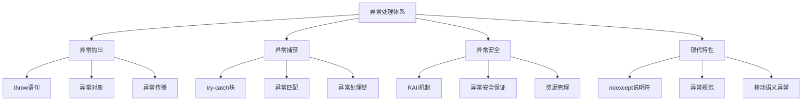
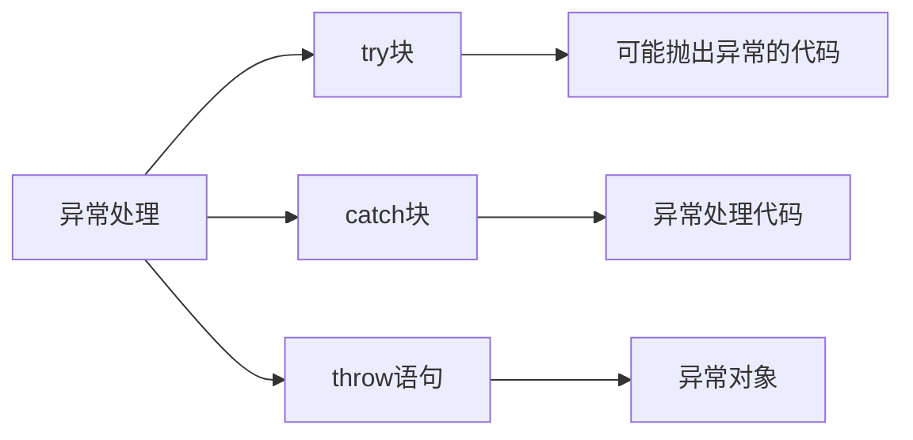
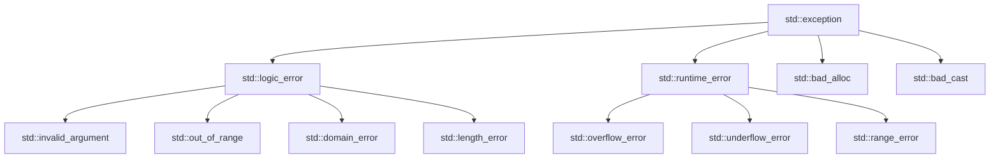
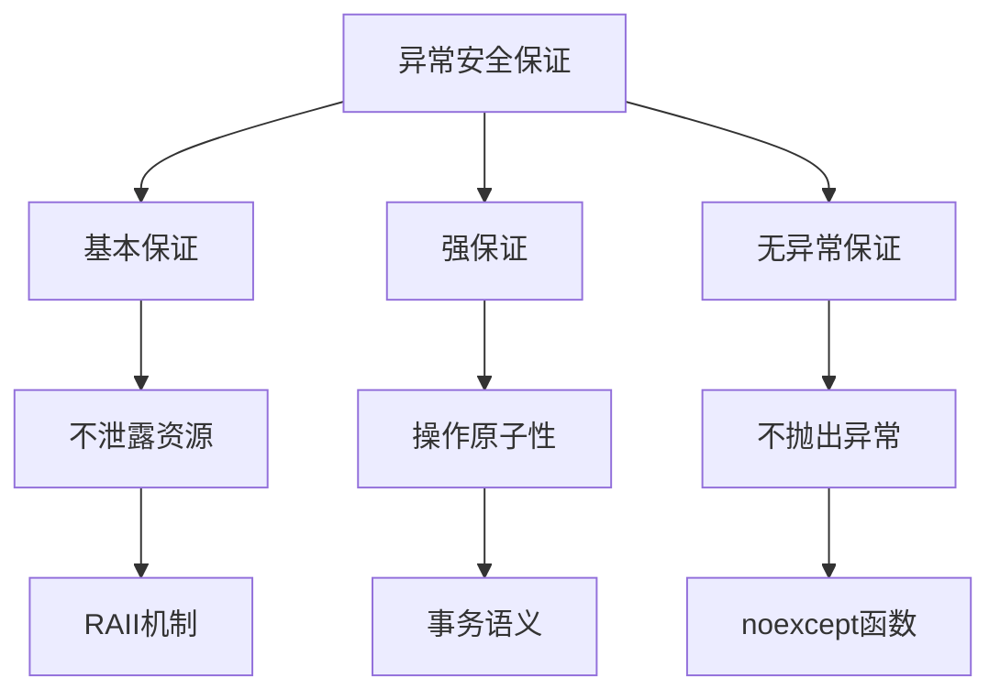
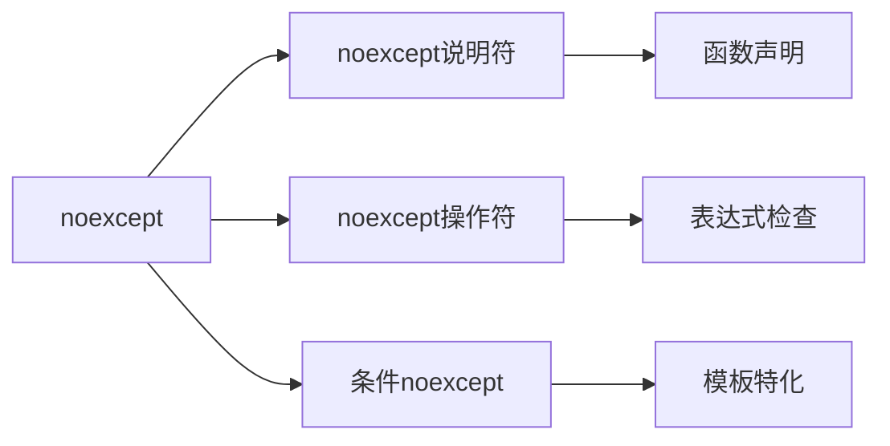
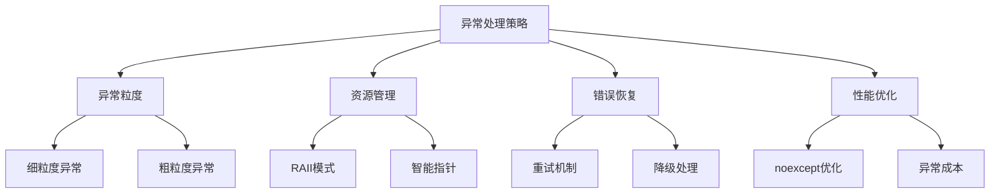

# 3.3 异常处理

## 概述

异常处理是 C++ 中处理程序运行时错误的机制，通过 try-catch 语句块实现异常的抛出、捕获和处理。异常处理体系包括异常类型、异常安全、RAII 资源管理等核心概念。本章将深入探讨异常处理的语法、最佳实践和现代 C++ 中的异常处理增强特性。



## 一、异常处理基础

### 基本语法与异常类型

**概念说明**：
异常处理通过 try-catch 语句块实现，异常可以是任何类型的对象，但通常继承自 std::exception 类。



| 异常处理组件 | 语法特点                    | 作用                        | 使用场景                    |
|------------|----------------------------|----------------------------|----------------------------|
| try块      | try { 代码 }               | 包含可能抛出异常的代码        | 函数调用、资源操作          |
| catch块    | catch (异常类型& e) { 处理 } | 捕获并处理特定类型的异常      | 异常恢复、错误日志          |
| throw语句  | throw 异常对象              | 抛出异常对象                | 错误条件、异常传播          |

```cpp
#include <iostream>
#include <stdexcept>
#include <string>

// 自定义异常类
class DivisionByZeroException : public std::exception {
private:
    std::string message;
    
public:
    DivisionByZeroException(const std::string& msg) : message(msg) {}
    
    const char* what() const noexcept override {
        return message.c_str();
    }
};

// 基础异常处理示例
double divide(double a, double b) {
    if (b == 0.0) {
        throw DivisionByZeroException("除数不能为零");
    }
    return a / b;
}

// 使用标准异常
int getArrayElement(const int* arr, int size, int index) {
    if (index < 0 || index >= size) {
        throw std::out_of_range("数组索引越界");
    }
    return arr[index];
}

// 基础异常处理
void basicExceptionHandling() {
    try {
        double result = divide(10.0, 0.0);
        std::cout << "结果: " << result << std::endl;
    }
    catch (const DivisionByZeroException& e) {
        std::cerr << "捕获到除零异常: " << e.what() << std::endl;
    }
    catch (const std::exception& e) {
        std::cerr << "捕获到标准异常: " << e.what() << std::endl;
    }
    catch (...) {
        std::cerr << "捕获到未知异常" << std::endl;
    }
}

// 使用示例
int main() {
    basicExceptionHandling();
    
    // 数组访问异常处理
    int arr[] = {1, 2, 3, 4, 5};
    try {
        int value = getArrayElement(arr, 5, 10);
        std::cout << "数组元素: " << value << std::endl;
    }
    catch (const std::out_of_range& e) {
        std::cerr << "数组访问错误: " << e.what() << std::endl;
    }
    
    return 0;
}
```

### 异常传播与栈展开

**概念说明**：
异常会沿着调用栈向上传播，直到找到匹配的 catch 块。在传播过程中，会自动调用已构造对象的析构函数，这个过程称为栈展开。

```cpp
#include <iostream>
#include <memory>

class Resource {
private:
    std::string name;
    
public:
    Resource(const std::string& n) : name(n) {
        std::cout << "构造资源: " << name << std::endl;
    }
    
    ~Resource() {
        std::cout << "析构资源: " << name << std::endl;
    }
    
    void use() {
        std::cout << "使用资源: " << name << std::endl;
    }
};

// 异常传播示例
void level3() {
    Resource r3("Level3");
    r3.use();
    throw std::runtime_error("Level3 抛出异常");
}

void level2() {
    Resource r2("Level2");
    r2.use();
    level3();
}

void level1() {
    Resource r1("Level1");
    r1.use();
    level2();
}

// 栈展开演示
void stackUnwindingDemo() {
    try {
        std::cout << "开始执行..." << std::endl;
        level1();
    }
    catch (const std::exception& e) {
        std::cerr << "捕获异常: " << e.what() << std::endl;
    }
    std::cout << "异常处理完成" << std::endl;
}

// 使用示例
int main() {
    stackUnwindingDemo();
    return 0;
}
```

## 二、异常类型与层次结构

### 标准异常类

**概念说明**：
C++ 标准库提供了一套完整的异常类层次结构，所有标准异常都继承自 std::exception 基类。



| 异常类型        | 继承关系                    | 使用场景                    | 典型错误                    |
|----------------|----------------------------|----------------------------|----------------------------|
| logic_error    | std::exception             | 逻辑错误                    | 参数无效、索引越界          |
| runtime_error  | std::exception             | 运行时错误                  | 文件不存在、网络错误        |
| bad_alloc      | std::exception             | 内存分配失败                | new 操作失败               |
| invalid_argument| std::logic_error           | 参数无效                    | 函数参数不符合要求          |
| out_of_range   | std::logic_error           | 索引越界                    | 数组、容器访问越界          |

```cpp
#include <iostream>
#include <stdexcept>
#include <vector>
#include <string>

// 标准异常使用示例
class Calculator {
public:
    // 参数验证异常
    double sqrt(double value) {
        if (value < 0) {
            throw std::invalid_argument("不能计算负数的平方根");
        }
        return std::sqrt(value);
    }
    
    // 范围检查异常
    int factorial(int n) {
        if (n < 0) {
            throw std::invalid_argument("阶乘不能计算负数");
        }
        if (n > 12) {
            throw std::overflow_error("阶乘结果溢出");
        }
        
        int result = 1;
        for (int i = 2; i <= n; ++i) {
            result *= i;
        }
        return result;
    }
    
    // 容器访问异常
    template<typename T>
    T getElement(const std::vector<T>& vec, size_t index) {
        if (index >= vec.size()) {
            throw std::out_of_range("索引 " + std::to_string(index) + " 超出范围");
        }
        return vec[index];
    }
};

// 异常类型演示
void standardExceptionDemo() {
    Calculator calc;
    
    try {
        // 测试参数验证异常
        double result = calc.sqrt(-1.0);
        std::cout << "平方根: " << result << std::endl;
    }
    catch (const std::invalid_argument& e) {
        std::cerr << "参数错误: " << e.what() << std::endl;
    }
    
    try {
        // 测试溢出异常
        int fact = calc.factorial(15);
        std::cout << "阶乘: " << fact << std::endl;
    }
    catch (const std::overflow_error& e) {
        std::cerr << "溢出错误: " << e.what() << std::endl;
    }
    
    try {
        // 测试范围异常
        std::vector<int> numbers = {1, 2, 3, 4, 5};
        int value = calc.getElement(numbers, 10);
        std::cout << "元素: " << value << std::endl;
    }
    catch (const std::out_of_range& e) {
        std::cerr << "范围错误: " << e.what() << std::endl;
    }
}

// 使用示例
int main() {
    standardExceptionDemo();
    return 0;
}
```

### 自定义异常类

**概念说明**：
自定义异常类应该继承自标准异常类，提供有意义的错误信息和额外的错误上下文。

```cpp
#include <iostream>
#include <stdexcept>
#include <string>
#include <sstream>

// 基础自定义异常
class FileException : public std::runtime_error {
private:
    std::string filename;
    int errorCode;
    
public:
    FileException(const std::string& msg, const std::string& fname, int code)
        : std::runtime_error(msg), filename(fname), errorCode(code) {}
    
    const std::string& getFilename() const { return filename; }
    int getErrorCode() const { return errorCode; }
    
    std::string getFullMessage() const {
        std::ostringstream oss;
        oss << "文件错误 [" << filename << "]: " << what() 
            << " (错误代码: " << errorCode << ")";
        return oss.str();
    }
};

// 网络异常类
class NetworkException : public std::runtime_error {
private:
    std::string host;
    int port;
    std::string operation;
    
public:
    NetworkException(const std::string& msg, const std::string& h, int p, const std::string& op)
        : std::runtime_error(msg), host(h), port(p), operation(op) {}
    
    std::string getConnectionInfo() const {
        return host + ":" + std::to_string(port);
    }
    
    const std::string& getOperation() const { return operation; }
};

// 业务逻辑异常
class BusinessLogicException : public std::logic_error {
private:
    std::string operation;
    std::string context;
    
public:
    BusinessLogicException(const std::string& msg, const std::string& op, const std::string& ctx)
        : std::logic_error(msg), operation(op), context(ctx) {}
    
    std::string getOperationContext() const {
        return "操作: " + operation + ", 上下文: " + context;
    }
};

// 使用示例
void customExceptionDemo() {
    try {
        // 模拟文件操作异常
        throw FileException("文件不存在", "config.txt", 404);
    }
    catch (const FileException& e) {
        std::cerr << e.getFullMessage() << std::endl;
    }
    
    try {
        // 模拟网络异常
        throw NetworkException("连接超时", "example.com", 80, "GET");
    }
    catch (const NetworkException& e) {
        std::cerr << "网络错误: " << e.what() << std::endl;
        std::cerr << "连接信息: " << e.getConnectionInfo() << std::endl;
        std::cerr << "操作: " << e.getOperation() << std::endl;
    }
    
    try {
        // 模拟业务逻辑异常
        throw BusinessLogicException("用户权限不足", "delete_user", "admin_panel");
    }
    catch (const BusinessLogicException& e) {
        std::cerr << "业务错误: " << e.what() << std::endl;
        std::cerr << e.getOperationContext() << std::endl;
    }
}

// 使用示例
int main() {
    customExceptionDemo();
    return 0;
}
```

## 三、异常安全与RAII

### 异常安全保证

**概念说明**：
异常安全保证分为三个级别：基本保证、强保证和无异常保证。RAII（资源获取即初始化）是实现异常安全的关键技术。



| 安全级别      | 保证内容                    | 实现方式                    | 使用场景                    |
|--------------|----------------------------|----------------------------|----------------------------|
| 基本保证      | 不泄露资源，对象状态有效      | RAII、智能指针              | 资源管理、内存分配          |
| 强保证        | 操作要么成功要么回滚          | 事务模式、copy-and-swap     | 容器操作、复杂状态变更      |
| 无异常保证    | 函数不抛出异常               | noexcept、简单操作          | 析构函数、移动操作          |

```cpp
#include <iostream>
#include <memory>
#include <vector>
#include <algorithm>

// RAII资源管理类
class FileHandle {
private:
    FILE* file;
    std::string filename;
    
public:
    FileHandle(const std::string& name) : filename(name) {
        file = fopen(name.c_str(), "r");
        if (!file) {
            throw std::runtime_error("无法打开文件: " + name);
        }
        std::cout << "打开文件: " << filename << std::endl;
    }
    
    ~FileHandle() {
        if (file) {
            fclose(file);
            std::cout << "关闭文件: " << filename << std::endl;
        }
    }
    
    // 禁用拷贝
    FileHandle(const FileHandle&) = delete;
    FileHandle& operator=(const FileHandle&) = delete;
    
    // 允许移动
    FileHandle(FileHandle&& other) noexcept 
        : file(other.file), filename(std::move(other.filename)) {
        other.file = nullptr;
    }
    
    FileHandle& operator=(FileHandle&& other) noexcept {
        if (this != &other) {
            if (file) fclose(file);
            file = other.file;
            filename = std::move(other.filename);
            other.file = nullptr;
        }
        return *this;
    }
    
    FILE* get() const { return file; }
    const std::string& getFilename() const { return filename; }
};

// 异常安全的容器类
template<typename T>
class SafeVector {
private:
    std::vector<T> data;
    
public:
    // 基本保证：push_back
    void push_back(const T& value) {
        data.push_back(value);  // 可能抛出异常，但不会泄露资源
    }
    
    // 强保证：insert_at
    void insert_at(size_t index, const T& value) {
        if (index > data.size()) {
            throw std::out_of_range("插入位置超出范围");
        }
        
        // 创建临时副本
        std::vector<T> temp = data;
        temp.insert(temp.begin() + index, value);
        
        // 如果成功，交换数据
        data.swap(temp);
    }
    
    // 无异常保证：size
    size_t size() const noexcept {
        return data.size();
    }
    
    // 无异常保证：empty
    bool empty() const noexcept {
        return data.empty();
    }
    
    // 基本保证：clear
    void clear() {
        data.clear();
    }
    
    const std::vector<T>& getData() const { return data; }
};

// 异常安全演示
void exceptionSafetyDemo() {
    // RAII演示
    try {
        FileHandle file1("nonexistent.txt");
        FileHandle file2("another.txt");
        
        // 即使这里抛出异常，文件也会被正确关闭
        throw std::runtime_error("模拟异常");
    }
    catch (const std::exception& e) {
        std::cerr << "捕获异常: " << e.what() << std::endl;
    }
    
    // 异常安全容器演示
    SafeVector<int> vec;
    
    try {
        vec.push_back(1);
        vec.push_back(2);
        vec.insert_at(1, 10);  // 强保证：要么成功要么回滚
        
        std::cout << "容器大小: " << vec.size() << std::endl;
        
        // 模拟异常
        vec.insert_at(100, 99);  // 会抛出异常
    }
    catch (const std::exception& e) {
        std::cerr << "容器操作异常: " << e.what() << std::endl;
        std::cout << "异常后容器大小: " << vec.size() << std::endl;
    }
}

// 使用示例
int main() {
    exceptionSafetyDemo();
    return 0;
}
```

### 智能指针与异常安全

**概念说明**：
智能指针是RAII的典型应用，自动管理内存资源，确保在异常发生时正确释放内存。

```cpp
#include <iostream>
#include <memory>
#include <vector>
#include <stdexcept>

// 资源类
class Resource {
private:
    std::string name;
    
public:
    Resource(const std::string& n) : name(n) {
        std::cout << "构造资源: " << name << std::endl;
    }
    
    ~Resource() {
        std::cout << "析构资源: " << name << std::endl;
    }
    
    void use() {
        std::cout << "使用资源: " << name << std::endl;
    }
    
    std::string getName() const { return name; }
};

// 异常安全的资源管理
class ResourceManager {
private:
    std::vector<std::unique_ptr<Resource>> resources;
    
public:
    // 添加资源（异常安全）
    void addResource(const std::string& name) {
        auto resource = std::make_unique<Resource>(name);
        resources.push_back(std::move(resource));
    }
    
    // 使用资源
    void useResource(size_t index) {
        if (index >= resources.size()) {
            throw std::out_of_range("资源索引越界");
        }
        resources[index]->use();
    }
    
    // 获取资源数量
    size_t getResourceCount() const noexcept {
        return resources.size();
    }
    
    // 清理所有资源
    void clear() {
        resources.clear();
    }
};

// 智能指针异常安全演示
void smartPointerDemo() {
    ResourceManager manager;
    
    try {
        // 添加资源
        manager.addResource("数据库连接");
        manager.addResource("网络连接");
        manager.addResource("文件句柄");
        
        std::cout << "资源数量: " << manager.getResourceCount() << std::endl;
        
        // 使用资源
        manager.useResource(0);
        manager.useResource(1);
        
        // 模拟异常
        manager.useResource(10);  // 会抛出异常
        
    }
    catch (const std::exception& e) {
        std::cerr << "资源操作异常: " << e.what() << std::endl;
    }
    
    // 即使发生异常，所有资源也会被正确释放
    std::cout << "异常后资源数量: " << manager.getResourceCount() << std::endl;
}

// 使用示例
int main() {
    smartPointerDemo();
    return 0;
}
```

## 四、现代C++异常处理特性

### noexcept说明符

**概念说明**：
noexcept 说明符用于声明函数不抛出异常，编译器可以据此进行优化。C++11 引入了 noexcept 操作符来检查表达式是否可能抛出异常。



| noexcept用法   | 语法                        | 作用                        | 使用场景                    |
|--------------|----------------------------|----------------------------|----------------------------|
| noexcept     | void func() noexcept       | 声明函数不抛出异常           | 析构函数、移动操作          |
| noexcept()   | void func() noexcept(true) | 条件性noexcept声明          | 模板函数、条件优化          |
| noexcept(expr)| noexcept(expression)      | 检查表达式是否可能抛出异常    | 编译期检查、模板特化        |

```cpp
#include <iostream>
#include <vector>
#include <type_traits>

// noexcept说明符示例
class NoExceptClass {
private:
    std::vector<int> data;
    
public:
    // 构造函数可能抛出异常
    NoExceptClass(size_t size) : data(size) {
        if (size > 1000) {
            throw std::bad_alloc();
        }
    }
    
    // 析构函数不抛出异常
    ~NoExceptClass() noexcept {
        std::cout << "析构函数执行" << std::endl;
    }
    
    // 移动构造函数不抛出异常
    NoExceptClass(NoExceptClass&& other) noexcept 
        : data(std::move(other.data)) {
        std::cout << "移动构造" << std::endl;
    }
    
    // 移动赋值运算符不抛出异常
    NoExceptClass& operator=(NoExceptClass&& other) noexcept {
        if (this != &other) {
            data = std::move(other.data);
        }
        std::cout << "移动赋值" << std::endl;
        return *this;
    }
    
    // 拷贝构造函数可能抛出异常
    NoExceptClass(const NoExceptClass& other) 
        : data(other.data) {
        std::cout << "拷贝构造" << std::endl;
    }
    
    // 条件性noexcept
    template<typename T>
    void addElement(T&& value) noexcept(noexcept(data.push_back(std::forward<T>(value)))) {
        data.push_back(std::forward<T>(value));
    }
    
    // 简单操作不抛出异常
    size_t size() const noexcept {
        return data.size();
    }
    
    bool empty() const noexcept {
        return data.empty();
    }
    
    void clear() noexcept {
        data.clear();
    }
};

// noexcept操作符示例
void noexceptOperatorDemo() {
    // 检查函数是否可能抛出异常
    std::cout << "析构函数noexcept: " << noexcept(NoExceptClass().~NoExceptClass()) << std::endl;
    std::cout << "移动构造noexcept: " << noexcept(NoExceptClass(std::declval<NoExceptClass>())) << std::endl;
    std::cout << "拷贝构造noexcept: " << noexcept(NoExceptClass(std::declval<const NoExceptClass&>())) << std::endl;
    
    // 检查表达式是否可能抛出异常
    std::cout << "vector::push_back noexcept: " << noexcept(std::vector<int>().push_back(1)) << std::endl;
    std::cout << "vector::size noexcept: " << noexcept(std::vector<int>().size()) << std::endl;
}

// 条件性noexcept模板
template<typename T>
class ConditionalNoExcept {
private:
    T data;
    
public:
    // 条件性noexcept移动构造函数
    ConditionalNoExcept(ConditionalNoExcept&& other) 
        noexcept(std::is_nothrow_move_constructible_v<T>)
        : data(std::move(other.data)) {
    }
    
    // 条件性noexcept移动赋值运算符
    ConditionalNoExcept& operator=(ConditionalNoExcept&& other) 
        noexcept(std::is_nothrow_move_assignable_v<T>) {
        if (this != &other) {
            data = std::move(other.data);
        }
        return *this;
    }
    
    // 条件性noexcept拷贝构造函数
    ConditionalNoExcept(const ConditionalNoExcept& other) 
        noexcept(std::is_nothrow_copy_constructible_v<T>)
        : data(other.data) {
    }
    
    // 条件性noexcept拷贝赋值运算符
    ConditionalNoExcept& operator=(const ConditionalNoExcept& other) 
        noexcept(std::is_nothrow_copy_assignable_v<T>) {
        if (this != &other) {
            data = other.data;
        }
        return *this;
    }
};

// 使用示例
void noexceptDemo() {
    NoExceptClass obj1(5);
    NoExceptClass obj2(3);
    
    // 移动操作（noexcept）
    NoExceptClass obj3 = std::move(obj1);
    obj2 = std::move(obj3);
    
    // 添加元素
    obj2.addElement(42);
    obj2.addElement(100);
    
    std::cout << "元素数量: " << obj2.size() << std::endl;
    
    // noexcept操作符演示
    noexceptOperatorDemo();
}

// 使用示例
int main() {
    noexceptDemo();
    return 0;
}
```

### 异常规范与移动语义

**概念说明**：
C++11 废弃了动态异常规范，引入了 noexcept 说明符。移动语义与异常处理密切相关，移动操作通常应该标记为 noexcept。

```cpp
#include <iostream>
#include <vector>
#include <memory>
#include <utility>

// 移动语义与异常处理
class MoveableResource {
private:
    std::unique_ptr<int[]> data;
    size_t size;
    
public:
    // 构造函数可能抛出异常
    MoveableResource(size_t s) : size(s) {
        if (s == 0) {
            throw std::invalid_argument("大小不能为零");
        }
        data = std::make_unique<int[]>(s);
        std::cout << "构造资源，大小: " << size << std::endl;
    }
    
    // 析构函数不抛出异常
    ~MoveableResource() noexcept {
        std::cout << "析构资源，大小: " << size << std::endl;
    }
    
    // 移动构造函数不抛出异常
    MoveableResource(MoveableResource&& other) noexcept 
        : data(std::move(other.data)), size(other.size) {
        other.size = 0;
        std::cout << "移动构造" << std::endl;
    }
    
    // 移动赋值运算符不抛出异常
    MoveableResource& operator=(MoveableResource&& other) noexcept {
        if (this != &other) {
            data = std::move(other.data);
            size = other.size;
            other.size = 0;
        }
        std::cout << "移动赋值" << std::endl;
        return *this;
    }
    
    // 拷贝构造函数可能抛出异常
    MoveableResource(const MoveableResource& other) : size(other.size) {
        data = std::make_unique<int[]>(size);
        for (size_t i = 0; i < size; ++i) {
            data[i] = other.data[i];
        }
        std::cout << "拷贝构造" << std::endl;
    }
    
    // 拷贝赋值运算符可能抛出异常
    MoveableResource& operator=(const MoveableResource& other) {
        if (this != &other) {
            auto temp = std::make_unique<int[]>(other.size);
            for (size_t i = 0; i < other.size; ++i) {
                temp[i] = other.data[i];
            }
            data = std::move(temp);
            size = other.size;
        }
        std::cout << "拷贝赋值" << std::endl;
        return *this;
    }
    
    size_t getSize() const noexcept { return size; }
    
    void setValue(size_t index, int value) {
        if (index >= size) {
            throw std::out_of_range("索引越界");
        }
        data[index] = value;
    }
    
    int getValue(size_t index) const {
        if (index >= size) {
            throw std::out_of_range("索引越界");
        }
        return data[index];
    }
};

// 异常安全的容器操作
template<typename T>
class ExceptionSafeContainer {
private:
    std::vector<T> data;
    
public:
    // 强保证的插入操作
    void insert(size_t index, const T& value) {
        if (index > data.size()) {
            throw std::out_of_range("插入位置超出范围");
        }
        
        // 创建临时副本
        std::vector<T> temp = data;
        temp.insert(temp.begin() + index, value);
        
        // 如果成功，交换数据
        data.swap(temp);
    }
    
    // 强保证的删除操作
    void remove(size_t index) {
        if (index >= data.size()) {
            throw std::out_of_range("删除位置超出范围");
        }
        
        // 创建临时副本
        std::vector<T> temp = data;
        temp.erase(temp.begin() + index);
        
        // 如果成功，交换数据
        data.swap(temp);
    }
    
    // 无异常保证的操作
    size_t size() const noexcept { return data.size(); }
    bool empty() const noexcept { return data.empty(); }
    void clear() noexcept { data.clear(); }
    
    const std::vector<T>& getData() const { return data; }
};

// 使用示例
void moveSemanticsExceptionDemo() {
    try {
        // 创建资源
        MoveableResource res1(5);
        res1.setValue(0, 10);
        res1.setValue(1, 20);
        
        // 移动操作（noexcept）
        MoveableResource res2 = std::move(res1);
        std::cout << "移动后大小: " << res2.getSize() << std::endl;
        std::cout << "值: " << res2.getValue(0) << std::endl;
        
        // 异常安全容器
        ExceptionSafeContainer<int> container;
        container.insert(0, 100);
        container.insert(1, 200);
        container.insert(0, 50);  // 在开头插入
        
        std::cout << "容器大小: " << container.size() << std::endl;
        
        // 模拟异常
        container.insert(100, 999);  // 会抛出异常
        
    }
    catch (const std::exception& e) {
        std::cerr << "操作异常: " << e.what() << std::endl;
    }
}

// 使用示例
int main() {
    moveSemanticsExceptionDemo();
    return 0;
}
```

## 五、异常处理最佳实践

### 异常处理策略

**概念说明**：
良好的异常处理策略包括异常粒度控制、资源管理、错误恢复和性能考虑。



| 策略类型      | 实现方式                    | 优势                        | 注意事项                    |
|--------------|----------------------------|----------------------------|----------------------------|
| 细粒度异常    | 针对具体错误类型            | 精确的错误处理              | 异常类型过多               |
| 粗粒度异常    | 统一异常处理                | 简化错误处理逻辑            | 可能丢失错误信息           |
| 资源管理      | RAII、智能指针              | 自动资源清理                | 设计复杂度增加             |
| 错误恢复      | 重试、降级、回滚            | 提高系统稳定性              | 实现复杂度高               |

```cpp
#include <iostream>
#include <memory>
#include <chrono>
#include <thread>
#include <random>

// 重试机制
template<typename Func, typename... Args>
auto retry(Func&& func, size_t maxAttempts, Args&&... args) 
    -> decltype(func(std::forward<Args>(args)...)) {
    
    for (size_t attempt = 1; attempt <= maxAttempts; ++attempt) {
        try {
            return func(std::forward<Args>(args)...);
        }
        catch (const std::exception& e) {
            if (attempt == maxAttempts) {
                throw;  // 重试次数用完，重新抛出异常
            }
            std::cerr << "尝试 " << attempt << " 失败: " << e.what() 
                      << "，准备重试..." << std::endl;
            
            // 指数退避
            std::this_thread::sleep_for(std::chrono::milliseconds(100 * attempt));
        }
    }
    
    throw std::runtime_error("重试机制异常");
}

// 网络操作模拟
class NetworkOperation {
private:
    std::random_device rd;
    std::mt19937 gen;
    std::uniform_real_distribution<> dis;
    
public:
    NetworkOperation() : gen(rd()), dis(0.0, 1.0) {}
    
    std::string fetchData(const std::string& url) {
        // 模拟网络失败
        if (dis(gen) < 0.7) {
            throw std::runtime_error("网络连接失败: " + url);
        }
        
        return "数据来自: " + url;
    }
    
    void sendData(const std::string& url, const std::string& data) {
        // 模拟发送失败
        if (dis(gen) < 0.5) {
            throw std::runtime_error("数据发送失败: " + url);
        }
        
        std::cout << "成功发送数据到: " << url << std::endl;
    }
};

// 降级处理
class ServiceManager {
private:
    NetworkOperation network;
    std::string cache;
    
public:
    std::string getData(const std::string& url) {
        try {
            // 尝试从网络获取数据
            return retry([this, &url]() {
                return network.fetchData(url);
            }, 3);
        }
        catch (const std::exception& e) {
            std::cerr << "网络获取失败，使用缓存: " << e.what() << std::endl;
            
            // 降级到缓存
            if (!cache.empty()) {
                return cache + " (缓存)";
            }
            
            // 进一步降级
            return "默认数据";
        }
    }
    
    void updateData(const std::string& url, const std::string& data) {
        try {
            // 尝试发送数据
            retry([this, &url, &data]() {
                network.sendData(url, data);
            }, 2);
            
            // 更新缓存
            cache = data;
        }
        catch (const std::exception& e) {
            std::cerr << "数据更新失败，仅更新缓存: " << e.what() << std::endl;
            cache = data;  // 降级处理
        }
    }
};

// 异常处理策略演示
void exceptionStrategyDemo() {
    ServiceManager manager;
    
    // 测试数据获取（包含重试和降级）
    try {
        std::string data = manager.getData("https://api.example.com/data");
        std::cout << "获取的数据: " << data << std::endl;
    }
    catch (const std::exception& e) {
        std::cerr << "最终失败: " << e.what() << std::endl;
    }
    
    // 测试数据更新
    try {
        manager.updateData("https://api.example.com/update", "新数据");
    }
    catch (const std::exception& e) {
        std::cerr << "更新失败: " << e.what() << std::endl;
    }
}

// 使用示例
int main() {
    exceptionStrategyDemo();
    return 0;
}
```

### 性能考虑与调试

```cpp
#include <iostream>
#include <chrono>
#include <vector>
#include <stdexcept>

// 异常处理性能测试
class PerformanceTest {
public:
    // 使用异常的错误处理
    static int divideWithException(int a, int b) {
        if (b == 0) {
            throw std::invalid_argument("除数不能为零");
        }
        return a / b;
    }
    
    // 使用返回值的错误处理
    static bool divideWithReturn(int a, int b, int& result) {
        if (b == 0) {
            return false;
        }
        result = a / b;
        return true;
    }
    
    // 性能测试
    static void performanceComparison() {
        const int iterations = 1000000;
        
        // 异常处理性能测试
        auto start = std::chrono::high_resolution_clock::now();
        int exceptionCount = 0;
        
        for (int i = 0; i < iterations; ++i) {
            try {
                divideWithException(10, i % 10);
            }
            catch (const std::exception&) {
                exceptionCount++;
            }
        }
        
        auto end = std::chrono::high_resolution_clock::now();
        auto exceptionTime = std::chrono::duration_cast<std::chrono::microseconds>(end - start);
        
        // 返回值处理性能测试
        start = std::chrono::high_resolution_clock::now();
        int returnCount = 0;
        
        for (int i = 0; i < iterations; ++i) {
            int result;
            if (!divideWithReturn(10, i % 10, result)) {
                returnCount++;
            }
        }
        
        end = std::chrono::high_resolution_clock::now();
        auto returnTime = std::chrono::duration_cast<std::chrono::microseconds>(end - start);
        
        std::cout << "异常处理时间: " << exceptionTime.count() << " 微秒" << std::endl;
        std::cout << "返回值处理时间: " << returnTime.count() << " 微秒" << std::endl;
        std::cout << "异常处理次数: " << exceptionCount << std::endl;
        std::cout << "返回值处理次数: " << returnCount << std::endl;
    }
};

// 调试辅助
class ExceptionDebugger {
public:
    static void logException(const std::exception& e, const std::string& context) {
        std::cerr << "=== 异常调试信息 ===" << std::endl;
        std::cerr << "上下文: " << context << std::endl;
        std::cerr << "异常类型: " << typeid(e).name() << std::endl;
        std::cerr << "异常信息: " << e.what() << std::endl;
        std::cerr << "==================" << std::endl;
    }
    
    template<typename Func>
    static auto debugWrapper(Func&& func, const std::string& operation) 
        -> decltype(func()) {
        try {
            return func();
        }
        catch (const std::exception& e) {
            logException(e, operation);
            throw;
        }
    }
};

// 使用示例
void performanceAndDebugDemo() {
    // 性能测试
    std::cout << "性能对比测试:" << std::endl;
    PerformanceTest::performanceComparison();
    
    // 调试演示
    std::cout << "\n调试演示:" << std::endl;
    try {
        ExceptionDebugger::debugWrapper([]() {
            return PerformanceTest::divideWithException(10, 0);
        }, "除法运算");
    }
    catch (const std::exception& e) {
        std::cout << "捕获到异常: " << e.what() << std::endl;
    }
}

// 使用示例
int main() {
    performanceAndDebugDemo();
    return 0;
}
```

## 总结

| 异常处理特性  | 语法特点                    | 应用场景                    | 现代C++增强                |
|--------------|----------------------------|----------------------------|----------------------------|
| 基础异常处理  | try-catch-throw            | 错误处理、资源管理          | noexcept说明符             |
| 异常类型     | std::exception层次结构      | 标准异常、自定义异常        | 条件性noexcept             |
| 异常安全     | RAII、智能指针              | 资源管理、容器操作          | 移动语义异常安全            |
| 性能优化     | noexcept、异常成本          | 性能关键代码                | 编译期优化                 |

> **重要提示**：
> 1. 异常处理应该用于异常情况，而不是正常的控制流
> 2. 析构函数和移动操作应该标记为 noexcept
> 3. 使用RAII和智能指针确保异常安全
> 4. 考虑异常处理的性能成本，在性能关键路径上谨慎使用
> 5. 提供有意义的异常信息和错误恢复机制

异常处理是 C++ 中处理运行时错误的重要机制，通过合理的异常处理策略，可以构建健壮、可维护的程序。从基础的 try-catch 到现代的 noexcept 和移动语义，异常处理系统不断演进，为 C++ 程序提供了强大的错误处理能力。 