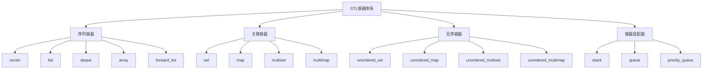
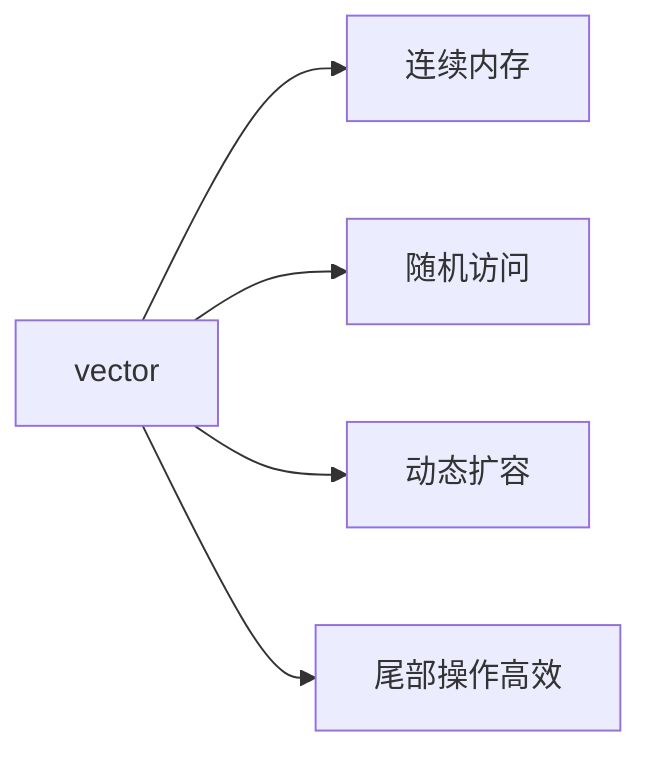
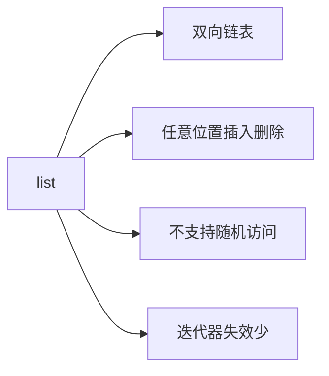
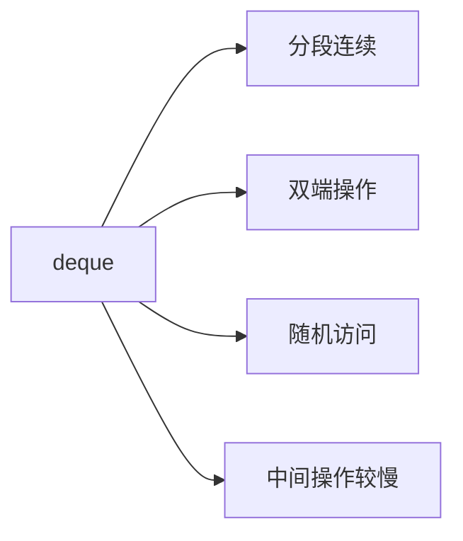
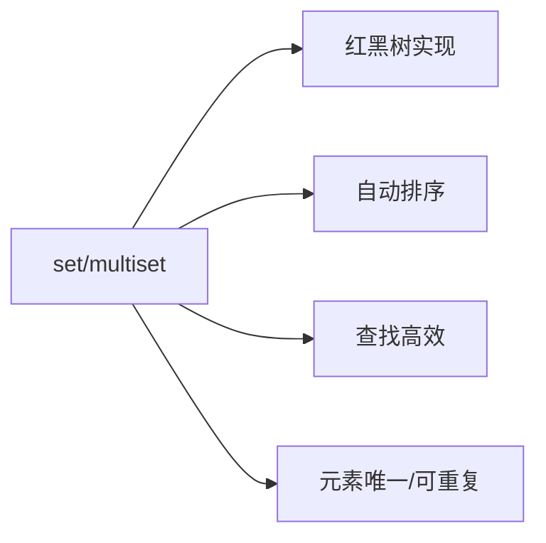
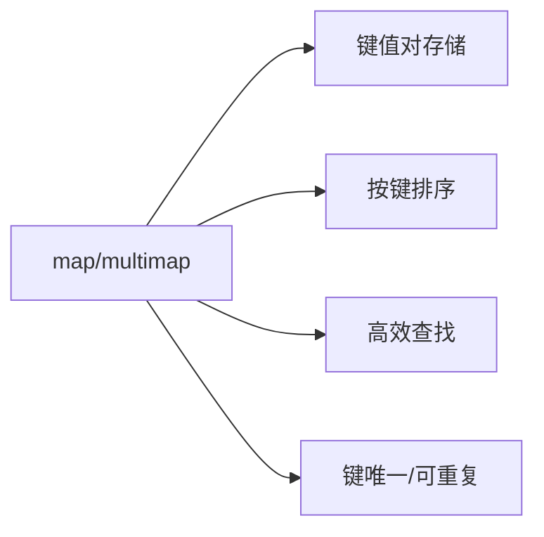
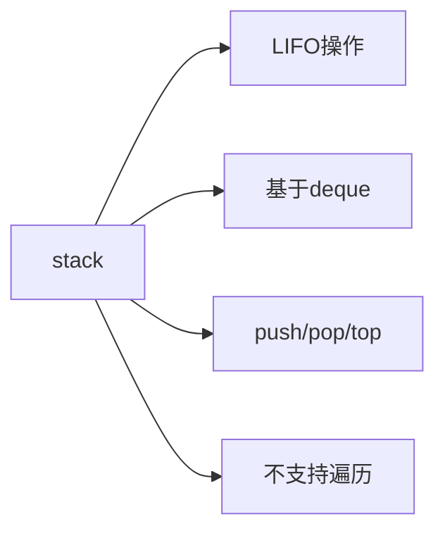
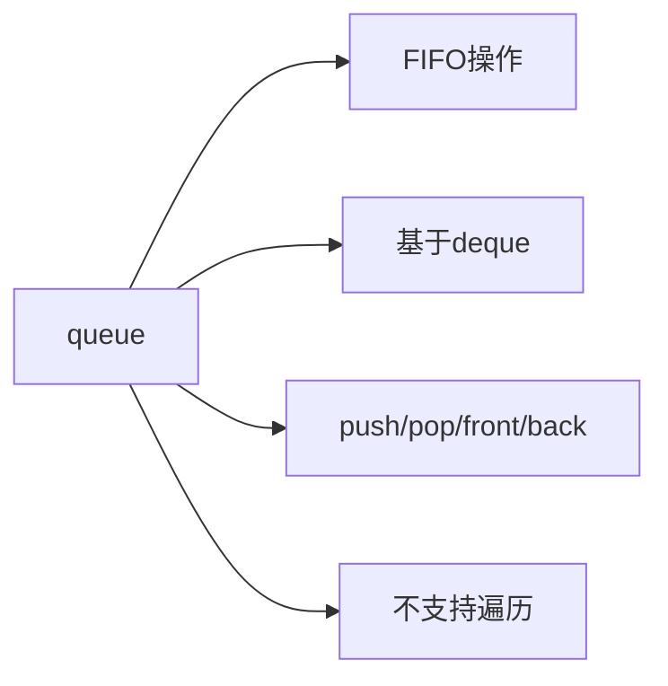
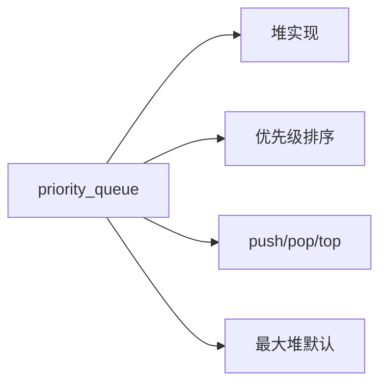
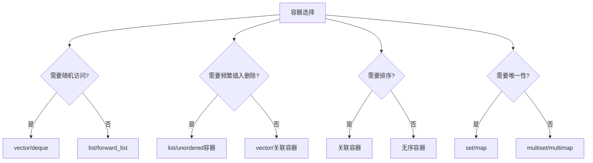

# 第四章 标准库组件（STL核心）

## 4.1 容器体系

**概述**：STL 容器是 C++ 标准库的核心组件，提供了多种数据结构实现。容器体系按存储方式和访问特性分为序列容器、关联容器、无序容器和容器适配器四大类，每种容器都有其特定的性能特征和适用场景。



## 一、序列容器

### 1.1 vector - 动态数组

**概念说明**：vector 是最常用的序列容器，提供动态数组功能，支持随机访问和动态扩容。



| 特性          | vector                    | 说明                        |
|---------------|---------------------------|----------------------------|
| 内存布局      | 连续内存块                | 支持随机访问，缓存友好      |
| 扩容机制      | 2倍扩容策略               | 均摊 O(1) 插入复杂度        |
| 迭代器类型    | 随机访问迭代器            | 支持算术运算                |
| 适用场景      | 频繁随机访问              | 尾部插入删除                |

```cpp
#include <vector>
#include <iostream>

int main() {
    // 创建和初始化
    std::vector<int> vec1;                    // 空vector
    std::vector<int> vec2(5, 10);             // 5个元素，值都是10
    std::vector<int> vec3 = {1, 2, 3, 4, 5}; // 列表初始化
    
    // 容量管理
    vec1.reserve(100);                        // 预分配100个元素空间
    std::cout << "容量: " << vec1.capacity() << std::endl;
    std::cout << "大小: " << vec1.size() << std::endl;
    
    // 元素访问
    vec3[0] = 100;                            // 下标访问（不检查边界）
    vec3.at(1) = 200;                         // 带边界检查的访问
    std::cout << "第一个元素: " << vec3.front() << std::endl;
    std::cout << "最后一个元素: " << vec3.back() << std::endl;
    
    // 插入和删除
    vec3.push_back(6);                        // 尾部插入
    vec3.pop_back();                          // 尾部删除
    vec3.insert(vec3.begin() + 2, 999);      // 指定位置插入
    vec3.erase(vec3.begin() + 1);            // 指定位置删除
    
    // 遍历方式
    for (const auto& elem : vec3) {           // 范围for循环
        std::cout << elem << " ";
    }
    std::cout << std::endl;
    
    return 0;
}
```

### 1.2 list - 双向链表

**概念说明**：list 是双向链表实现，支持高效的插入删除操作，但不支持随机访问。



| 特性          | list                      | 说明                        |
|---------------|---------------------------|----------------------------|
| 内存布局      | 双向链表                  | 非连续内存，插入删除高效    |
| 访问方式      | 顺序访问                  | 不支持下标访问              |
| 迭代器类型    | 双向迭代器                | 支持 ++/-- 操作             |
| 适用场景      | 频繁插入删除              | 需要保持插入顺序            |

```cpp
#include <list>
#include <iostream>

int main() {
    // 创建和初始化
    std::list<int> lst1;
    std::list<int> lst2(3, 5);                // 3个元素，值都是5
    std::list<int> lst3 = {1, 2, 3, 4, 5};   // 列表初始化
    
    // 插入操作
    lst3.push_front(0);                       // 头部插入
    lst3.push_back(6);                        // 尾部插入
    
    auto it = lst3.begin();
    std::advance(it, 3);                      // 移动到第4个位置
    lst3.insert(it, 999);                     // 在指定位置插入
    
    // 删除操作
    lst3.pop_front();                         // 删除头部元素
    lst3.pop_back();                          // 删除尾部元素
    
    it = lst3.begin();
    std::advance(it, 2);
    lst3.erase(it);                           // 删除指定位置元素
    
    // 特殊操作
    lst3.remove(3);                           // 删除所有值为3的元素
    lst3.unique();                            // 删除连续重复元素
    lst3.reverse();                           // 反转链表
    lst3.sort();                              // 排序
    
    // 遍历
    for (const auto& elem : lst3) {
        std::cout << elem << " ";
    }
    std::cout << std::endl;
    
    return 0;
}
```

### 1.3 deque - 双端队列

**概念说明**：deque 是双端队列，支持在两端高效插入删除，同时支持随机访问。



| 特性          | deque                     | 说明                        |
|---------------|---------------------------|----------------------------|
| 内存布局      | 分段连续存储              | 多个连续内存块              |
| 访问方式      | 随机访问                  | 支持下标访问                |
| 操作效率      | 两端高效，中间较慢        | 适合双端操作场景            |
| 适用场景      | 双端队列操作              | 需要随机访问的队列          |

```cpp
#include <deque>
#include <iostream>

int main() {
    // 创建和初始化
    std::deque<int> dq1;
    std::deque<int> dq2(5, 10);               // 5个元素，值都是10
    std::deque<int> dq3 = {1, 2, 3, 4, 5};   // 列表初始化
    
    // 双端操作
    dq3.push_front(0);                        // 头部插入
    dq3.push_back(6);                         // 尾部插入
    dq3.pop_front();                          // 头部删除
    dq3.pop_back();                           // 尾部删除
    
    // 随机访问
    dq3[2] = 999;                             // 下标访问
    std::cout << "第3个元素: " << dq3.at(2) << std::endl;
    
    // 插入和删除
    auto it = dq3.begin() + 2;
    dq3.insert(it, 888);                      // 指定位置插入
    dq3.erase(dq3.begin() + 1);               // 指定位置删除
    
    // 遍历
    for (const auto& elem : dq3) {
        std::cout << elem << " ";
    }
    std::cout << std::endl;
    
    return 0;
}
```

## 二、关联容器

### 2.1 set/multiset - 有序集合

**概念说明**：set 是有序集合，元素唯一且自动排序；multiset 允许重复元素。



| 特性          | set                       | multiset                  | 说明                        |
|---------------|---------------------------|---------------------------|----------------------------|
| 元素唯一性    | 唯一                      | 可重复                    | 自动去重/允许重复           |
| 内部实现      | 红黑树                    | 红黑树                    | 平衡二叉搜索树              |
| 查找复杂度    | O(log n)                  | O(log n)                  | 高效查找                    |
| 插入复杂度    | O(log n)                  | O(log n)                  | 自动维护有序性              |

```cpp
#include <set>
#include <iostream>

int main() {
    // set - 唯一元素集合
    std::set<int> s1 = {3, 1, 4, 1, 5, 9};   // 自动去重和排序
    std::set<std::string> s2 = {"apple", "banana", "cherry"};
    
    // 插入操作
    auto result = s1.insert(2);               // 返回pair<iterator, bool>
    if (result.second) {
        std::cout << "插入成功" << std::endl;
    }
    
    // 查找操作
    auto it = s1.find(4);                     // 查找元素
    if (it != s1.end()) {
        std::cout << "找到元素: " << *it << std::endl;
    }
    
    // 删除操作
    s1.erase(3);                              // 按值删除
    s1.erase(s1.begin());                     // 按迭代器删除
    
    // 遍历（自动有序）
    for (const auto& elem : s1) {
        std::cout << elem << " ";
    }
    std::cout << std::endl;
    
    // multiset - 允许重复元素
    std::multiset<int> ms = {1, 2, 2, 3, 3, 3};
    
    // 统计元素个数
    std::cout << "元素2的个数: " << ms.count(2) << std::endl;
    
    // 获取元素范围
    auto range = ms.equal_range(3);
    for (auto it = range.first; it != range.second; ++it) {
        std::cout << *it << " ";
    }
    std::cout << std::endl;
    
    return 0;
}
```

### 2.2 map/multimap - 有序映射

**概念说明**：map 是有序键值对容器，键唯一且自动排序；multimap 允许重复键。



| 特性          | map                       | multimap                  | 说明                        |
|---------------|---------------------------|---------------------------|----------------------------|
| 键唯一性      | 唯一                      | 可重复                    | 自动去重/允许重复           |
| 内部实现      | 红黑树                    | 红黑树                    | 平衡二叉搜索树              |
| 查找复杂度    | O(log n)                  | O(log n)                  | 按键高效查找                |
| 插入复杂度    | O(log n)                  | O(log n)                  | 自动维护有序性              |

```cpp
#include <map>
#include <iostream>
#include <string>

int main() {
    // map - 唯一键值对
    std::map<std::string, int> m1;
    std::map<int, std::string> m2 = {
        {1, "one"},
        {2, "two"},
        {3, "three"}
    };
    
    // 插入操作
    m1["apple"] = 5;                          // 下标插入
    m1.insert({"banana", 3});                 // insert方法
    m1.insert(std::make_pair("cherry", 2));   // make_pair
    
    // 访问操作
    std::cout << "apple数量: " << m1["apple"] << std::endl;
    
    // 安全访问（不创建新元素）
    auto it = m1.find("orange");
    if (it != m1.end()) {
        std::cout << "orange数量: " << it->second << std::endl;
    }
    
    // 删除操作
    m1.erase("banana");                       // 按键删除
    m1.erase(m1.begin());                     // 按迭代器删除
    
    // 遍历
    for (const auto& pair : m1) {
        std::cout << pair.first << ": " << pair.second << std::endl;
    }
    
    // multimap - 允许重复键
    std::multimap<std::string, int> mm = {
        {"apple", 1},
        {"apple", 2},
        {"banana", 3}
    };
    
    // 获取键的所有值
    auto range = mm.equal_range("apple");
    for (auto it = range.first; it != range.second; ++it) {
        std::cout << it->first << ": " << it->second << std::endl;
    }
    
    return 0;
}
```

## 三、无序容器

### 3.1 unordered_set/unordered_multiset - 无序集合

**概念说明**：基于哈希表实现的无序集合，查找插入平均 O(1) 复杂度。

```mermaid
graph LR
    A[unordered_set] --> B[哈希表实现]
    A --> C[无序存储]
    A --> D[平均O(1)操作]
    A --> E[需要哈希函数]
```

| 特性          | unordered_set             | unordered_multiset        | 说明                        |
|---------------|---------------------------|---------------------------|----------------------------|
| 内部实现      | 哈希表                    | 哈希表                    | 散列表实现                  |
| 元素顺序      | 无序                      | 无序                      | 不保证顺序                  |
| 平均复杂度    | O(1)                      | O(1)                      | 查找插入删除                |
| 最坏复杂度    | O(n)                      | O(n)                      | 哈希冲突时                  |

```cpp
#include <unordered_set>
#include <iostream>
#include <string>

// 自定义类型的哈希函数
struct Person {
    std::string name;
    int age;
    
    bool operator==(const Person& other) const {
        return name == other.name && age == other.age;
    }
};

// 为Person提供哈希函数
namespace std {
    template<>
    struct hash<Person> {
        size_t operator()(const Person& p) const {
            return hash<string>()(p.name) ^ hash<int>()(p.age);
        }
    };
}

int main() {
    // unordered_set - 无序唯一集合
    std::unordered_set<int> us1 = {3, 1, 4, 1, 5, 9};
    std::unordered_set<std::string> us2 = {"apple", "banana", "cherry"};
    
    // 插入操作
    us1.insert(2);
    us1.emplace(6);                           // 就地构造
    
    // 查找操作
    if (us1.find(4) != us1.end()) {
        std::cout << "找到元素4" << std::endl;
    }
    
    // 删除操作
    us1.erase(3);
    
    // 遍历（无序）
    for (const auto& elem : us1) {
        std::cout << elem << " ";
    }
    std::cout << std::endl;
    
    // 自定义类型使用
    std::unordered_set<Person> people;
    people.insert({"Alice", 25});
    people.insert({"Bob", 30});
    
    // unordered_multiset - 无序可重复集合
    std::unordered_multiset<int> ums = {1, 2, 2, 3, 3, 3};
    
    // 统计元素个数
    std::cout << "元素2的个数: " << ums.count(2) << std::endl;
    
    return 0;
}
```

### 3.2 unordered_map/unordered_multimap - 无序映射

**概念说明**：基于哈希表实现的无序键值对容器，查找插入平均 O(1) 复杂度。

```mermaid
graph LR
    A[unordered_map] --> B[哈希表实现]
    A --> C[无序存储]
    A --> D[平均O(1)操作]
    A --> E[键值对存储]
```

| 特性          | unordered_map             | unordered_multimap        | 说明                        |
|---------------|---------------------------|---------------------------|----------------------------|
| 内部实现      | 哈希表                    | 哈希表                    | 散列表实现                  |
| 键值对顺序    | 无序                      | 无序                      | 不保证顺序                  |
| 平均复杂度    | O(1)                      | O(1)                      | 查找插入删除                |
| 最坏复杂度    | O(n)                      | O(n)                      | 哈希冲突时                  |

```cpp
#include <unordered_map>
#include <iostream>
#include <string>

int main() {
    // unordered_map - 无序键值对
    std::unordered_map<std::string, int> um1;
    std::unordered_map<int, std::string> um2 = {
        {1, "one"},
        {2, "two"},
        {3, "three"}
    };
    
    // 插入操作
    um1["apple"] = 5;
    um1.insert({"banana", 3});
    um1.emplace("cherry", 2);                 // 就地构造
    
    // 访问操作
    std::cout << "apple数量: " << um1["apple"] << std::endl;
    
    // 安全访问
    auto it = um1.find("orange");
    if (it != um1.end()) {
        std::cout << "orange数量: " << it->second << std::endl;
    }
    
    // 删除操作
    um1.erase("banana");
    
    // 遍历（无序）
    for (const auto& pair : um1) {
        std::cout << pair.first << ": " << pair.second << std::endl;
    }
    
    // 哈希表统计信息
    std::cout << "桶数量: " << um1.bucket_count() << std::endl;
    std::cout << "负载因子: " << um1.load_factor() << std::endl;
    
    // unordered_multimap - 无序可重复键值对
    std::unordered_multimap<std::string, int> umm = {
        {"apple", 1},
        {"apple", 2},
        {"banana", 3}
    };
    
    // 获取键的所有值
    auto range = umm.equal_range("apple");
    for (auto it = range.first; it != range.second; ++it) {
        std::cout << it->first << ": " << it->second << std::endl;
    }
    
    return 0;
}
```

## 四、容器适配器

### 4.1 stack - 栈

**概念说明**：基于其他容器实现的栈，提供 LIFO（后进先出）操作。



| 特性          | stack                     | 说明                        |
|---------------|---------------------------|----------------------------|
| 默认容器      | deque                     | 可指定其他容器              |
| 操作限制      | 仅栈顶操作                | 不支持随机访问              |
| 主要操作      | push/pop/top              | 后进先出                    |
| 适用场景      | 函数调用栈                | 括号匹配                    |

```cpp
#include <stack>
#include <iostream>
#include <string>

int main() {
    // 创建栈
    std::stack<int> s1;
    std::stack<std::string> s2;
    
    // 压栈操作
    s1.push(1);
    s1.push(2);
    s1.push(3);
    
    // 查看栈顶
    std::cout << "栈顶元素: " << s1.top() << std::endl;
    
    // 出栈操作
    while (!s1.empty()) {
        std::cout << s1.top() << " ";
        s1.pop();
    }
    std::cout << std::endl;
    
    // 括号匹配示例
    std::string expr = "((()))";
    std::stack<char> brackets;
    bool balanced = true;
    
    for (char c : expr) {
        if (c == '(') {
            brackets.push(c);
        } else if (c == ')') {
            if (brackets.empty()) {
                balanced = false;
                break;
            }
            brackets.pop();
        }
    }
    
    if (brackets.empty() && balanced) {
        std::cout << "括号匹配" << std::endl;
    } else {
        std::cout << "括号不匹配" << std::endl;
    }
    
    return 0;
}
```

### 4.2 queue - 队列

**概念说明**：基于其他容器实现的队列，提供 FIFO（先进先出）操作。



| 特性          | queue                     | 说明                        |
|---------------|---------------------------|----------------------------|
| 默认容器      | deque                     | 可指定其他容器              |
| 操作限制      | 仅两端操作                | 不支持随机访问              |
| 主要操作      | push/pop/front/back       | 先进先出                    |
| 适用场景      | 任务队列                  | 广度优先搜索                |

```cpp
#include <queue>
#include <iostream>

int main() {
    // 创建队列
    std::queue<int> q1;
    
    // 入队操作
    q1.push(1);
    q1.push(2);
    q1.push(3);
    
    // 查看队首和队尾
    std::cout << "队首元素: " << q1.front() << std::endl;
    std::cout << "队尾元素: " << q1.back() << std::endl;
    
    // 出队操作
    while (!q1.empty()) {
        std::cout << q1.front() << " ";
        q1.pop();
    }
    std::cout << std::endl;
    
    // 广度优先搜索示例
    std::queue<int> bfs_queue;
    bool visited[5] = {false};
    
    // 从节点0开始BFS
    bfs_queue.push(0);
    visited[0] = true;
    
    while (!bfs_queue.empty()) {
        int current = bfs_queue.front();
        bfs_queue.pop();
        
        std::cout << "访问节点: " << current << std::endl;
        
        // 模拟访问相邻节点
        for (int i = 0; i < 5; ++i) {
            if (!visited[i]) {
                bfs_queue.push(i);
                visited[i] = true;
            }
        }
    }
    
    return 0;
}
```

### 4.3 priority_queue - 优先队列

**概念说明**：基于堆实现的优先队列，支持优先级排序。



| 特性          | priority_queue            | 说明                        |
|---------------|---------------------------|----------------------------|
| 内部实现      | 堆（默认最大堆）          | 可自定义比较器              |
| 默认容器      | vector                    | 可指定其他容器              |
| 主要操作      | push/pop/top              | 优先级最高元素优先          |
| 适用场景      | 任务调度                  | 图算法（Dijkstra）          |

```cpp
#include <queue>
#include <iostream>
#include <vector>

int main() {
    // 默认最大堆
    std::priority_queue<int> pq1;
    
    // 插入元素
    pq1.push(3);
    pq1.push(1);
    pq1.push(4);
    pq1.push(1);
    pq1.push(5);
    
    // 查看和删除最大元素
    while (!pq1.empty()) {
        std::cout << pq1.top() << " ";
        pq1.pop();
    }
    std::cout << std::endl;
    
    // 最小堆
    std::priority_queue<int, std::vector<int>, std::greater<int>> pq2;
    
    pq2.push(3);
    pq2.push(1);
    pq2.push(4);
    pq2.push(1);
    pq2.push(5);
    
    std::cout << "最小堆输出: ";
    while (!pq2.empty()) {
        std::cout << pq2.top() << " ";
        pq2.pop();
    }
    std::cout << std::endl;
    
    // 自定义比较器
    struct Task {
        int priority;
        std::string name;
        
        Task(int p, std::string n) : priority(p), name(n) {}
        
        bool operator<(const Task& other) const {
            return priority < other.priority; // 优先级高的先出队
        }
    };
    
    std::priority_queue<Task> task_queue;
    task_queue.push(Task(1, "低优先级任务"));
    task_queue.push(Task(3, "高优先级任务"));
    task_queue.push(Task(2, "中优先级任务"));
    
    std::cout << "任务调度顺序: ";
    while (!task_queue.empty()) {
        std::cout << task_queue.top().name << " ";
        task_queue.pop();
    }
    std::cout << std::endl;
    
    return 0;
}
```

## 五、容器选择指南

### 5.1 选择标准



### 5.2 性能对比表

| 操作          | vector | list | deque | set | map | unordered_set | unordered_map |
|---------------|--------|------|-------|-----|-----|---------------|---------------|
| 随机访问      | O(1)   | O(n) | O(1)  | O(log n) | O(log n) | O(1) | O(1) |
| 头部插入      | O(n)   | O(1) | O(1)  | O(log n) | O(log n) | O(1) | O(1) |
| 尾部插入      | O(1)   | O(1) | O(1)  | O(log n) | O(log n) | O(1) | O(1) |
| 中间插入      | O(n)   | O(1) | O(n)  | O(log n) | O(log n) | O(1) | O(1) |
| 查找          | O(n)   | O(n) | O(n)  | O(log n) | O(log n) | O(1) | O(1) |
| 内存使用      | 低     | 高   | 中等  | 高   | 高   | 中等 | 中等 |

### 5.3 使用建议

> **注意**：选择合适的容器对程序性能至关重要

| 使用场景      | 推荐容器                  | 原因                        |
|---------------|---------------------------|----------------------------|
| 频繁随机访问  | vector                   | 连续内存，缓存友好          |
| 频繁插入删除  | list                     | 任意位置 O(1) 操作          |
| 需要排序      | set/map                  | 自动维护有序性              |
| 快速查找      | unordered_set/map        | 平均 O(1) 查找              |
| 双端操作      | deque                    | 两端高效操作                |
| 栈操作        | stack                    | 专门的栈接口                |
| 队列操作      | queue                    | 专门的队列接口              |
| 优先级队列    | priority_queue           | 堆实现，高效优先级操作      |

## 六、核心要点总结

| 容器类型      | 主要特性                  | 内部实现                    | 适用场景                    |
|---------------|---------------------------|----------------------------|----------------------------|
| **序列容器**  |                           |                            |                            |
| vector        | 动态数组，随机访问        | 连续内存块                 | 频繁随机访问，尾部操作      |
| list          | 双向链表，任意位置操作    | 双向链表                   | 频繁插入删除，保持顺序      |
| deque         | 双端队列，随机访问        | 分段连续存储               | 双端操作，需要随机访问      |
| **关联容器**  |                           |                            |                            |
| set/map       | 有序存储，自动排序        | 红黑树                     | 需要有序性，高效查找        |
| multiset/map  | 允许重复元素              | 红黑树                     | 需要有序性，允许重复        |
| **无序容器**  |                           |                            |                            |
| unordered_set/map | 无序存储，快速查找    | 哈希表                     | 快速查找，不要求顺序        |
| **适配器**    |                           |                            |                            |
| stack         | LIFO操作                  | 基于deque                  | 栈操作，函数调用栈          |
| queue         | FIFO操作                  | 基于deque                  | 队列操作，任务调度          |
| priority_queue | 优先级排序               | 堆实现                     | 优先级队列，算法应用        |
``` 