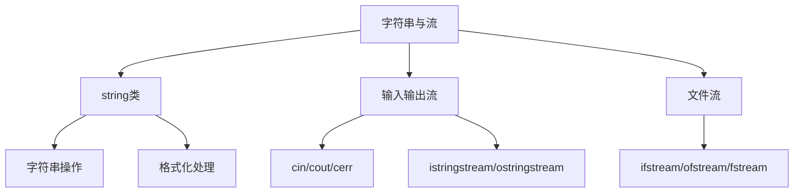

# 第四章 标准库组件（STL核心）

## 4.3 字符串与流

**概述**：C++ 标准库提供了功能强大的 string 类和流（stream）体系，支持高效的字符串处理、格式化输入输出以及文件操作。掌握 string 类的高级用法和流的状态管理，是现代 C++ 编程的基础。



## 一、string 类高级操作

### 1.1 基本用法与构造

```cpp
#include <string>
#include <iostream>

int main() {
    std::string s1;                      // 空字符串
    std::string s2 = "hello";           // 直接初始化
    std::string s3(s2);                  // 拷贝构造
    std::string s4(5, 'a');              // 重复字符
    std::string s5 = s2 + " world";     // 拼接
    std::cout << s5 << std::endl;
    return 0;
}
```

### 1.2 常用成员函数

| 操作         | 示例代码                        | 说明                 |
|--------------|---------------------------------|----------------------|
| 长度/判空    | s.size(), s.empty()             | 获取长度/是否为空    |
| 访问         | s[0], s.at(1), s.front()        | 下标/安全访问        |
| 拼接         | s += "abc", s.append("xyz")    | 字符串拼接           |
| 插入/删除    | s.insert(2, "xx"), s.erase(1,2) | 插入/删除子串        |
| 查找/替换    | s.find("a"), s.replace(0,1,"b")| 查找/替换子串        |
| 截取         | s.substr(1,3)                   | 截取子串             |
| 转换         | std::stoi(s), std::to_string(i) | 字符串与数字转换     |

### 1.3 字符串遍历与修改

```cpp
#include <string>
#include <iostream>

int main() {
    std::string s = "abcdef";
    // 范围for遍历
    for (char c : s) std::cout << c << ' ';
    std::cout << std::endl;
    // 反转
    std::reverse(s.begin(), s.end());
    std::cout << s << std::endl;
    // 替换
    std::replace(s.begin(), s.end(), 'a', 'X');
    std::cout << s << std::endl;
    return 0;
}
```

## 二、流状态管理与格式化

### 2.1 标准输入输出流

- `std::cin`：标准输入流
- `std::cout`：标准输出流
- `std::cerr`：标准错误流
- `std::clog`：标准日志流

```cpp
#include <iostream>
#include <iomanip>

int main() {
    int a = 42;
    double pi = 3.14159;
    // 格式化输出
    std::cout << std::setw(6) << a << std::endl;         // 宽度
    std::cout << std::setprecision(3) << pi << std::endl;// 精度
    std::cout << std::fixed << std::setfill('*') << std::setw(8) << pi << std::endl;
    // 输入
    std::string name;
    std::cout << "请输入姓名：";
    std::cin >> name;
    std::cout << "你好, " << name << std::endl;
    return 0;
}
```

### 2.2 流状态管理

| 状态函数         | 说明                       |
|------------------|----------------------------|
| good()           | 流无错误                   |
| eof()            | 读到文件/流末尾            |
| fail()           | 非致命错误（格式错误等）   |
| bad()            | 严重错误（如IO失败）       |
| clear()          | 清除所有错误状态           |

```cpp
#include <iostream>
#include <fstream>

int main() {
    std::ifstream fin("test.txt");
    if (!fin) {
        std::cerr << "文件打开失败" << std::endl;
        return 1;
    }
    int x;
    while (fin >> x) {
        std::cout << x << std::endl;
    }
    if (fin.eof()) {
        std::cout << "读取完毕" << std::endl;
    } else if (fin.fail()) {
        std::cout << "读取出错" << std::endl;
    }
    fin.close();
    return 0;
}
```

### 2.3 字符串流与格式化

- `std::istringstream`：字符串输入流
- `std::ostringstream`：字符串输出流
- `std::stringstream`：输入输出流

```cpp
#include <sstream>
#include <iostream>

int main() {
    std::string data = "100 3.14 hello";
    std::istringstream iss(data);
    int i; double d; std::string s;
    iss >> i >> d >> s;
    std::cout << i << ", " << d << ", " << s << std::endl;
    // 格式化输出
    std::ostringstream oss;
    oss << "编号: " << i << ", 值: " << d;
    std::cout << oss.str() << std::endl;
    return 0;
}
```

## 三、注意事项与最佳实践

> **注意**：
> - string 类底层自动管理内存，避免手动释放
> - 流操作后应检查状态，防止数据丢失或异常
> - 文件流操作需及时关闭文件，防止资源泄漏
> - 格式化输出建议使用 iomanip 头文件

## 四、核心要点总结

| 主题         | 关键点说明                                   |
|--------------|----------------------------------------------|
| string类     | 丰富成员函数，支持高效字符串处理             |
| 流体系       | 标准输入输出、文件流、字符串流全面支持       |
| 格式化       | iomanip/string流灵活格式化                   |
| 状态管理     | good/eof/fail/bad/clear等状态判断            |

---

> 掌握 string 与流的高级用法，是 C++ 工程开发和算法竞赛的基础能力。 