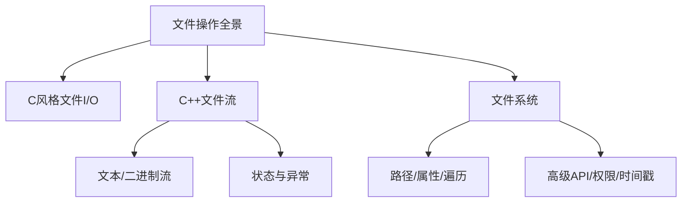

# 第四章 标准库组件（STL核心）

## 4.4 文件

**概述**：C++ 文件操作涵盖了从 C 语言的基础文件 I/O，到 C++ 文件流的面向对象封装，再到 C++17 `<filesystem>` 的现代工程化文件系统管理。掌握这些内容，是实现高效、健壮、跨平台文件处理的基础。



---

## 一、C风格文件I/O基础

### 1.1 基本函数与用法

| 操作         | 函数                | 说明                   |
|--------------|---------------------|------------------------|
| 打开文件     | fopen               | 以指定模式打开文件     |
| 关闭文件     | fclose              | 关闭文件流             |
| 读写字符     | fgetc/fputc         | 读/写单字符            |
| 读写字符串   | fgets/fputs         | 读/写字符串            |
| 读写二进制   | fread/fwrite        | 读/写二进制块          |
| 定位         | fseek/ftell/rewind  | 文件指针定位           |

#### 示例：文本文件读写
```cpp
#include <cstdio>
int main() {
    FILE* fp = fopen("test.txt", "w");
    if (fp) {
        fputs("Hello, C文件IO!\n", fp);
        fclose(fp);
    }
    fp = fopen("test.txt", "r");
    char buf[100];
    if (fp && fgets(buf, 100, fp)) {
        printf("读取内容: %s", buf);
        fclose(fp);
    }
    return 0;
}
```

#### 示例：二进制文件读写
```cpp
#include <cstdio>
struct Data { int x; double y; };
int main() {
    Data d = {42, 3.14};
    FILE* fp = fopen("data.bin", "wb");
    fwrite(&d, sizeof(d), 1, fp);
    fclose(fp);
    Data d2;
    fp = fopen("data.bin", "rb");
    fread(&d2, sizeof(d2), 1, fp);
    fclose(fp);
    printf("x=%d, y=%.2f\n", d2.x, d2.y);
    return 0;
}
```

#### 文件打开模式
| 模式   | 说明                 |
|--------|----------------------|
| "r"    | 只读                 |
| "w"    | 只写（清空原内容）   |
| "a"    | 追加写入             |
| "rb"   | 只读二进制           |
| "wb"   | 只写二进制           |
| "r+"   | 读写                 |
| "w+"   | 读写（清空原内容）   |

> **注意**：C风格I/O不具备类型安全，易出错，建议仅用于兼容性场景。

---

## 二、C++文件流基础与进阶

### 2.1 文件流类型与基本用法

| 类型           | 头文件         | 说明                   |
|----------------|---------------|------------------------|
| ifstream       | <fstream>     | 文件输入流（读）       |
| ofstream       | <fstream>     | 文件输出流（写）       |
| fstream        | <fstream>     | 文件读写流             |

#### 示例：文本文件读写
```cpp
#include <fstream>
#include <iostream>
int main() {
    std::ofstream fout("test.txt");
    fout << "Hello, C++文件流!" << std::endl;
    fout.close();
    std::ifstream fin("test.txt");
    std::string line;
    std::getline(fin, line);
    std::cout << line << std::endl;
    fin.close();
    return 0;
}
```

#### 示例：二进制文件读写
```cpp
#include <fstream>
struct Data { int x; double y; };
int main() {
    Data d = {100, 6.28};
    std::ofstream fout("data.bin", std::ios::binary);
    fout.write(reinterpret_cast<char*>(&d), sizeof(d));
    fout.close();
    Data d2;
    std::ifstream fin("data.bin", std::ios::binary);
    fin.read(reinterpret_cast<char*>(&d2), sizeof(d2));
    fin.close();
    std::cout << d2.x << ", " << d2.y << std::endl;
    return 0;
}
```

### 2.2 文件流打开模式
| 模式                | 说明                       |
|---------------------|----------------------------|
| std::ios::in        | 读                         |
| std::ios::out       | 写                         |
| std::ios::app       | 追加写入                   |
| std::ios::trunc     | 打开时清空                 |
| std::ios::binary    | 二进制模式                 |
| std::ios::ate       | 打开后定位到文件末尾       |

#### 组合示例
```cpp
std::fstream fs("file.txt", std::ios::in | std::ios::out | std::ios::app);
```

### 2.3 文件流高级用法
- **文件指针定位**：seekg/seekp, tellg/tellp
- **流状态管理**：good(), eof(), fail(), bad(), clear()
- **异常处理**：exceptions() 抛出流异常
- **缓冲与同步**：rdbuf(), sync()
- **跨平台换行**：std::endl, std::flush

#### 定位与状态示例
```cpp
#include <fstream>
#include <iostream>
int main() {
    std::ifstream fin("test.txt");
    fin.seekg(0, std::ios::end);
    std::streampos len = fin.tellg();
    fin.seekg(0, std::ios::beg);
    std::cout << "文件长度: " << len << std::endl;
    fin.close();
    return 0;
}
```

#### 异常安全示例
```cpp
#include <fstream>
#include <iostream>
int main() {
    std::ifstream fin;
    fin.exceptions(std::ifstream::failbit | std::ifstream::badbit);
    try {
        fin.open("nofile.txt");
    } catch (const std::ios_base::failure& e) {
        std::cerr << "文件异常: " << e.what() << std::endl;
    }
    return 0;
}
```

---

## 三、C++17 <filesystem> 文件系统全解

### 3.1 路径与文件属性
- **fs::path** 类型安全路径拼接、解析
- **exists/is_regular_file/is_directory** 判断类型
- **file_size** 获取文件大小
- **last_write_time** 获取/设置修改时间
- **permissions** 权限管理

#### 路径与属性示例
```cpp
#include <filesystem>
#include <iostream>
namespace fs = std::filesystem;
int main() {
    fs::path p = "./test.txt";
    std::cout << "文件名: " << p.filename() << std::endl;
    std::cout << "父路径: " << p.parent_path() << std::endl;
    std::cout << "存在: " << fs::exists(p) << std::endl;
    std::cout << "大小: " << (fs::exists(p) ? fs::file_size(p) : 0) << std::endl;
    return 0;
}
```

### 3.2 目录遍历与递归
- **directory_iterator** 非递归遍历
- **recursive_directory_iterator** 递归遍历
- **is_symlink** 判断符号链接

#### 遍历示例
```cpp
#include <filesystem>
#include <iostream>
namespace fs = std::filesystem;
int main() {
    for (const auto& entry : fs::recursive_directory_iterator(".")) {
        std::cout << entry.path() << std::endl;
    }
    return 0;
}
```

### 3.3 文件与目录操作
- **create_directory/create_directories** 创建目录
- **remove/remove_all** 删除文件/目录
- **copy/copy_file/copy_options** 拷贝
- **rename** 重命名
- **temp_directory_path** 临时目录

#### 操作示例
```cpp
#include <filesystem>
namespace fs = std::filesystem;
int main() {
    fs::create_directory("mydir");
    fs::copy("test.txt", "mydir/test.txt");
    fs::rename("mydir/test.txt", "mydir/test2.txt");
    fs::remove_all("mydir");
    return 0;
}
```

### 3.4 权限与时间戳
- **permissions** 设置/获取权限
- **last_write_time** 文件时间戳

#### 权限与时间戳示例
```cpp
#include <filesystem>
#include <iostream>
namespace fs = std::filesystem;
int main() {
    fs::permissions("test.txt", fs::perms::owner_all, fs::perm_options::add);
    auto t = fs::last_write_time("test.txt");
    std::cout << "最后修改时间: " << decltype(t)::clock::to_time_t(t) << std::endl;
    return 0;
}
```

### 3.5 空间与异常安全
- **space** 查询磁盘空间
- **try-catch** 捕获filesystem_error

#### 空间与异常示例
```cpp
#include <filesystem>
#include <iostream>
namespace fs = std::filesystem;
int main() {
    try {
        auto info = fs::space(".");
        std::cout << "可用空间: " << info.available << std::endl;
    } catch (const fs::filesystem_error& e) {
        std::cerr << "文件系统异常: " << e.what() << std::endl;
    }
    return 0;
}
```

### 3.6 <filesystem> 常用API对比表
| 功能         | API示例                                 | 说明                 |
|--------------|-----------------------------------------|----------------------|
| 路径拼接     | p / "subdir"                           | 跨平台路径拼接       |
| 判断存在     | fs::exists(p)                           | 路径是否存在         |
| 判断类型     | fs::is_directory(p), is_regular_file(p) | 判断目录/文件        |
| 获取大小     | fs::file_size(p)                        | 获取文件字节数       |
| 遍历目录     | fs::directory_iterator/recursive_directory_iterator | 遍历目录 |
| 创建/删除    | fs::create_directory, fs::remove        | 创建/删除文件/目录   |
| 拷贝/重命名  | fs::copy, fs::rename                    | 文件/目录操作        |
| 权限管理     | fs::permissions                         | 设置/获取权限        |
| 时间戳       | fs::last_write_time                     | 获取/设置修改时间    |
| 空间查询     | fs::space                               | 查询磁盘空间         |

---

## 四、C++文件操作对比与最佳实践

| 维度         | C风格I/O         | C++文件流           | <filesystem>         |
|--------------|------------------|---------------------|----------------------|
| 类型安全     | 弱               | 强                  | 强                   |
| 跨平台性     | 一般             | 较好                | 极佳                 |
| 面向对象     | 否               | 是                  | 是                   |
| 错误处理     | 返回值           | 状态/异常           | 异常                 |
| 目录操作     | 不支持           | 不支持              | 全面支持             |
| 路径管理     | 手动字符串       | 手动字符串          | 类型安全path         |
| 推荐场景     | 兼容老代码       | 一般文件读写        | 工程化/复杂场景      |

> **最佳实践**：
> - 新项目优先用 C++17 `<filesystem>` + 文件流，兼容性需求可用 C风格I/O
> - 文件流操作后及时关闭，异常安全用RAII
> - 路径拼接、属性判断、目录遍历等用 `<filesystem>`，避免手动字符串处理
> - 处理大文件/二进制数据时注意缓冲与性能
> - 充分利用流状态/异常机制，提升健壮性

---

## 五、核心要点总结

| 主题         | 关键点说明                                   |
|--------------|----------------------------------------------|
| C风格I/O     | 兼容性强，类型安全差，适合简单场景           |
| C++文件流    | 面向对象，支持文本/二进制，状态/异常管理     |
| <filesystem> | 跨平台、类型安全、API丰富，适合工程开发      |
| 权限/时间戳  | 支持权限管理与时间戳操作，适合高阶需求       |
| 最佳实践     | 新项目优先用现代API，注意异常与资源管理      |

---

> 掌握从C到C++17全套文件操作，是成为高效C++工程师的必备能力。 