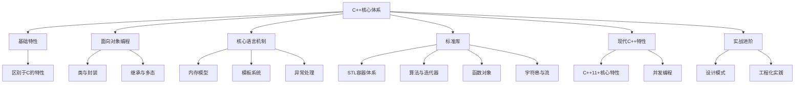

# 现代 C++ 系统学习指南

## 知识体系架构

## 学习路径

### 一、C++ 基础特性
- 语法增强与类型安全
- 内存管理（new/delete）
- 引用机制
- 函数重载与默认参数
- 命名空间管理

### 二、面向对象编程
#### 类与封装
- 类七要素（构造/析构/拷贝/移动/赋值）
- this指针机制
- 运算符重载
- 友元与静态成员

#### 继承与多态
- 三种继承方式
- 虚函数与抽象类
- vtable机制
- 动态类型识别
- 编译时多态实现

### 三、核心语言机制
#### 内存与类型转换
- 内存四区模型
- 类型转换操作符

#### 模板
- 函数模板与类模板
- 模板特化技术

#### 异常处理
- 异常处理体系

### 四、标准库组件（STL核心）
#### 容器体系
- 序列容器（vector/list/deque）
- 关联容器（map/set/multimap）
- 无序容器（unordered_map/set）
- 容器适配器（stack/queue/priority_queue）

#### 算法与迭代器
- 迭代器分类与能力
- 泛型算法（排序/查找/变换）
- 容器特性与算法选择

#### 字符串与流
- string类高级操作
- 流状态管理与格式化

#### 文件
- 文件系统操作（C++17）
- 文件流

### 五、现代 C++ 特性（C++11+）
#### 核心特性
- 类型推导（auto/decltype）
- 智能指针体系
- 右值引用与移动语义
- 完美转发机制
- constexpr 编译期计算
- 结构化绑定

#### 函数对象
- 谓词与函数适配器
- bind机制与函数组合
- lambda表达式整合

#### 并发编程
- 线程管理（std::thread）
- 同步原语（mutex/atomic）
- 异步模型（async/future）
- 条件变量
- 线程池原理

### 六、实战进阶
#### 设计模式实现
- 创建型（单例/工厂）
- 结构型（适配器/装饰器）
- 行为型（观察者/策略）

#### 工程化实践
- 编译器特性比较
- 调试技术（GDB/IDE）
- CMake构建系统
- 性能优化策略
- C++20新特性（概念/协程）