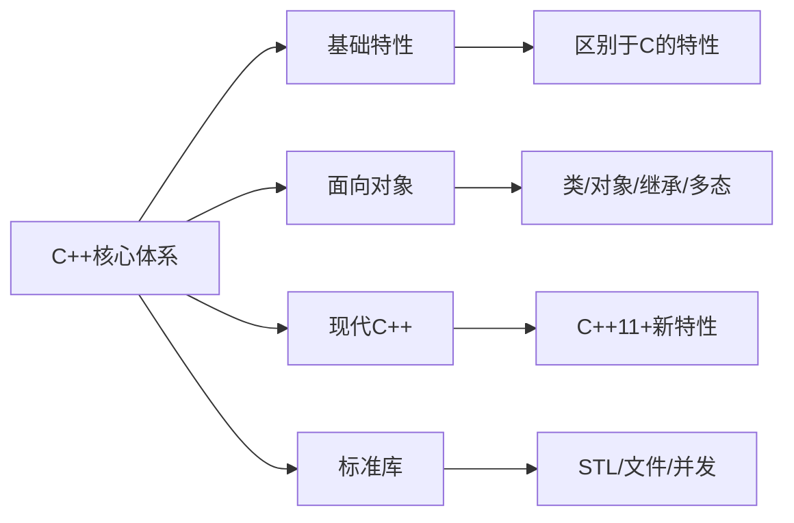
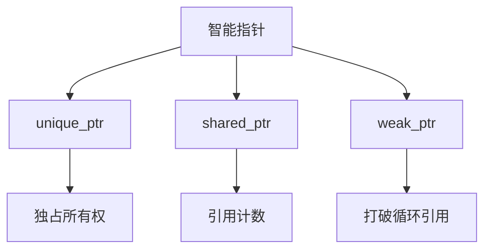

现代 C++ 系统学习指南

本项目致力于系统性学习 **C++ 相较于 C 的独有特性**，聚焦面向对象编程思想、常用设计模式，以及现代 C++（C++11 及以后的版本）核心机制，帮助学习者从基础扎实掌握 C++ 编程，逐步迈向工程实践与高阶应用。

---

##  知识体系架构

---

##  学习目录

### 一、C++ 基础特性（区别于 C）

* **语法增强**：`bool` 类型、函数原型强制声明
* **类型安全机制**：强类型检查、类型转换约束
* **内存管理对比**：`new/delete` vs `malloc/free`
* **引用机制**：本质解析与指针对比
* **函数特性**：重载规则、默认参数陷阱
* **命名空间**：避免符号冲突，`using` 的正确使用

---

### 二、面向对象编程核心

####　类与封装

* 类的七要素：构造、析构、拷贝、移动、赋值、运算符重载
* `this` 指针：机制与常见用法

####　继承与多态

* 三种继承方式：`public` / `protected` / `private`
* 虚函数表机制：`virtual`/`override`/`final`
* 抽象类与接口设计规范
* 编译时多态：函数重载、模板（泛型）实现
* 运行时多态：虚函数、动态绑定
* 虚表（vtable）机制原理
* 纯虚函数与抽象基类
* 动态类型识别：`typeid` 与 `dynamic_cast`

####　高级特性

* 友元机制：函数友元 / 类友元
* 静态成员变量与函数
* 运算符重载：常见的 `<<`、`[]`、`()` 等用法

---

### 三、核心语言机制

####　内存模型

* 四区模型：栈 / 堆 / 全局区 / 常量区
* 对象生命周期与内存布局

####　模板系统

* 函数模板与类模板
* 模板特化：全特化 / 偏特化
* SFINAE：Substitution Failure Is Not An Error 原理与实战

####　异常处理系统

* 异常传播与栈展开
* 自定义异常类与继承体系
* `noexcept` 关键字优化技巧

####　类型转换

* `static_cast`：基本类型转换
* `dynamic_cast`：运行时安全类型检查
* `const_cast`：常量性移除
* `reinterpret_cast`：底层位级解释

---

### 四、标准库与设计模式实战

####　STL 核心组件

| 类别    | 典型代表              | 应用场景     |
| ----- | ----------------- | -------- |
| 序列容器  | `vector`, `deque` | 快速随机访问   |
| 关联容器  | `map`, `set`      | 有序键值查找   |
| 无序容器  | `unordered_map`   | 哈希快速访问   |
| 容器适配器 | `stack`, `queue`  | 特定结构行为模拟 |

* **迭代器体系**：五种迭代器与能力矩阵
* **算法库**：`<algorithm>` 中常用泛型函数

####　文件与流操作

* 文本模式 vs 二进制模式
* 流状态管理与错误处理技巧

####　设计模式实现（精选）

* **创建型**：

  * 单例模式（线程安全双检锁）
  * 工厂模式（简单工厂 / 抽象工厂）
* **结构型**：

  * 适配器（类 / 对象适配）
  * 装饰器（动态功能扩展）
* **行为型**：

  * 观察者模式（发布-订阅）
  * 策略模式（算法封装与切换）

---

### 五、现代 C++（C++11 起）

####　核心语言特性

* **类型推导**：`auto` 推导规则、`decltype` 应用
* **智能指针机制**：

* **Lambda 表达式**：值捕获 / 引用捕获 / `mutable` 使用

####　并发与异步编程

* 线程创建与管理：`std::thread`
* 同步机制：`mutex` / `condition_variable` / `atomic`
* 异步模型：`async` + `future` / `promise`
* 线程池实现原理：任务队列与工作窃取策略

####　移动语义与右值引用

* 右值与`&&`符号解析
* 移动构造与移动赋值
* 完美转发：`std::forward` 原理与实践

####　关键语言增强

* `constexpr`：编译期计算
* 统一初始化语法：大括号 `{}` 初始化
* 结构化绑定：支持多返回值解构
* 变参模板与参数包展开技巧

---

### 六、实战与进阶方向

####　工具链与工程化

* **编译器**：`g++` / `clang` / `MSVC` 特性比较
* **调试工具**：`GDB` 常用命令 / IDE 调试实践
* **构建系统**：CMake 项目组织与构建流程

####　拓展学习方向

* Placement new 与对象定制构造
* 零开销抽象：性能优化实践
* C++20 新特性：`concepts` / `coroutines` / `ranges`

---

如需系统性学习 C++，该项目将成为你从语言入门到现代工程开发的重要参考资料。欢迎反馈与完善，共同构建高质量的 C++ 学习路径。
