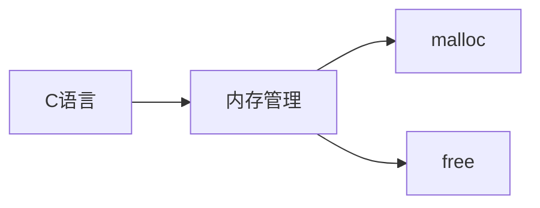
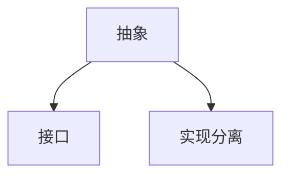

# 笔记格式规范

## 一、整体结构

### 1. 章节标题层级
```markdown
# 一级标题 (章节名称)
## 二级标题 (子章节)
### 三级标题 (关键概念/分类)
```

### 2. 章节必备元素
- **概述段落**：每章开头 2-3 行简要说明本章核心内容
- **图示**：使用 Mermaid 图表展示概念关系
- **对比表格**：用于 C/C++ 特性对比
- **代码示例**：每个关键概念提供可运行的代码片段
- **总结表格**：章节末尾的核心要点总结

## 二、内容格式规范

### 1. 标题格式
```markdown
## 二、编程范式差异

### 面向过程 vs 面向对象
```

### 2. 对比表格
```markdown
| 特性         | C 语言               | C++ 语言               | 说明                  |
|--------------|----------------------|-----------------------|-----------------------|
| 内存管理     | malloc/free         | new/delete           | 自动调用构造/析构     |
| 多态支持     | 函数指针             | 虚函数机制            | 运行时动态绑定        |
```

### 3. 图示规范
````markdown

````

### 4. 代码示例
````markdown
```cpp
// 带有详细注释的示例
class Example {
public:
    Example() { // 默认构造函数
        data = new int[10];
    }
    ~Example() { // 析构函数
        delete[] data;
    }
private:
    int* data; // 成员变量
};
```
````

### 5. 核心要点总结
```markdown
| 特性          | C 语言                 | C++ 语言                  | 优势对比               |
|---------------|------------------------|--------------------------|------------------------|
| 类型安全      | 弱类型系统             | 强类型系统               | 减少运行时错误         |
```

## 三、内容元素规范

### 1. 概念说明
- 使用清晰的定义语句
- 关键术语加粗：如**封装性**、**多态**
- 复杂概念配图表说明

### 2. 对比分析
- 每个对比维度单独成行
- 明确标注 C 和 C++ 的实现差异
- 说明差异带来的实际影响

### 3. 代码注释
```cpp
// 单行注释说明关键行
void importantFunction() {
    /* 
     * 多行注释说明复杂逻辑
     * 每行以星号开头保持对齐
     */
}
```

### 4. 注意事项
> 使用引用块格式表示重要提示或警告

### 5. 版本标注
- 新特性标注版本：`(C++11+)`
- 弃用特性标注：`(已弃用)`

## 四、排版规范

### 1. 空格使用
- 中英文间加空格：C++ 中的**类**（class）
- 操作符两侧加空格：`int a = b + c;`
- 逗号后加空格：`void func(int a, int b)`

### 2. 代码格式
- 使用 4 空格缩进
- 大括号换行统一：
```cpp
class Example 
{
    // 类内容
}
```

### 3. 表格优化
- 表头与内容空行分隔
- 重要单元格使用**加粗**
- 内容保持纵向对齐

## 五、文档元素示例

### 完整小节模板
```markdown
### 3. 抽象性

**概念说明**：
抽象性是指...（简明定义）



| 抽象机制    | C 语言             | C++ 语言          |
|------------|-------------------|------------------|
| 数据抽象    | 结构体            | 类访问控制        |
| 行为抽象    | 函数指针          | 纯虚函数          |

```cpp
// 抽象类示例
class Abstract {
public:
    virtual void method() = 0; // 纯虚函数定义接口
};

class Concrete : public Abstract {
public:
    void method() override { // 具体实现
        // 实现代码
    }
};
```

> **注意**：抽象类不能实例化，只能通过派生类实现

| 关键点      | C 语言                     | C++ 语言                     |
|------------|---------------------------|-----------------------------|
| 接口定义    | 无直接支持                | 纯虚函数                    |
| 实现分离    | 需手动管理                | 语言原生支持                |
```

## 六、跨章节一致性

1. **术语统一**：
   - 使用"成员函数"而非"方法"
   - 使用"实例化"而非"创建对象"

2. **图示风格统一**：
   - 相同概念使用相同图形元素
   - 保持配色方案一致

3. **代码风格统一**：
   - 所有示例采用相同命名规范
   - 错误处理方式保持一致

4. **参考链接**：
   - 相关章节标注：详见 1.3 节
   - 外部参考使用脚注

按此规范可确保笔记风格一致，专业性和可读性兼备。每个章节可根据具体内容调整细节，但核心结构保持不变。